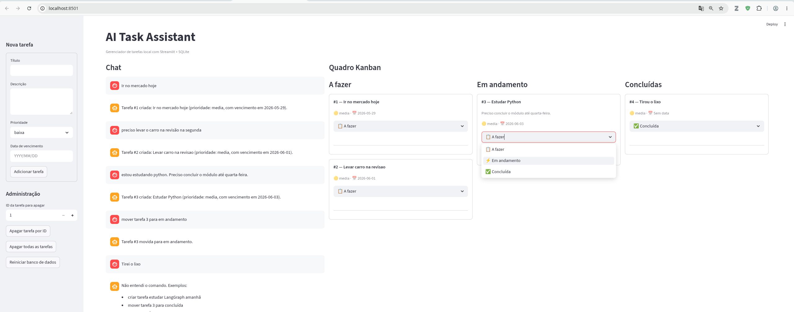

<h1>
<a href="https://www.dio.me/">
</a>
<span>Criando um Agente para Automatizar um Fluxo de Trabalho em Python
</span>
</h1>

## 📌 Descrição

Este projeto implementa um assistente local para gerenciamento de tarefas com interface em chat e quadro kanban, desenvolvido em Python. A solução utiliza múltiplos agentes locais com Ollama, persistência em SQLite e interface web com Streamlit, permitindo criar, mover, listar e apagar tarefas por linguagem natural.

Obs.: Projeto desenvolvido com vibe coding usando a [Perplexity AI](https://perplexity.ai).
## 🎯 Objetivo

O objetivo é automatizar um fluxo de trabalho simples de organização de tarefas, inspirado em quadros no estilo Trello. O usuário interage pelo chat e o sistema interpreta comandos para atualizar o banco local e refletir as mudanças na interface.

## 🧰 Tecnologias utilizadas

- Python
- Streamlit
- SQLite (`sqlite3`)
- Ollama
- LangChain
- LangGraph
- `python-dateutil`
- `dateparser`
- `uv`

Essas ferramentas permitem construir uma aplicação local, leve e prática, com componentes de chat no Streamlit e persistência baseada em arquivo com SQLite.

## 🧠 Arquitetura dos agentes

O projeto foi estruturado com pelo menos dois agentes locais:

- **Supervisor Agent**: classifica a intenção da mensagem do usuário, como criar tarefa, mover status, listar tarefas, apagar tarefa ou reiniciar o banco.
- **Task Agent**: extrai informações estruturadas da mensagem, como título, prioridade, status e identificador da tarefa.

Essa separação facilita a organização da lógica e acompanha o padrão de aplicações multiagente com Ollama e LangChain.

## 🗂️ Estrutura do projeto

```text
AI_TaskAssistent/
├── app.py
├── agents.py
├── database.py
├── data/
│   └── tasks.db
├── pyproject.toml
└── uv.lock
```

A estrutura foi mantida simples para facilitar desenvolvimento local, manutenção e demonstração do projeto no bootcamp.

## 💾 Banco de dados

O sistema utiliza apenas SQLite para simplificar a persistência local. As informações principais ficam em tabelas como `tasks` e `messages`, permitindo armazenar tarefas, histórico do chat e consultas sobre tarefas atrasadas.

Exemplos de operações suportadas:

- Criar tarefa
- Atualizar status
- Apagar tarefa por ID
- Apagar todas as tarefas
- Reiniciar o banco de dados
- Listar tarefas atrasadas

## 🗓️ Tratamento de datas

A definição de datas foi melhorada com parsing em Python, em vez de depender apenas da LLM. A biblioteca `dateparser` é apropriada para expressões em linguagem natural como “amanhã” e “segunda-feira”, enquanto `dateutil` ajuda a interpretar datas numéricas com ordem dia/mês configurável.

Exemplos de entradas aceitas:

- `comprar ração amanhã`
- `comprar ração segunda-feira`
- `comprar ração dia 01/06`
- `comprar ração 2026-06-01`

Quando uma tarefa vencida é encontrada, o sistema exibe um lembrete no início do chat com base em comparação de datas no SQLite.

## 💬 Comandos no chat

O usuário pode interagir em linguagem natural para controlar as tarefas. Exemplos:

- `crie uma tarefa para amanhã`
- `comprar ração segunda-feira`
- `mova a tarefa 2 para concluída`
- `mova a tarefa 3 para em andamento`
- `mova a tarefa 4 para a fazer`
- `apague a tarefa 2`
- `apague todas as tarefas`
- `reinicie o banco`
- `liste minhas tarefas`
- `mostre tarefas atrasadas`

A aplicação também aceita variações de status em português, como “concluída”, “em andamento” e “a fazer”, convertendo internamente para os estados `done`, `doing` e `todo`.

## 🖥️ Interface

A interface foi construída em Streamlit e reúne chat e quadro kanban na mesma tela. O projeto utiliza os componentes nativos de chat do Streamlit e uma visualização em colunas para as tarefas, com edição compacta do status por `selectbox` com emoji para economizar espaço.

Principais elementos da interface:

- Chat com histórico
- Quadro kanban com colunas “A fazer”, “Em andamento” e “Concluídas”
- Formulário lateral para criação de tarefas
- Ações administrativas para apagar tarefas e reiniciar o banco
- Alertas de tarefas atrasadas no topo da tela

## ⚙️ Instalação e execução

### 1. Criar o projeto e ambiente

```bash
uv init AI_TaskAssistent
cd AI_TaskAssistent
uv venv
source .venv/bin/activate
```

### 2. Instalar dependências

```bash
uv add langchain langgraph langchain-ollama ollama
uv add streamlit python-dotenv python-dateutil dateparser
```

### 3. Executar a aplicação

```bash
streamlit run app.py
```

Na primeira execução, o banco SQLite é criado automaticamente na pasta `data/`.

## 🚀 Funcionalidades implementadas

- Criação de tarefas por chat
- Alteração de status por chat e pela interface
- Lembrete automático de tarefas atrasadas
- Persistência local com SQLite
- Quadro kanban integrado ao chat
- Exclusão de tarefa por ID
- Exclusão de todas as tarefas
- Reinicialização do banco de dados
- Interpretação de datas em português
- Suporte a comandos em linguagem natural

## 🔮 Melhorias futuras

- Confirmação em duas etapas para comandos destrutivos
- Melhor suporte a datas como “daqui a duas semanas” ou “próxima sexta à tarde”
- Separação de prompts em arquivo próprio
- Testes automatizados
- Interface mais rica com drag-and-drop
- Migração futura para Reflex ou outro framework mais completo

## ✅ Resultado

O projeto atende à proposta de desenvolver um agente em Python para automatizar um fluxo de trabalho local, combinando agentes com LLM local, banco SQLite, interpretação de comandos por chat e visualização estilo kanban em uma única interface.

<p align=center>

</p>