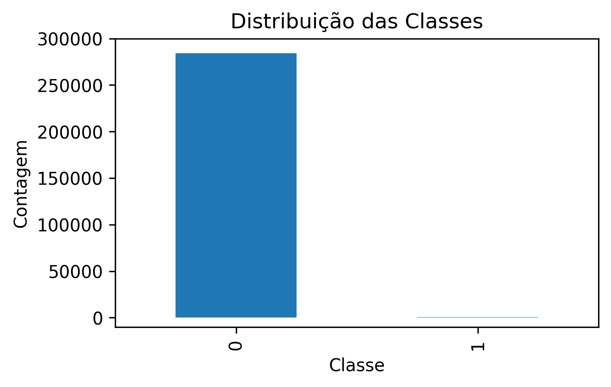
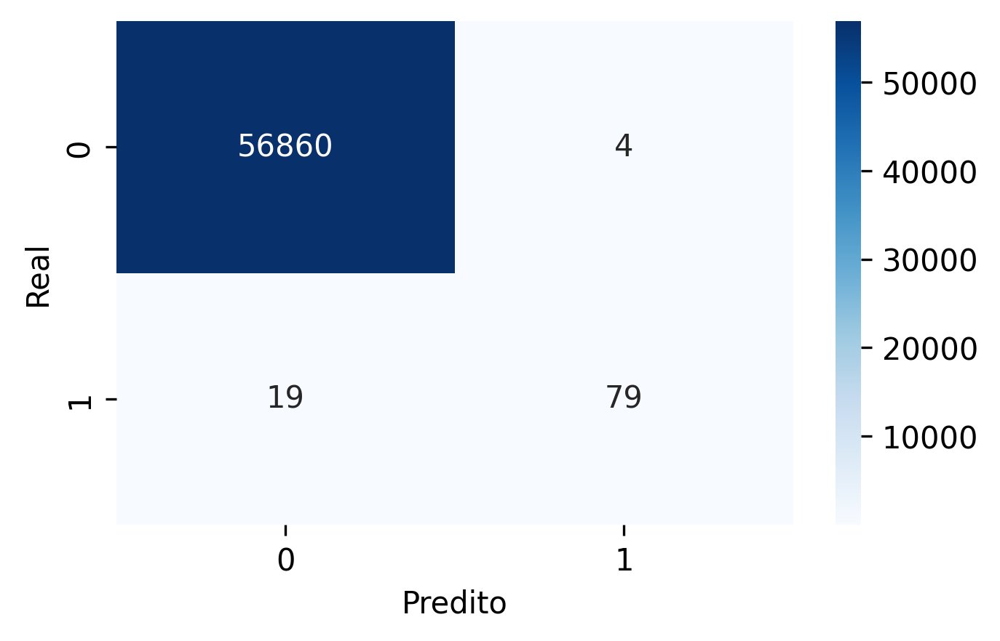
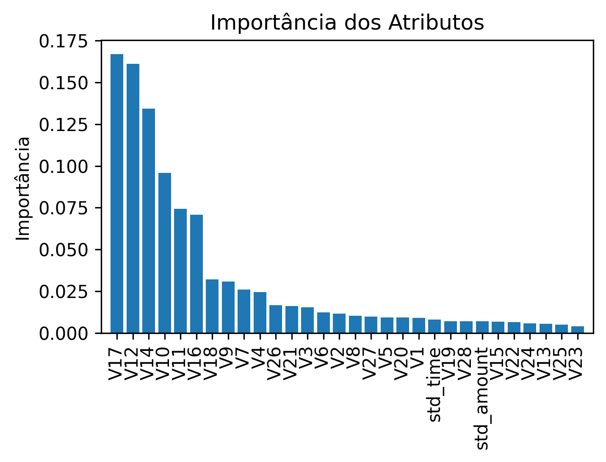

<h1>
<a href="https://www.dio.me/">
     </a>
    <span>Detecção de Anomalias em Transações em Python</span>
</h1>

Olá, galera! 👋 do GitHub e da ciência dos dados, venho compartilhar um projeto incrível que eu fiz. 🌟

## :computer: Desafio
Neste projeto, tivemos como desafio usar a linguagem Python para desenvolver uma solução eficiente para detectar fraudes em transações bancárias. Como estamos lidando com um dataset desbalanceado e um problema delicado de recall, precisamos de uma abordagem cuidadosa.

Para o desenvolvimento do projeto utilizei vibe coding. No arquivo `anomalias.ipynb` se encontra os comentários gerados com auxílio de IA e os códigos para o desenvolvimento do desafio. Além de utilizar o Gemini no navegador da internet para iniciar o projeto e descrever o dataset, utilizei os modelos locais `qwen2.5-coder:3b` e `qwen2.5-coder:7b` com a extensão `Continue` no vscode. 

## 📊 Sobre o Dataset

O projeto utiliza o dataset **Credit Card Fraud Detection**, composto por transações financeiras realizadas por cartões de crédito em setembro de 2013 por titulares europeus.

*   **Natureza dos Dados:** O conjunto contém transações que ocorreram em dois dias, onde foram registradas **492 fraudes** em meio a **284.807 transações**.
*   **Desbalanceamento Extremo:** A classe positiva (fraudes) representa apenas **0,172%** de todos os dados, o que exige estratégias específicas de amostragem (como SMOTE ou Undersampling).
*   **Privacidade e Variáveis:** Devido a questões de confidencialidade, as features originais foram transformadas utilizando **PCA (Análise de Componentes Principais)**. As colunas resultantes são nomeadas de `V1` a `V28`. As únicas variáveis que não passaram pelo PCA são:
    *   `Time`: Segundos decorridos entre cada transação e a primeira transação no conjunto de dados.
    *   `Amount`: Valor da transação (essencial para análises de custo-benefício).
    *   `Class`: Variável alvo, onde `1` indica fraude e `0` indica transação legítima.


---

### Por que este dataset é um desafio?
Trabalhar com este arquivo não é apenas sobre "treinar um modelo", mas sobre saber lidar com o **falso negativo**. Em detecção de fraude, deixar uma transação criminosa passar (falso negativo) é muito mais caro para a instituição do que bloquear uma transação legítima por engano (falso positivo). Por isso, o foco do projeto está na otimização da métrica **Recall** e no **AUPRC (Area Under the Precision-Recall Curve)**.

## :bulb: O que Fiz
Na fase inicial, carregamos o dataset do [Kaggle](https://www.kaggle.com/datasets/mlg-ulb/creditcardfraud?resource=download) (já pré-processado via PCA) e normalizamos as colunas `Time` e `Amount`. Essas são operações comuns no pré-processamento dos dados. 🔄

Após isso, enfrentamos o desafio de lidar com a falta de equilíbrio nas classes do nosso conjunto de dados. 

<p align="center">
  
</p>

Usando técnicas avançadas como SMOTE (Oversampling) conseguimos balancear as classes sem violar as leis da ética dos dados. 🎯

## Modelos e Métricas
Para resolver este problema utilizamos o modelo **Random Forest** e para otimizar os hiperparâmetros do nosso modelo, integramos o `imbalanced-learn` no Pipeline do Scikit-Learn usando Optuna. O objetivo é garantir que nosso modelo esteja bem ajustado e que não ocorra *data leakage*. ✨

```python
# Pipeline: SMOTE + Modelo
pipeline = ImbPipeline([
    ('smote', SMOTE(random_state=42)),
    ('classifier', RandomForestClassifier(n_estimators=n_estimators, max_depth=max_depth, n_jobs=-1))
])

# Validação cruzada focando em Precision-Recall AUC
score = cross_val_score(pipeline, X_train, y_train, cv=3, scoring='average_precision').mean()
```
## Avaliação Final
Depois de encontrar os melhores parâmetros com o Optuna, treinamos o modelo final e visualizamos a **Matriz de Confusão** para entender melhor como nosso modelo está desempenhando. 📈

<p align="center">
  
</p>
Por fim, calculamos as importâncias das características usando o método Feature Importance do RandomForestClassifier e visualizamos isso em um gráfico de barras para analisar quais recursos têm mais impacto na previsão. 🔄

<p align="center">
  
</p>

## Resultados
Os resultados foram bastante satisfatórios! Nossos modelos conseguiram detectar com precisão as fraudes, equilibrando bem a recall e a precisão. 🎉

```bash
              precision    recall  f1-score   support

           0       1.00      1.00      1.00     56864
           1       0.95      0.81      0.87        98

    accuracy                           1.00     56962
   macro avg       0.98      0.90      0.94     56962
weighted avg       1.00      1.00      1.00     56962
```
---

Espero que vocês tenham gostado deste projeto! Se tiverem alguma dúvida ou quiserem contribuir, sinta-se à vontade para abrir um pull request ou comentar aqui no GitHub. Obrigado por seguir até o fim!

#GitHub #CiênciaDeDados #MachineLearning