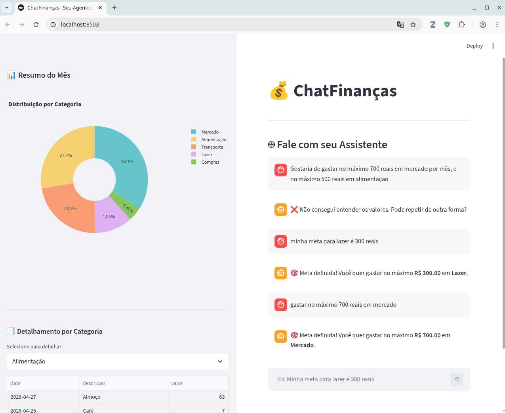
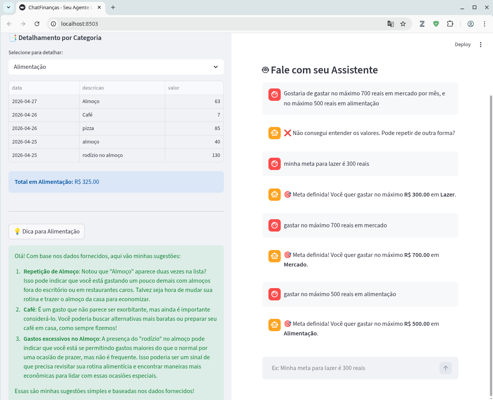
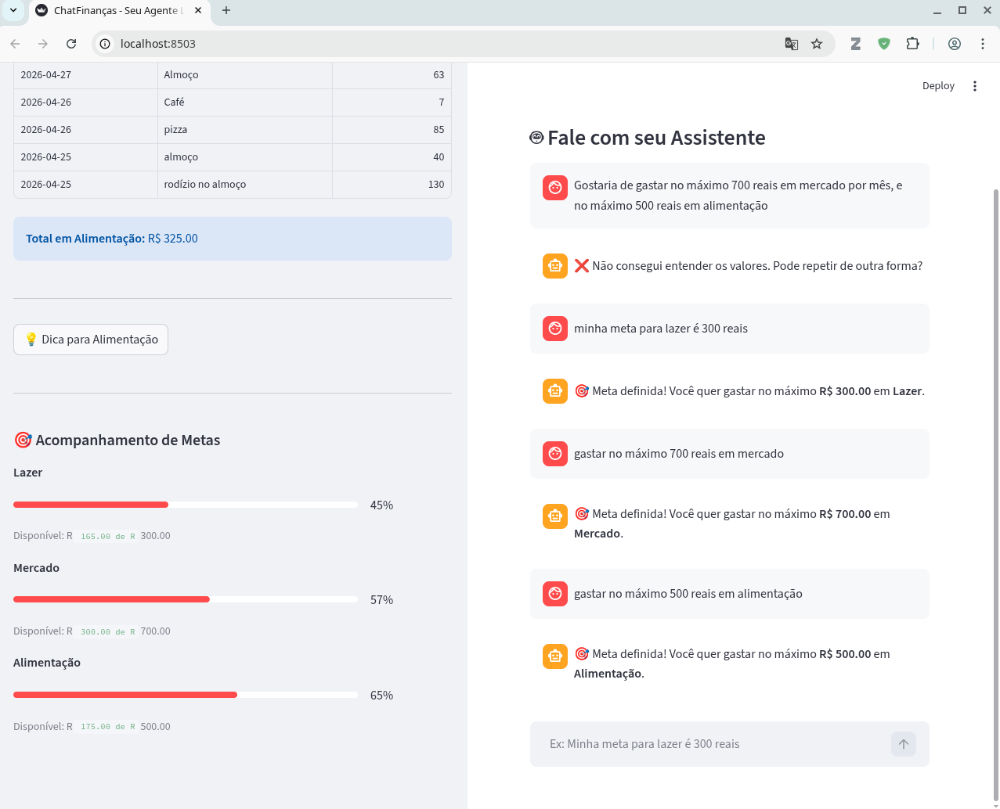

<h1>
<a href="https://www.dio.me/">
     </a>
    <span>App de Organização de Finanças Pessoais com Vibe Coding</span>
</h1>

# 💰 ChatFinanças: Assistente Financeiro com IA Local (Ollama)

Este projeto foi desenvolvido como um desafio de **Vibe Coding** pela [DIO](https://www.dio.me/). O objetivo é criar um assistente inteligente que organiza suas finanças através de conversas naturais, eliminando planilhas chatas. O projeto foi desenvolvido com o uso da IA **Gemini** e um teste local codado com o **Windsurf** no **vscode**. O projeto foi executado localmente com LLM **Ollama** e banco de dados **SQLite**.

## 🌟 Diferenciais
- **Privacidade Total:** Graças ao **Ollama**, nenhum dado financeiro sai da máquina do usuário.
- **Vibe Coding:** Desenvolvido de forma iterativa utilizando **Windsurf** e **Gemini** para acelerar o ciclo de vida do software.
- **Interface Reativa:** Dashboard dinâmico que atualiza conforme a conversa flui.

## 🚀 Funcionalidades
1. **Registro Natural:** "Gastei 50 reais com pizza" vira um registro automático no banco.
2. **Gestão de Metas:** Definição de limites por categoria via chat (ex: "Minha meta para lazer é 300 reais").
3. **Dicas Inteligentes:** Consultoria financeira baseada nos itens reais consumidos pelo usuário.
4. **Dashboard de Performance:** Gráfico de pizza para visão macro e tabelas filtradas para auditoria detalhada.

## 🛠️ Stack Tecnológica
- **Linguagem:** Python 3.12 (Gerenciado por `uv`)
- **Interface:** [Streamlit](https://streamlit.io/)
- **Processamento de Linguagem:** [Ollama](https://ollama.ai/) (Modelo: Llama 3.1:8b)
- **Banco de Dados:** SQLite
- **Gráficos:** Plotly

## ⚙️ Configuração do Ambiente

### 1. Pré-requisitos
- Ter o **Ollama** instalado e rodando.
- Baixar o modelo necessário: `ollama run llama3.1:8b`

### 2. Instalação

Utilize o `uv` para uma instalação ultra-rápida das dependências:

Abra seu terminal na pasta raiz e execute os seguintes comandos para isolar o ambiente e instalar as dependências iniciais:

```bash
# Cria a pasta do projeto
$ mkdir AppFinancasPessoais
$ cd AppFinancasPessoais

# Inicializa o projeto com uv
$ uv init

# Adiciona as dependências principais
$ uv add streamlit ollama pandas matplotlib plotly

# Cria o ambiente virtual e sincroniza
$ uv venv
$ source .venv/bin/activate
```

---

## Estrutura do Projeto

No seu VS Code, a estrutura deve ficar assim:

```text
AppFinancasPessoais/
├── data/               # Banco de Dados SQLite (ignorado no git ou vazio)
├── src/
│   ├── app.py          # Interface Streamlit (Frontend/Backend)
│   ├── database.py     # Camada de Dados (SQLite)
│   └── agent.py        # Lógica da IA (Ollama/LangChain)
├── pyproject.toml      # Configurações do uv
├── README.md           # Documentação Principal
└── requirements.txt    # Gerado via 'uv export' para compatibilidade
```

## 📄 Product Requirements Document (PRD)

### 1. Visão Geral
O **ChatFinanças** é um assistente financeiro "zero-friction". Em vez de preencher campos, o usuário "desabafa" suas finanças. O sistema utiliza processamento de linguagem natural (NLP) local para extrair entidades e intenções.

### 2. User Stories (Histórias de Usuário)
* **Como iniciante**, quero dizer "Gastei R$ 45 no almoço" e ver isso categorizado como 'Alimentação' automaticamente.
* **Como poupador**, quero perguntar "Quanto ainda posso gastar este mês?" e receber uma resposta baseada no meu saldo e metas.
* **Como usuário preocupado com privacidade**, quero que todos os meus dados financeiros e conversas sejam processados localmente no meu hardware.

### 3. Requisitos Funcionais (RF)
* **RF01 - Extração de Entidades:** O sistema deve identificar *Valor*, *Categoria* (ou sugerir uma) e *Data* a partir de texto livre.
* **RF02 - Memória de Contexto:** O agente deve lembrar que "almoço" geralmente refere-se à categoria "Alimentação" para aquele usuário específico.
* **RF03 - Dashboard Sintético:** Visualização rápida de gastos por categoria e progresso de metas via gráficos simples (Barra/Pizza).
* **RF04 - Agente Proativo:** O chat deve sugerir economias se detectar padrões de gastos excessivos em categorias não essenciais.

### 4. Requisitos Não Funcionais (RNF)
* **RNF01 - Latência:** Respostas do chat devem ocorrer em menos de 2 segundos (otimizado para rodar via Ollama na GPU local).
* **RNF02 - Persistência:** Dados armazenados em SQLite local para garantir portabilidade e privacidade.

---

## 🏗️ Plano de MVP (Mínimo Produto Viável)

O objetivo do MVP é validar se a IA consegue converter frases soltas em registros financeiros confiáveis sem a necessidade de intervenção manual constante.

### Fase 1: O "Cérebro" (Processamento de Linguagem)
* **Tecnologia:** Ollama + Llama 3.
* **Tarefa:** Criar um *System Prompt* que force o modelo a responder apenas em JSON estruturado.
* **Exemplo de Entrada:** "Paguei 120 reais de internet agora pouco"
* **Exemplo de Saída:** `{"valor": 120.00, "descricao": "internet", "categoria": "Contas Fixas", "data": "2026-04-26"}`

### Fase 2: A "Interface" (Experiência do Usuário)
* **Telas do App:**
    1. **Chat Principal:** Input de texto e histórico de mensagens com o agente.
    2. **Extrato Inteligente:** Uma tabela simples com os últimos gastos extraídos.
    3. **Painel de Metas:** Um card mostrando `%` de uso do orçamento mensal.

### Fase 3: Validação Inicial
* **Teste de "Estresse" de Linguagem:** Testar gírias e variações (ex: "morri em 50 conto na padaria", "cinquentão pro Uber").
* **Consistência de Dados:** Verificar se o SQLite está salvando corretamente os tipos numéricos para não causar erros de cálculo no dashboard.

---

## Teste de persistência de dados

Utilizando o Windsurf chat no vscode, utilizei o prompt citando arquivos do projeto:

> Use as funções de database.py e agent.py para criar um script de teste que processe a frase 'Comprei um café por 7 reais no débito' e salve no banco".

Resposta: 
> Claro! Aqui está um exemplo de como você pode usar as funções `parse_input` do `agent.py` e `add_transaction` do `database.py` para criar um script de teste que processe a frase 'Comprei um café por 7 reais no débito' e salve no banco:
> 
> ```python
> from agent import FinanceAgent
> from database import FinanceDB
> 
> def test_script():
>     finance_agent = FinanceAgent()
>     finance_db = FinanceDB()
> 
>     user_text = "Comprei um café por 7 reais no débito"
>     json_data = finance_agent.parse_input(user_text)
>     if json_data:
>         finance_db.add_transaction(
>             valor=json_data["valor"],
>             descricao=json_data["descricao"],
>             categoria=json_data["categoria"],
>             data=json_data["data"],
>             tipo=json_data["tipo"]
>         )
>         print("Transação salva com sucesso!")
>     else:
>         print("Falha ao processar a frase.")
> 
> if __name__ == "__main__":
>     test_script()
> ```
> 
> Certifique-se de ter importado corretamente as funções necessárias e de que você está usando as instâncias corretas das classes `FinanceAgent` e `FinanceDB`. Além disso, verifique se você está usando o caminho correto para o banco de dados no construtor da classe `FinanceDB`.

Após rodar o script `src/test_integração.py`, o banco de dados `data/financas.db` deverá ter um novo registro de transação com o seguinte conteúdo:
```bash
$ sqlite3 data/financas.db "SELECT * FROM transacoes;"
╭────┬───────┬───────────┬─────────────┬────────────┬─────────╮
│ id │ valor │ descricao │  categoria  │    data    │  tipo   │
╞════╪═══════╪═══════════╪═════════════╪════════════╪═════════╡
│  1 │   7.0 │ Café      │ Alimentação │ 2026-04-26 │ despesa │
╰────┴───────┴───────────┴─────────────┴────────────┴─────────╯
```

## Funcionamento e Prints da interface

O assistente funcionou como esperado, com uma interface dinâmica e gráficos interativos. Classifica os gastos por categoria e mostra o progresso de metas. Além disso consegue fornecer dicas de economia para a categoria selecionada. 

<p align="center"></p>


Para gerar dicas, adicionamos o seguinte método na classe do `src/agent.py`:

```python
def gerar_dicas_economia(self, resumo_gastos):
        """
        Gera dicas estritamente baseadas na categoria e itens fornecidos.
        """
        prompt = f"""
        Você é um Analista de Dados Financeiros. 
        Sua tarefa é dar conselhos baseados EXCLUSIVAMENTE nos dados fornecidos abaixo.
        
        DADOS DE GASTOS:
        {resumo_gastos}
        
        REGRAS:
        1. NÃO sugira nada sobre categorias que não estão nos DADOS acima (ex: se não houver transporte nos dados, não fale de transporte).
        2. Analise os ITENS específicos listados.
        3. Dê 2 ou 3 dicas práticas e curtas.
        4. Responda em português de forma direta.

        CONSELHO:
        """

        try:
            # Usando o parâmetro system para reforçar o comportamento (se o modelo suportar)
            response = ollama.generate(
                model=self.model, 
                system="Você é um assistente que nunca inventa informações fora do contexto fornecido.",
                prompt=prompt
            )
            return response['response']
        except Exception as e:
            return "Erro ao processar dicas."
```

<p align="center"></p>

<p align="center"></p>
