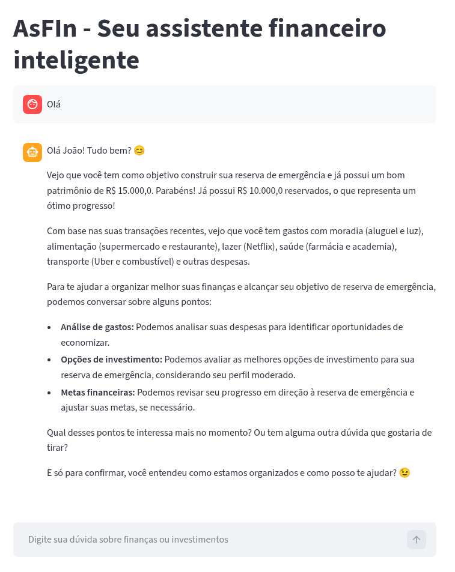
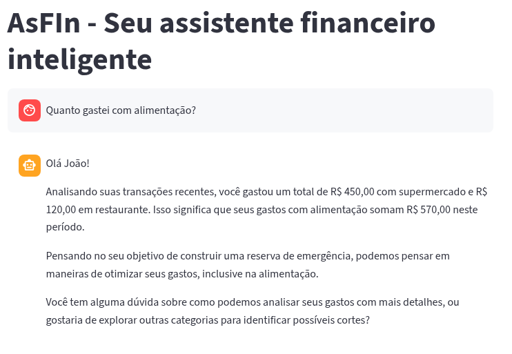

<h1>
<a href="https://www.dio.me/">
     </a>
    <span>Agente Financeiro Inteligente com IA Generativa</span>
</h1>
 
## Contexto

Os assistentes virtuais no setor financeiro estão evoluindo de simples chatbots reativos para **agentes inteligentes e proativos**. Neste desafio, você vai idealizar e prototipar um agente financeiro que utiliza IA Generativa para:

- **Antecipar necessidades** ao invés de apenas responder perguntas
- **Personalizar** sugestões com base no contexto de cada cliente
- **Cocriar soluções** financeiras de forma consultiva
- **Garantir segurança** e confiabilidade nas respostas (anti-alucinação)

---

## AsFIn - Assistente Financeiro Inteligente

O agente de finança pessoal foi desenvolvido seguindo o passo a passo apresentado pelo instrutor e como base foi utilizado os [templates](https://github.com/digitalinnovationone/dio-lab-bia-do-futuro) fornecidos pelo DIO.

O modelo de LLM foi executado localmente utilizando o Ollama com o modelo `gemma3:12b-it-qat`.

 O agente foi desenvolvido com o objetivo de responder perguntas sobre finanças pessoais e explicar produtos financeiros para iniciantes de uma forma educativa.

## Estrutura do Repositório

```
📁 AssistenteIA/
│
├── 📄 README.md
│
├── 📁 data/                          # Dados mockados para o agente
│   ├── historico_atendimento.csv     # Histórico de atendimentos (CSV)
│   ├── perfil_investidor.json        # Perfil do cliente (JSON)
│   ├── produtos_financeiros.json     # Produtos disponíveis (JSON)
│   └── transacoes.csv                # Histórico de transações (CSV)
│
├── 📁 docs/                          # Documentação do projeto
│   ├── 01-documentacao-agente.md     # Caso de uso e arquitetura
│   ├── 02-base-conhecimento.md       # Estratégia de dados
│   ├── 03-prompts.md                 # Engenharia de prompts
│   └── 04-metricas.md                # Avaliação e métricas
│   
└── 📁 src/                           # Código da aplicação
    └── app.py                        
```
---


## Aplicação Funcional

A aplicação funcional se encontra na pasta:

📁 [`src/`](./src/)

Após instalar todas as dependências, 

```bash
$ pip install pandas streamlit requests
```

rodar o aplicativo

```bash
# Rodar a aplicação
$ streamlit run app.py
```

A aplicação foi desenvolvida usando o streamlit como interface e rodando o modelo `gemma3:12b-it-qat` localmente com o Ollama.

### Exemplo de execução

<p align="center">

</p>

<p align="center">

</p>
---

O modelo funcionou bem e sem alucinações. A documentação do agente pode ser encontrada na pasta :file_folder: [`docs/`](./docs/).