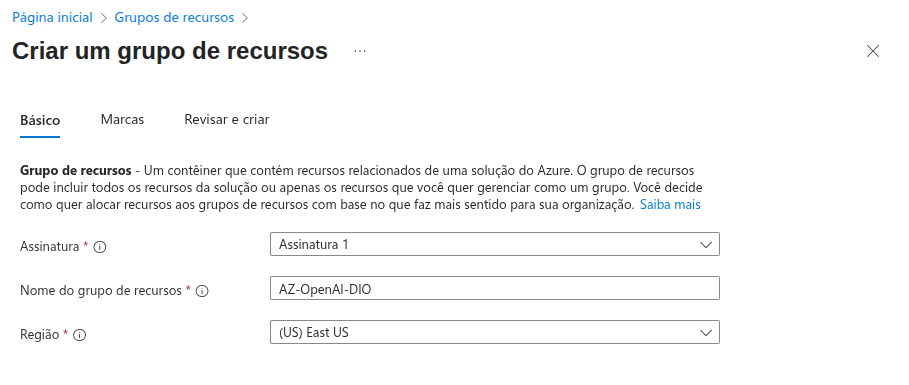
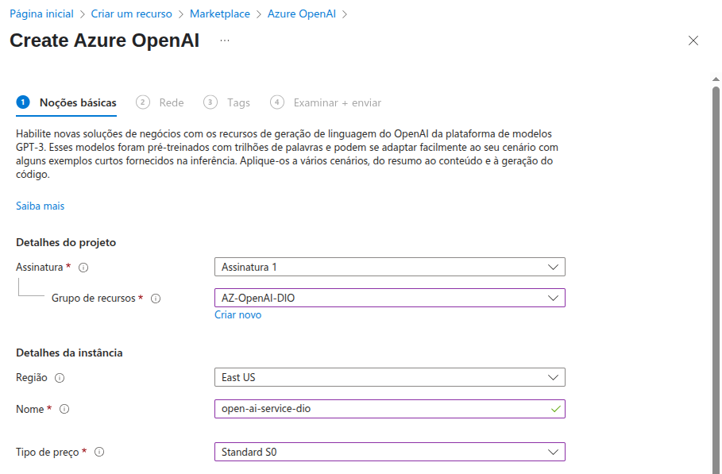
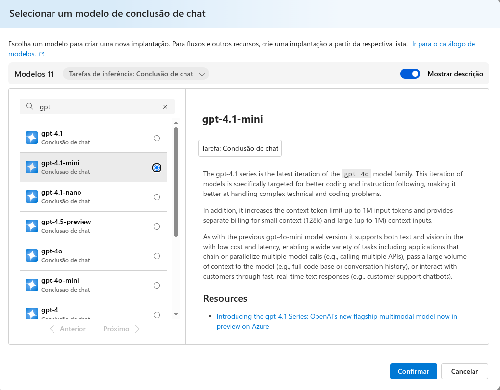
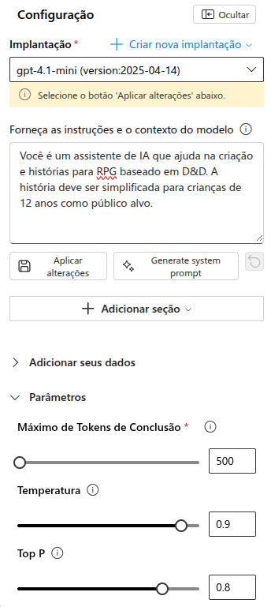
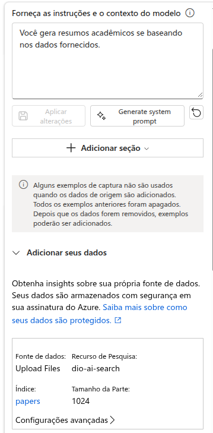
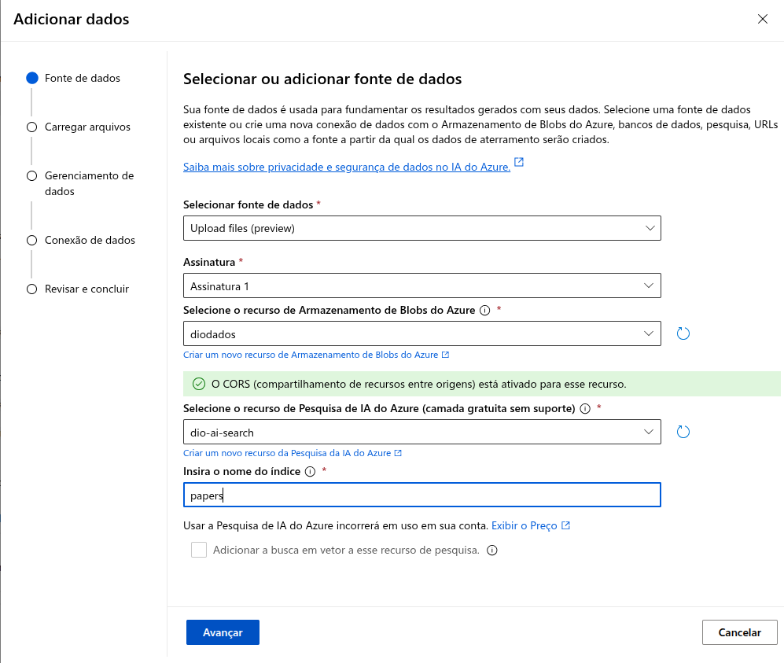
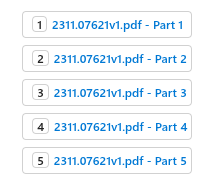
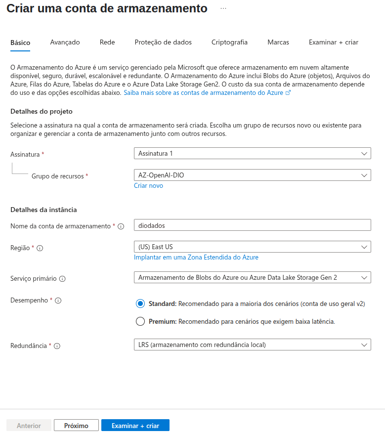
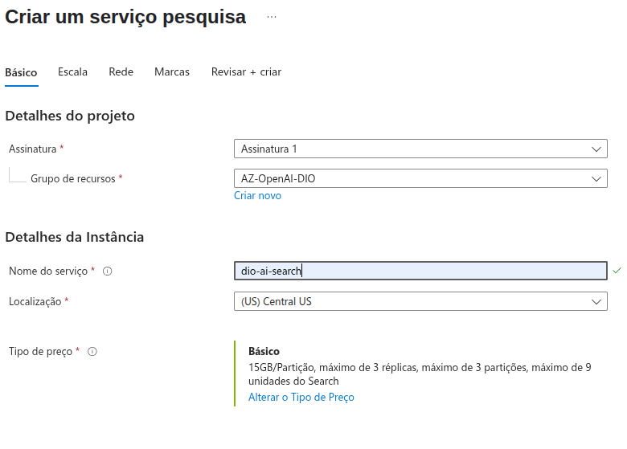

<h1>

    Projeto Azure OpenAI no PlayGround
</h1>

# :computer: Descrição

O objetivo deste desafio é utilizar o Playground do Azure OpenAI para gerar conteúdos e compreender as diferentes configurações e parâmetros

# :pencil: Parâmetros LLM, conteúdo gerado com [Microsoft Copilot](copilot.microsoft.com)

No Azure OpenAI Service, ao interagir com modelos de linguagem, você pode ajustar alguns parâmetros para personalizar as respostas geradas. Aqui estão os principais:

1. **Temperatura** (`temperature`): Esse parâmetro controla o nível de aleatoriedade da saída do modelo. Valores mais baixos (como 0.1) tornam as respostas mais determinísticas e previsíveis, enquanto valores mais altos (como 0.8 ou 1.0) fazem com que o modelo gere respostas mais criativas e variadas.

2. **Top-P (nucleus sampling)** (`top_p`): Em vez de definir aleatoriedade diretamente, o top-p ajusta a probabilidade acumulada das palavras consideradas. Um valor de 0.1 significa que o modelo só escolherá entre as palavras que compõem 10% da probabilidade total, gerando respostas mais seguras. Um valor de 0.9 permite mais diversidade.

3. **Max Tokens** (`max_tokens`): Define o número máximo de tokens que podem ser gerados na resposta. Tokens podem ser palavras inteiras ou partes delas, então aumentar ou reduzir esse número afeta o tamanho da resposta.

4. **Frequency Penalty** (`frequency_penalty`): Esse parâmetro reduz a probabilidade do modelo repetir palavras ou frases já mencionadas. Valores mais altos desencorajam a repetição excessiva.

5. **Presence Penalty** (`presence_penalty`): Diferente da frequency penalty, esse parâmetro incentiva o modelo a introduzir novos tópicos e palavras, tornando a resposta mais diversificada.

Esses parâmetros são cruciais para moldar o comportamento do modelo e podem ser ajustados de acordo com a necessidade da aplicação.

Claro! Aqui estão três exemplos práticos com justificativas para diferentes configurações de parâmetros no Azure OpenAI Service:

### 1️⃣ **Chatbot de Atendimento ao Cliente (Respostas Precisas e Objetivas)**
**Configuração:**
- `temperature = 0.2`
- `top_p = 0.1`
- `max_tokens = 100`
- `frequency_penalty = 0.5`
- `presence_penalty = 0.3`

**Justificativa:**  
Um chatbot de suporte precisa fornecer respostas claras, confiáveis e diretas. Ao definir **temperature** baixa, garantimos que o modelo seja mais determinístico e mantenha um tom consistente. O **top_p** reduz a variação, evitando respostas ambíguas. Um limite de **max_tokens** impede que as respostas sejam muito extensas e o **frequency_penalty** ajuda a evitar repetições desnecessárias. O **presence_penalty** é baixo para evitar a introdução de termos irrelevantes.

---

### 2️⃣ **Assistente Criativo para Geração de Histórias (Respostas Criativas e Variadas)**
**Configuração:**
- `temperature = 0.9`
- `top_p = 0.8`
- `max_tokens = 500`
- `frequency_penalty = 0.2`
- `presence_penalty = 1.2`

**Justificativa:**  
Aqui, queremos estimular a criatividade, então usamos uma **temperature** alta para respostas mais inesperadas e diversificadas. O **top_p** elevado permite maior variação sem perder a coerência. O **max_tokens** maior dá espaço para desenvolver histórias mais ricas. Um **frequency_penalty** baixo evita que o modelo limite suas escolhas por repetição e o **presence_penalty** alto incentiva a introdução de novas ideias e enredos inovadores.

---

### 3️⃣ **Gerador de Resumos Acadêmicos (Respostas Concisas e Informativas)**
**Configuração:**
- `temperature = 0.3`
- `top_p = 0.2`
- `max_tokens = 150`
- `frequency_penalty = 0.6`
- `presence_penalty = 0.4`

**Justificativa:**  
Para um bom resumo, precisamos de respostas diretas e bem organizadas. A **temperature** baixa evita respostas criativas demais, focando na precisão. O **top_p** menor ajuda a manter um tom técnico e confiável. O **max_tokens** limita o tamanho para manter a concisão. O **frequency_penalty** mais alto impede repetições desnecessárias e o **presence_penalty** médio mantém a variedade sem introduzir tópicos irrelevantes.

# :bulb: Solução do desafio

## Criando o grupo de recursos

## Criando o serviço OpenAI 

## Usando o chat Playground no Azure AI Foundry

### Implementando o modelo gpt-4.1-mini

## Chatbot gerador de histórias 

Aqui vou utilizar o chat para gerar campanha de RPG para crianças de 12 anos. O modelo precisa ser criativo e ter linguagem adequada. Escolhi os parâmetros:  

**Configuração:**
- `temperature = 0.9`
- `top_p = 0.8`
- `max_tokens = 500`
- `frequency_penalty = 0.2`
- `presence_penalty = 1.2`

### Resultado

>**Prompt**: Desenvolva uma campanha  em que um grupo de amigos, logo após se cadastrarem numa guilda de aventureiros, descobrem que sua vila natal está sendo atacada por um grupo de goblins. Eles chegam atrasados para descobrir a vila destruída e precisam resgatar os moradores. 
>
>**Resposta**: Claro! Aqui está uma campanha simples e divertida para crianças de 12 anos, baseada na sua ideia:
> 
>#### Campanha: **O Resgate da Vila Perdida**
>
>#### Introdução:
>Um grupo de amigos acaba de se juntar à Guilda dos Aventureiros, um lugar onde heróis treinam para proteger o mundo. Logo no seu primeiro dia, eles recebem uma notícia urgente: sua vila natal está sendo atacada por goblins!
>
>#### Capítulo 1: Chegando Tarde
>Os aventureiros correm até a vila, mas chegam atrasados. Eles encontram casas queimadas e ruas vazias. Alguns moradores foram levados pelos goblins! Agora, os amigos precisam encontrar pistas para descobrir onde os goblins estão escondendo os moradores.
>
>* Objetivo: Encontrar pistas na vila destruída (pegadas, objetos deixados para trás, um diário perdido).
> 
>#### Capítulo 2: Na Trilha dos Goblins
>Com as pistas em mãos, o grupo segue uma trilha que leva até a floresta próxima. No caminho, enfrentam pequenos desafios como atravessar um rio ou evitar armadilhas feitas pelos goblins.
>
>* Objetivo: Superar obstáculos naturais e chegar ao esconderijo dos goblins.
> 
>#### Capítulo 3: O Esconderijo dos Goblins
>Finalmente, os aventureiros encontram a caverna onde os goblins estão mantendo os moradores presos. Eles devem trabalhar juntos para derrotar os goblins e libertar seus amigos e familiares.
>
>* Objetivo: Derrotar os goblins e resgatar os moradores.
> 
>#### Conclusão:
>Com todos seguros, o grupo volta para a vila para ajudar a reconstruir e proteger sua casa. Eles são celebrados como verdadeiros heróis da guilda!
> 
>Se quiser, posso ajudar a criar detalhes dos personagens, monstros ou desafios para essa aventura!

## Chatbot resumos acadêmicos

Para gerar resumos acadêmicos o chatbot deve ser mais direto e preciso. Para isso escolhi os parâmetros: 

**Configuração:**
- `temperature = 0.3`
- `top_p = 0.2`
- `max_tokens = 800`
- `frequency_penalty = 0.6`
- `presence_penalty = 0.4`

E adicionei dois artigos como dados. 

- [Attention Is All You Need
](https://arxiv.org/abs/1706.03762)
- [To Transformers and Beyond: Large Language Models for the Genome
](https://arxiv.org/abs/2311.07621)

### Resultado:

>**Prompt**: Faça um resumo em português brasileiro do modelo dos transformers e suas apicações para o genoma.
>
>**Resposta**:
>Os transformers são uma arquitetura de redes neurais introduzida em 2017, composta por camadas empilhadas de mecanismos de autoatenção (self-attention), que permitem relacionar diferentes posições dentro de uma sequência para construir sua representação. Diferentemente das redes recorrentes (RNNs), os transformers eliminam a recorrência, utilizando atenção para capturar dependências globais, o que possibilita o processamento paralelo em GPUs e supera limitações computacionais das RNNs  1 .  
>   
>Na genômica, os transformers são aplicados principalmente de duas formas: como parte de modelos híbridos, que combinam transformers com outras camadas para compressão e extração de características, e como modelos de linguagem de grande escala (LLMs) específicos para sequências genômicas. Os modelos híbridos são usados para tarefas como predição de dados experimentais (ex.: ChIP-seq, expressão gênica), enquanto os LLMs genômicos são treinados para entender e gerar sequências biológicas, podendo prever anotações regulatórias, acessibilidade cromatínica, e outras características funcionais do DNA  2  3  4 .  
>   
>O mecanismo de atenção dos transformers é especialmente valioso para o genoma, pois permite captar interações de longo alcance em sequências de DNA que podem se estender por dezenas de milhares de pares de bases, superando limitações das abordagens anteriores baseadas em convoluções ou recorrência. No entanto, a atenção direta base a base em sequências genômicas muito longas ainda é desafiadora devido a restrições computacionais e de memória, o que leva ao uso de estratégias como atenção aplicada a características extraídas por convoluções dilatadas antes dos módulos transformer  1  5 .  
>   
>Além disso, avanços recentes incluem módulos de transformação espacial que incorporam informações contextuais maiores e camadas especializadas (como a camada Hyena) que ampliam o contexto sequencial enquanto reduzem a dimensionalidade dos dados, melhorando a eficiência e a capacidade preditiva dos modelos  2 .  
>   
>Em resumo, os transformers revolucionaram a modelagem genômica ao permitir a análise eficiente de sequências longas e complexas, oferecendo uma nova perspectiva para entender a organização e a regulação do genoma, com aplicações que vão desde a predição de elementos regulatórios até a anotação funcional de dados de sequenciamento  3  4 .

O chatbot inclusive retorna as citações:

Para Adicionarmos os dados foi necessário criar um serviço de armazenamento

e um serviço de pesquisa de IA

