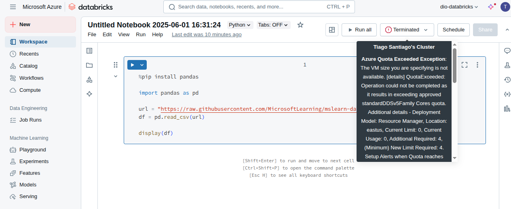

<h1>

    Controle e Versionamento de Código no Notebook da Azure
</h1>

# :computer: Descrição

Explorar o Azure Databricks e explorar versões de código de notebooks.

# :bulb: Solução do desafio

Conclui o curso [Explorar o Azure Databricks](https://learn.microsoft.com/pt-br/training/modules/explore-azure-databricks/)

## Criando um workspace do databricks

Agora é possível acessar o Azure Databricks portal

## Criando um cluster

## Rodando um notebook

O cluster estava indisponível e não foi possível rodar o notebook no Databricks.

É possível acessar o [histórico do notebook](https://docs.databricks.com/aws/pt/notebooks/notebook-version-history) e restaurar versões anteriores ou fazer [integração com o Git](https://docs.databricks.com/aws/pt/repos/). 

No arquivo `test_notebook.ipynb` exploro o arquivo do [link fornecido no tutorial](https://raw.githubusercontent.com/MicrosoftLearning/mslearn-databricks/main/data/products.csv)

