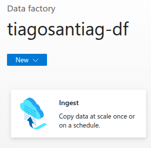
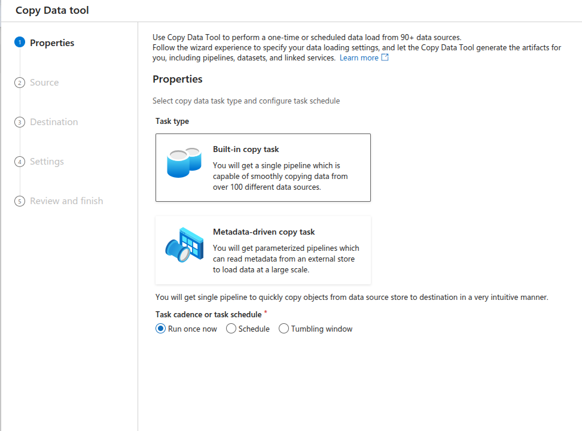
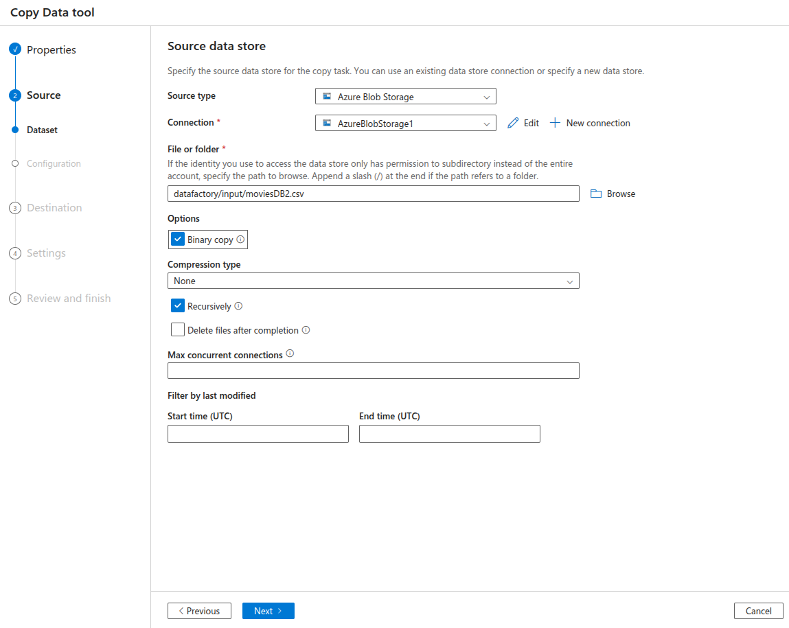
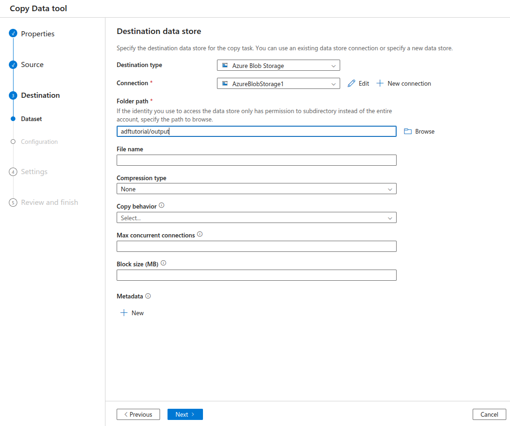
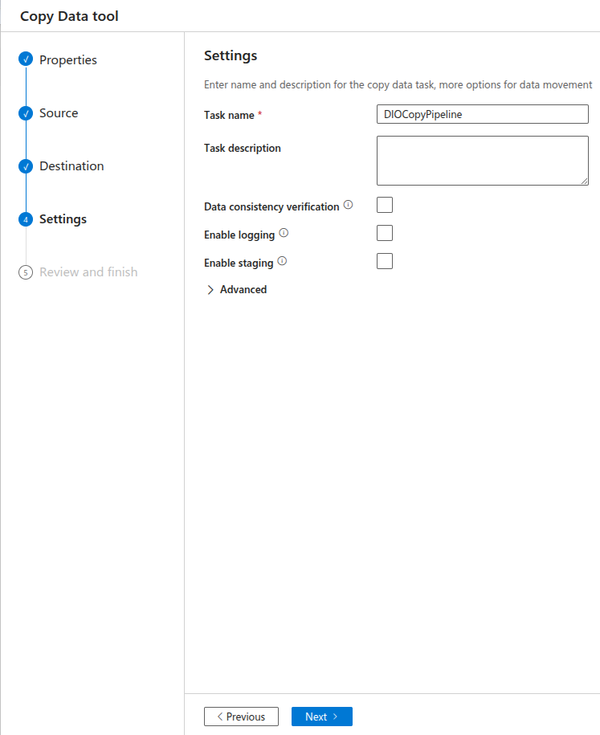
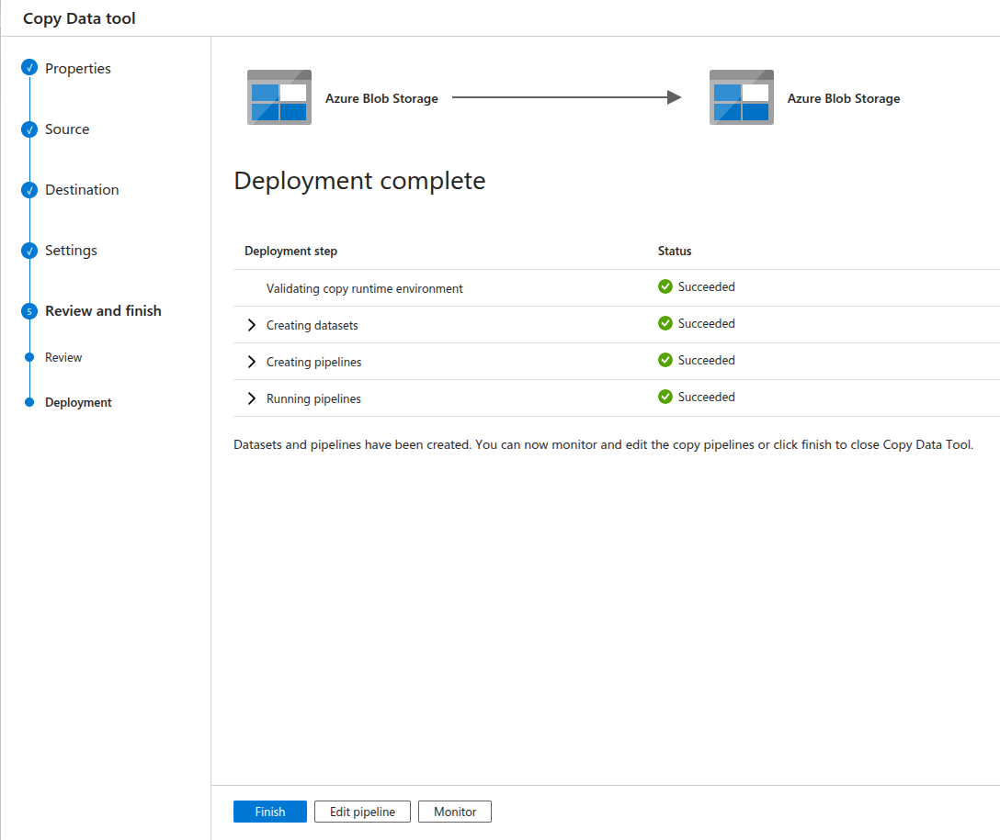
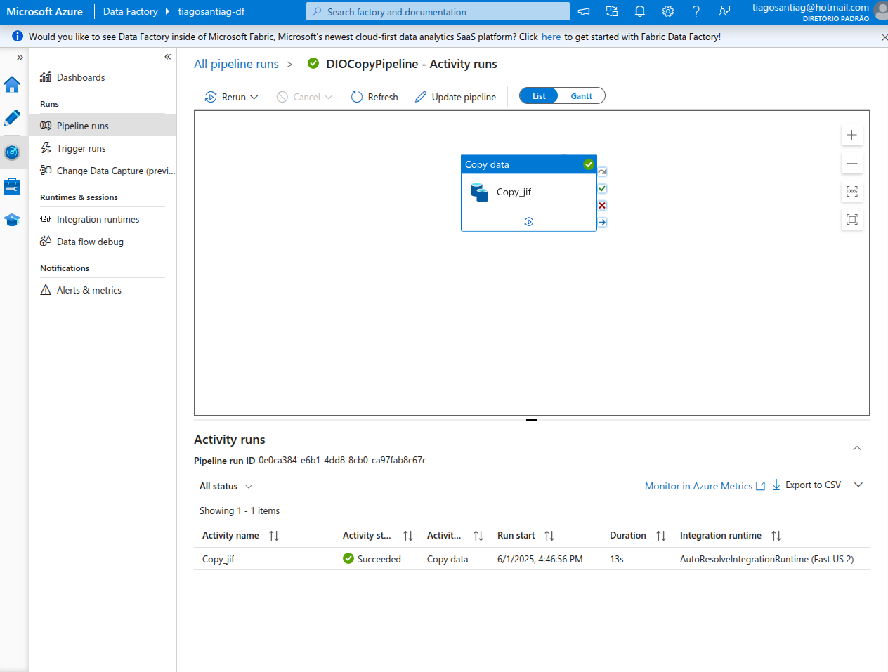
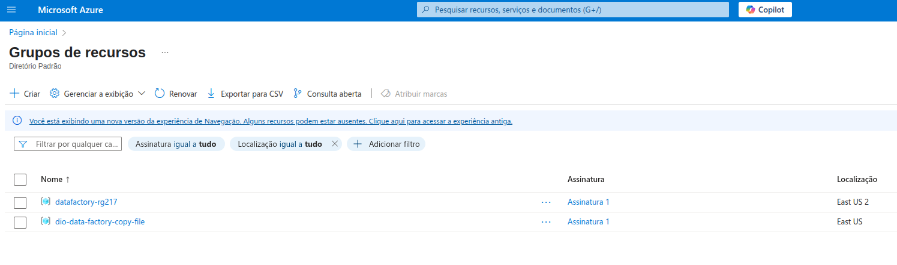

<h1>

    Criando Processos de Redundância de Arquivos na Azure
</h1>

# :computer: Descrição

O objetivo desse desafio é se familiarizar com o Azure Data Factory e entender o processo de criar redundância de arquivos fazendo cópia de diferentes fontes de dados. Vou seguir o tutorial da microsoft learn:

* [Use a ferramenta Copiar dados no Azure Data Factory Studio para copiar dados](https://learn.microsoft.com/en-us/azure/data-factory/quickstart-hello-world-copy-data-tool)

Para copiar arquivos de um blob storage da Azure.

# :bulb: Solução do desafio

1. Preparando dados seguindo o [template do tutorial](https://portal.azure.com/#create/Microsoft.Template/uri/https%3A%2F%2Fraw.githubusercontent.com%2FAzure%2Fazure-quickstart-templates%2Fmaster%2Fquickstarts%2Fmicrosoft.datafactory%2Fdata-factory-copy-data-tool%2Fazuredeploy.json), o arquivo moviesDB2.csv é armazenado em uma pasta chamada input no Armazenamento de Blobs.

2. Criando um data factory seguindo o tutorial [criar uma fábrica de dados](https://learn.microsoft.com/en-us/azure/data-factory/quickstart-create-data-factory).

3. Acessar o data Factory Studio e selecionar o tipo de tarefa de ingestão

4. Criando tarefa de cópia de dados

5. Criando nova conexão

6. Configurando fonte de arquivo

7. Configurando destino do arquivo

8. Nomeando a tarefa

9. Implantando

10. Observando a pipeline no monitor

11. Excluir os grupos de recursos para evitar cobranças adicionais

