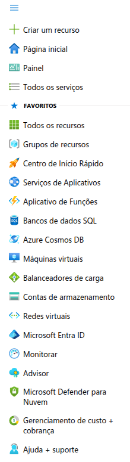

<h1>

    Microsoft Azure - Localizando Serviços por Categoria
</h1>

# :computer: Descrição

O objetivo deste desafio é explorar o portal do Azure e localizar serviço por categorias.

# :pencil: Principais recurso no Portal do Azure

O portal do Azure oferece uma ampla gama de recursos organizados por categoria para facilitar a busca e o gerenciamento de serviços na nuvem. Aqui estão algumas das principais categorias e seus respectivos recursos:

- **Computação**: Máquinas virtuais, Kubernetes, funções sem servidor.
- **Armazenamento**: Blobs, discos gerenciados, arquivos e bancos de dados.
- **Redes**: VPN, balanceadores de carga, CDN e firewalls.
- **Segurança**: Identidade e acesso, proteção contra ameaças, conformidade.
- **DevOps**: Pipelines de CI/CD, repositórios Git, monitoramento de aplicativos.
- **Internet das Coisas (IoT)**: Hub IoT, análise de dados em tempo real.
- **Inteligência Artificial e Machine Learning**: Serviços de IA, aprendizado de máquina, visão computacional.
- **Gerenciamento e Governança**: Monitoramento, automação, políticas de conformidade.
- **Desenvolvimento Web e Móvel**: Aplicações web, APIs, desenvolvimento multiplataforma.

Você pode explorar mais detalhes sobre cada categoria diretamente no [portal do Azure](https://azure.microsoft.com/pt-br/products/category).

No menu de acesso rápido já observamos alguns dos principais recursos, podendo modificar o menu personalizando os favoritos.

## :robot: Serviços em versão prévia

Os recursos em versão prévia no Azure são funcionalidades que ainda estão em fase de testes antes do lançamento oficial. Eles permitem que os usuários experimentem novas capacidades e ofereçam feedback à Microsoft. No entanto, há alguns pontos importantes a considerar ao utilizá-los:

- **Estabilidade**: Como ainda estão em desenvolvimento, podem apresentar instabilidades ou mudanças inesperadas.
- **Suporte**: O suporte técnico pode ser limitado, e algumas versões prévias exigem aprovação para acesso.
- **Termos de Uso**: Os recursos em versão prévia estão sujeitos a termos específicos, que podem incluir restrições quanto ao uso em produção.
- **Segurança e Conformidade**: Algumas versões prévias podem não atender a requisitos regulatórios ou de segurança elevados.
- **Atualizações**: A Microsoft pode exigir atualizações obrigatórias para manter a funcionalidade do recurso.

Se você deseja testar um recurso em versão prévia, é recomendável fazê-lo em um ambiente de desenvolvimento ou teste, evitando implementações críticas em produção. Você pode gerenciar versões prévias diretamente no portal do Azure.