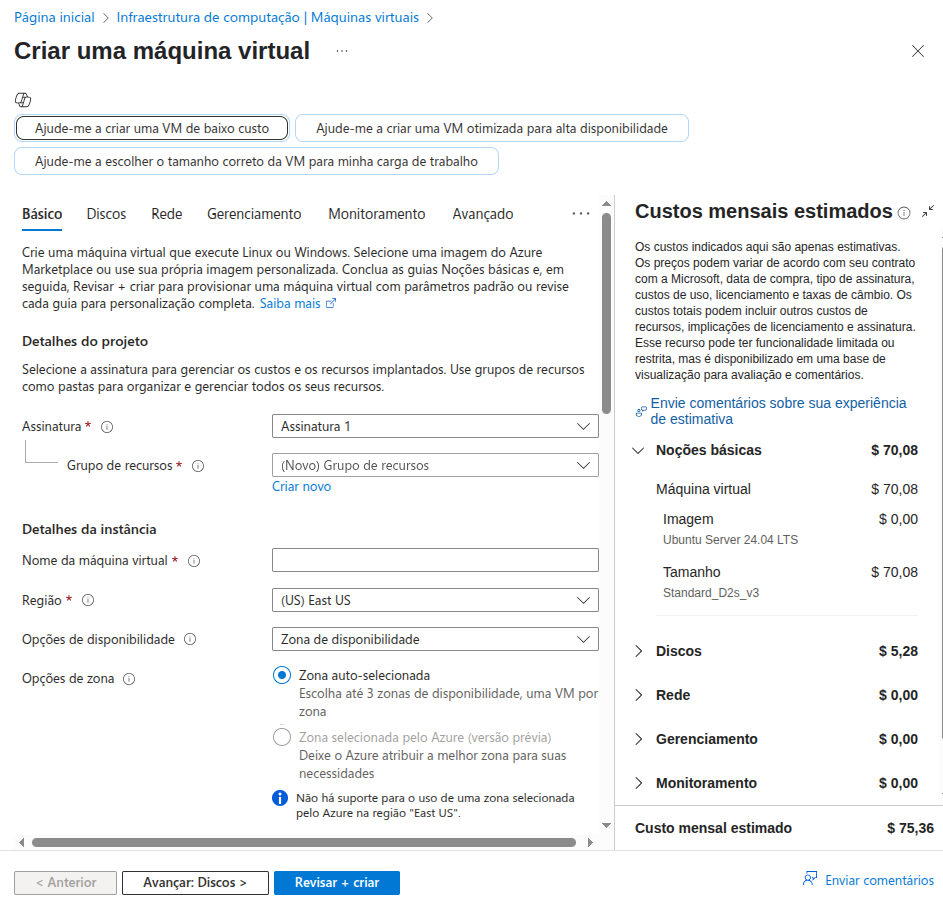

<h1>

    Microsoft Azure - Criando máquinas Virtuais na Azure
</h1>

# :computer: Descrição

O objetivo deste desafio é se familiarizar com o portal do Azure, descrever os SLAs, redundância de dados para serviços de armazenamento e criação de máquina virtual. 

# :pencil: Service Level Agreements

Os **SLAs (Service Level Agreements)** da Azure definem os níveis de disponibilidade e desempenho garantidos para os serviços em nuvem. Eles são fundamentais para garantir a confiabilidade das aplicações e estabelecer expectativas claras entre a Microsoft e os clientes.

### **Principais Elementos dos SLAs**
- **Disponibilidade (Uptime)**: Percentual garantido de tempo que o serviço estará operacional. Exemplo:
  - **99,9%** de disponibilidade significa que o serviço pode ficar indisponível por até **8,76 horas por ano**.
  - **99,99%** reduz esse tempo para **52,56 minutos por ano**.
- **Desempenho**: Tempo de resposta dos servidores e latência.
- **Suporte Técnico**: Tempo de resposta e canais de atendimento em caso de falhas.
- **Penalidades**: Compensações caso o provedor não cumpra o SLA, como descontos ou créditos.
- **Escopo dos Serviços**: Quais serviços estão cobertos pelo SLA e quais não estão.

### **Exemplos de Indicação**
1. **Aplicações Críticas** (Exemplo: sistemas financeiros) → Recomendado **99,99%** de disponibilidade para minimizar interrupções.
2. **Serviços Web** (Exemplo: e-commerce) → **99,9%** pode ser suficiente, garantindo alta disponibilidade sem custos excessivos.
3. **Ambientes de Desenvolvimento e Teste** → SLAs mais flexíveis, pois interrupções não impactam usuários finais.

# :pencil: Redundância em contas de armazenamento

O Azure oferece várias opções de **redundância** para contas de armazenamento, garantindo **disponibilidade e proteção contra falhas**. Aqui estão as principais opções e seus casos de uso recomendados:

### **Redundância na Região Primária**
1. **LRS (Locally Redundant Storage)** – Replicação dentro de um único datacenter na região primária.
   - **Caso recomendado**: Aplicações de baixo custo que não exigem alta disponibilidade.
   
2. **ZRS (Zone-Redundant Storage)** – Replicação síncrona em três zonas de disponibilidade na região primária.
   - **Caso recomendado**: Aplicações que precisam de alta disponibilidade dentro da mesma região.

### **Redundância na Região Secundária**
3. **GRS (Geo-Redundant Storage)** – Replicação assíncrona para uma região secundária distante.
   - **Caso recomendado**: Proteção contra falhas regionais, mas sem acesso imediato aos dados replicados.

4. **GZRS (Geo-Zone-Redundant Storage)** – Combina ZRS na região primária com replicação para uma região secundária.
   - **Caso recomendado**: Aplicações críticas que precisam de alta disponibilidade e recuperação de desastres.

5. **RA-GRS (Read Access Geo-Redundant Storage)** – Igual ao GRS, mas permite leitura dos dados na região secundária.
   - **Caso recomendado**: Aplicações que precisam de acesso de leitura aos dados replicados em caso de falha na região primária.

6. **RA-GZRS (Read Access Geo-Zone-Redundant Storage)** – Igual ao GZRS, mas com acesso de leitura na região secundária.
   - **Caso recomendado**: Aplicações que exigem máxima disponibilidade e recuperação de desastres com acesso imediato aos dados replicados.

Você pode conferir mais detalhes sobre redundância no [Microsoft Learn](https://learn.microsoft.com/pt-br/azure/storage/common/storage-redundancy). 

# :pencil: Máquinas virtuais 

As **máquinas virtuais (VMs)** no Azure são usadas para executar aplicativos e serviços em um ambiente de nuvem escalável, sem a necessidade de hardware físico. Elas são úteis para desenvolvimento, testes, hospedagem de sites, bancos de dados, processamento de dados e muito mais.

### **Como Criar e Configurar uma VM no Portal do Azure**
1. **Acesse o Portal do Azure** e vá para a seção de **Máquinas Virtuais**.
2. **Clique em "Criar"** e selecione **"Máquina Virtual do Azure"**.
3. **Configure os detalhes da instância**, incluindo nome, região e sistema operacional (Windows ou Linux).
4. **Escolha o tamanho da VM**, considerando CPU, memória e armazenamento necessários.
5. **Defina credenciais de acesso**, como nome de usuário e senha.
6. **Configure a rede**, incluindo IP público e regras de segurança.
7. **Revise e crie a VM**, aguardando a implantação.
8. **Acesse a VM** via **RDP (Windows)** ou **SSH (Linux)** para iniciar a configuração.

Durante o processo para criar e configurar a máquina virtual no portal do Azure vemos uma estimativa de custos.

