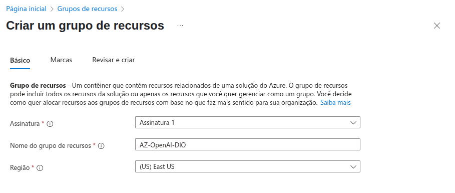
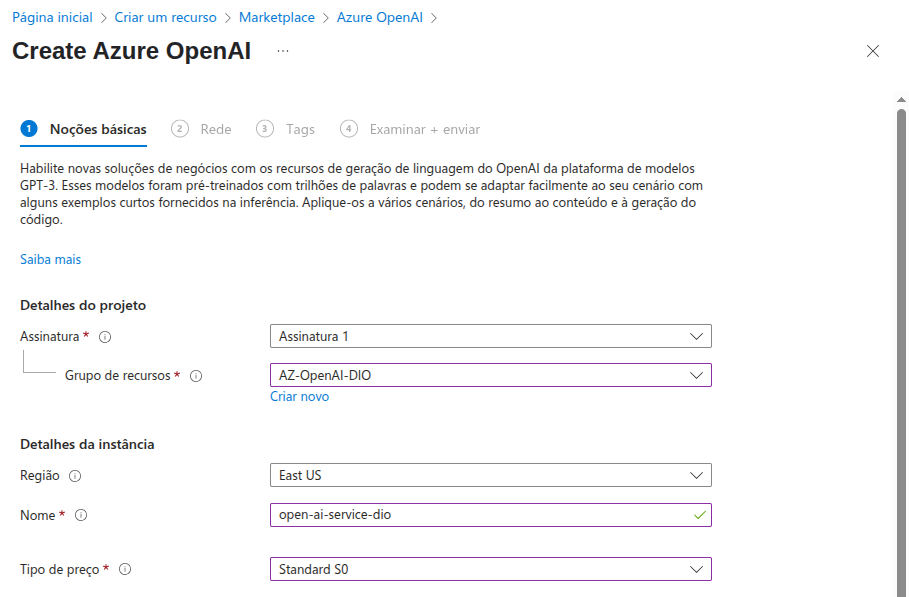
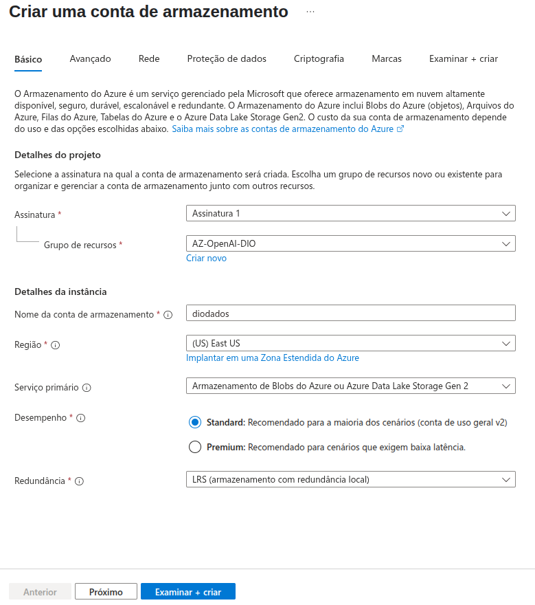
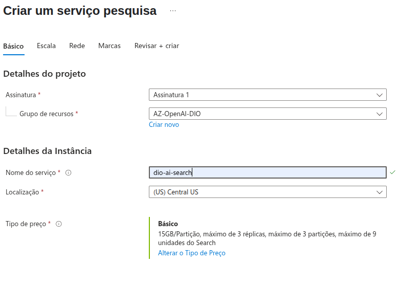
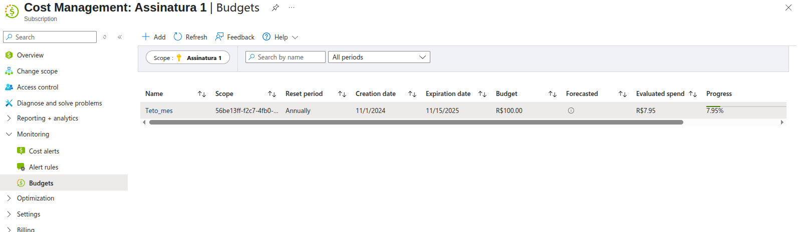

<h1>

    Criando Recursos no portal do Azure
</h1>

# :computer: Descrição

O objetivo deste desafio é explorar o portal do Azure e criar recursos e monitorar custos.

# :bulb: Solução do desafio

Após acessar o portal do Azure com uma assinatura ativa, o primeiro passo é criar um grupo de recursos que vai agregar todos os recursos os serviços que serão necessários para nossa aplicação. 

Nesse caso vou criar um serviço de IA do Azure, serviço de armazenamento e serviço de pesquisa de IA. Com isso, em um outro projeto, será possível utilizar o playground do Azure AI Foundry e criar chats com pesquisa em arquivos. 

## Criando o grupo de recursos

## Criando o serviço OpenAI 

## Criando o serviço de armazenamento

## Criando o serviço de pesquisa de IA

## Monitorando custos

Na aba gerenciamento de custos é possível acompanhar os gastos. No meu caso eu adicionei um orçamento para minha assinatura.

Também é possível adicionar o acompanhamento de custos a um dashboard, assim como criar alertas quando determinado valor de gastos é atingido.