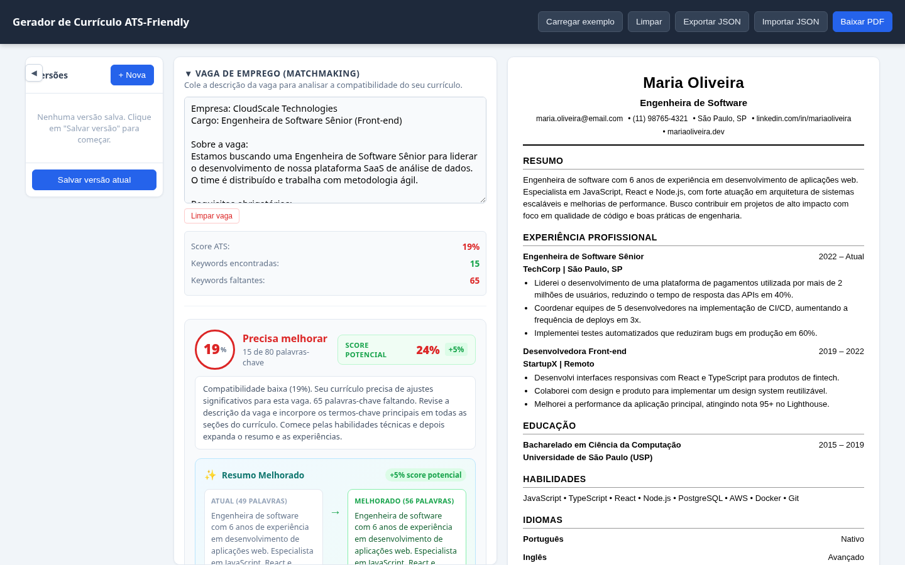
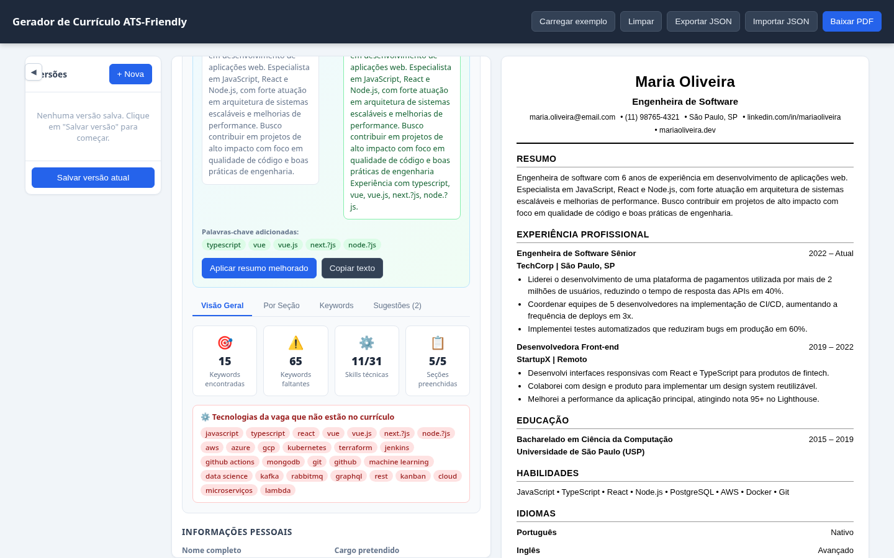
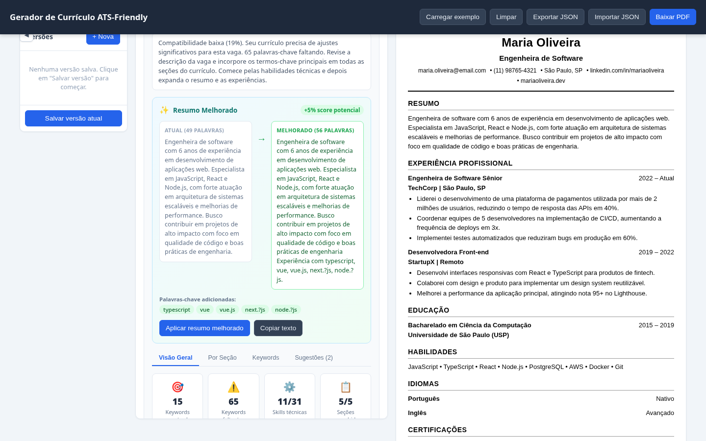
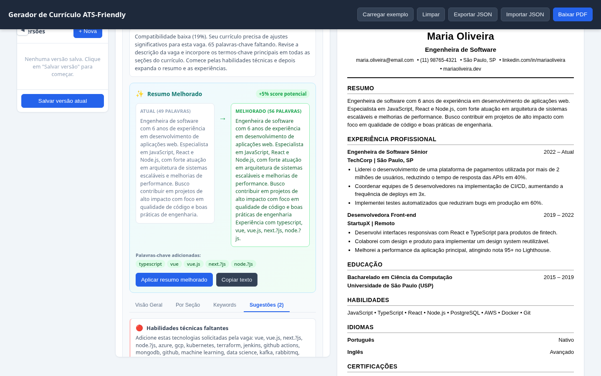

<h1>
<a href="https://www.dio.me/">
</a>
<span>Gerador de Currículos ATS Friendly - Matchmaking de Vagas</span>
</h1>


## 📌 Descrição

Aplicativo web para **geração de currículos otimizados para ATS (Applicant Tracking System)** com funcionalidade de **matchmaking de vagas de emprego**. O projeto permite que os usuários criem, editem e otimizem seus currículos para maximizar a compatibilidade com descrições de vagas específicas.

### Funcionalidades Principais

- **Editor de Currículo Completo**: Seções para dados pessoais, resumo profissional, experiência, educação, habilidades, idiomas e certificações
- **Análise ATS em Tempo Real**: Score de compatibilidade (0-100%) com a vaga de emprego
- **Matchmaking de Vagas**: Cole a descrição da vaga e receba análise detalhada de keywords
- **Resumo Melhorado com IA**: Geração automática de resumo otimizado para a vaga
- **Múltiplas Versões**: Salve diferentes versões do currículo para diferentes vagas
- **Exportação PDF**: Download direto do currículo em formato PDF otimizado para ATS
- **Persistência Local**: Auto-save no localStorage para não perder dados

## 🎯 Objetivo

O objetivo deste projeto é criar uma ferramenta que ajude profissionais de TI a:

1. **Otimizar currículos** para passar por sistemas de rastreamento de candidatos (ATS)
2. **Analisar compatibilidade** com vagas específicas antes de se candidatar
3. **Identificar keywords faltantes** que são importantes para a vaga
4. **Gerar versões personalizadas** do currículo para cada oportunidade
5. **Melhorar o resumo profissional** com palavras-chave relevantes

## 🧰 Tecnologias Utilizadas

| Tecnologia | Versão | Uso |
|------------|--------|-----|
| React | ^19.2.8 | Framework de interface |
| Vite | ^8.2.0 | Bundler e dev server |
| JavaScript (ES2022) | - | Linguagem principal |
| jsPDF | ^2.5.1 | Geração de PDF |
| html2canvas | ^1.4.1 | Captura de tela para PDF |
| Oxlint | ^1.75.0 | Linter |

## 🧠 Análise ATS e Matchmaking

### Como Funciona a Análise

O sistema de análise ATS funciona da seguinte forma:

1. **Extração de Keywords**: Identifica palavras-chave técnicas e comportamentais na descrição da vaga
2. **Análise por Seção**: Verifica a cobertura de keywords em cada seção do currículo
3. **Cálculo de Score**: Percentual de compatibilidade baseado nas keywords encontradas
4. **Geração de Sugestões**: Recomendações específicas para melhorar o currículo
5. **Resumo Melhorado**: Gera automoticamente um resumo otimizado com keywords faltantes

### Categorias de Análise

- **Visão Geral**: Cards com métricas principais
- **Por Seção**: Análise individual de cada seção do currículo
- **Keywords**: Lista completa de palavras-chave encontradas e faltantes
- **Sugestões**: Recomendações com justificativas e ações

## 🗂️ Estrutura do Projeto

```
CurriculoATSFriendly/
├── public/
│   ├── favicon.svg
│   └── icons.svg
├── src/
│   ├── components/
│   │   ├── PersonalSection.jsx      # Dados pessoais
│   │   ├── SummarySection.jsx       # Resumo profissional
│   │   ├── ExperienceSection.jsx    # Experiência profissional
│   │   ├── EducationSection.jsx     # Educação
│   │   ├── SkillsSection.jsx        # Habilidades
│   │   ├── LanguagesSection.jsx     # Idiomas
│   │   ├── CertificationsSection.jsx # Certificações
│   │   ├── ResumePreview.jsx        # Preview do currículo
│   │   ├── JobMatcher.jsx           # Input de vaga
│   │   ├── ATSScore.jsx             # Análise ATS
│   │   └── VersionSidebar.jsx       # Gerenciamento de versões
│   ├── utils/
│   │   ├── atsAnalyzer.js           # Lógica de análise ATS
│   │   ├── storage.js               # Persistência localStorage
│   │   └── pdfExport.js             # Exportação PDF
│   ├── data.js                      # Dados de exemplo
│   ├── utils.js                     # Utilitários gerais
│   ├── App.jsx                      # Componente principal
│   ├── App.css                      # Estilos da aplicação
│   ├── index.css                    # Estilos globais
│   └── main.jsx                     # Ponto de entrada
├── index.html
├── package.json
├── vite.config.js
└── README.md
```

## 🚀 Como Executar

### Pré-requisitos

- Node.js 18+ instalado
- npm ou yarn

### Instalação

```bash
# Baixar os arquivos do projeto

# Navegar até o diretório
cd CurriculoATSFriendly

# Instalar dependências
npm install

# Iniciar servidor de desenvolvimento
npm run dev
```

### Scripts Disponíveis

```bash
npm run dev      # Inicia servidor de desenvolvimento
npm run build    # Gera build de produção
npm run lint     # Executa linter (Oxlint)
npm run preview  # Visualiza build de produção
```

## 📸 Interface

### Tela Principal


### Análise ATS


### Resumo Melhorado


### Sugestões de Melhoria


## 🤖 Uso de Inteligência Artificial

> **Observação**: Este projeto foi desenvolvido com o auxilio de **Inteligência Artificial (IA)** através da ferramenta **OpenCode**. A IA foi utilizada para:
>
> - **Geração de código**: Implementação de componentes React, lógica de análise ATS e funcionalidades de matchmaking
> - **Refatoração**: Melhoria de código existente e implementação de padrões melhores
> - **Documentação**: Criação de documentação técnica e README
> - **Debugging**: Identificação e correção de erros
> - **Arquitetura**: Definição de estrutura de componentes e fluxo de dados
>
> A IA atuou como uma ferramenta de auxílio ao desenvolvimento, cabendo ao desenvolvedor as decisões de arquitetura, design e validação do código gerado.

## 📋 Funcionalidades Detalhadas

### Editor de Currículo
- Dados pessoais (nome, cargo, email, telefone, LinkedIn, website)
- Resumo profissional
- Experiência profissional com descrições detalhadas
- Educação (graduação, pós-graduação)
- Habilidades técnicas (input dinâmico)
- Idiomas com nível de proficiência
- Certificações profissionais

### Análise ATS
- Score de compatibilidade em tempo real (0-100%)
- Identificação automática de keywords técnicas
- Análise por seção do currículo
- Sugestões específicas de melhoria
- Score potencial com resumo melhorado

### Matchmaking de Vagas
- Input para descrição completa da vaga
- Extração de habilidades técnicas solicitadas
- Comparação com currículo atual
- Lista de keywords encontradas vs. faltantes
- Recomendações de palavras-chave para adicionar

### Gerenciamento de Versões
- Salvar versões com nome personalizado
- Duplicar versões existentes
- Renomear e excluir versões
- Score salvo para cada versão
- Restauração rápida de versões anteriores

## 🎨 Design

- **Interface Responsiva**: Layout adaptável para desktop e mobile
- **Design System**: Cores e tipografia consistentes
- **ATS-Friendly**: Currículo renderizado em formato limpo para sistemas de rastreamento
- **Acessibilidade**: Componentes com suporte a navegação por teclado

## 🔧 Configuração

### Vite Config
```javascript
import { defineConfig } from 'vite'
import react from '@vitejs/plugin-react'

export default defineConfig({
  plugins: [react()],
})
```

### Oxlint Config (`.oxlintrc.json`)
```json
{
  "rules": {
    "no-unused-vars": "warn",
    "no-console": "warn"
  }
}
```

## 🔗 Links Úteis

- [Documentação React](https://react.dev/)
- [Vite Documentation](https://vitejs.dev/)
- [ATS Optimization Guide](https://www.indeed.com/career-advice/resumes-cover-letters/ats-resume-template)
- [DIO - Digital Innovation One](https://www.dio.me/)

---

<p align="center">
  Desenvolvido com ❤️ e 🤖 durante o Bootcamp DIO
</p>
