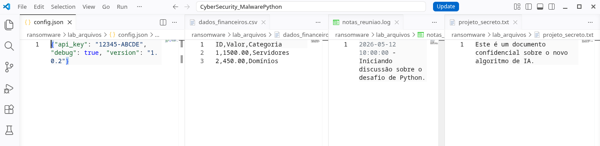
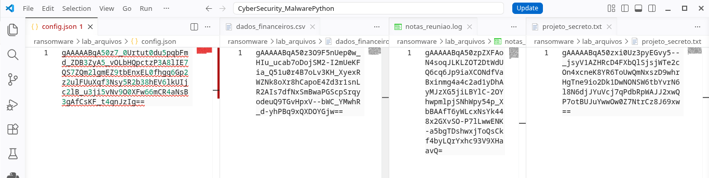

<h1>
<a href="https://www.dio.me/">
     </a>
    <span>Simulando um Malware de Captura de Dados Simples em Python e Aprendendo a se Proteger</span>
</h1>

# Descrição do projeto

Este projeto foi desenvolvido como um desafio prático de Cybersegurança no bootcamp da **DIO**. O objetivo é simular, de forma controlada e ética, o comportamento de ameaças digitais para entender como elas operam e, principalmente, como podemos nos defender.

> **⚠️ AVISO LEGAL:** Este projeto tem fins estritamente educativos. O uso desses scripts em ambientes sem autorização prévia é ilegal e antiético. Os testes devem ser realizados apenas na pasta `lab_arquivos` incluída neste repositório.

---

## 🏗️ Estrutura do Projeto

```text
CyberSecurity_MalwarePython/
├── ransomware/
│   ├── malware_encrypt.py # Script de criptografia
│   ├── create_files.py    # Script para criar os arquivos
│   └── decryptor.py       # Script de recuperação
├── keylogger/
│   ├── keylogger.py       # Captura de teclas e exfiltração
│   └── .logs_secretos.txt # Arquivo de log (oculto)
└── README.md              # Documentação e análise de defesa
```

---

## 🛠️ Tecnologias e Ferramentas

* **Linguagem:** Python 3.12+
* **Criptografia:** `cryptography` (Fernet - AES-128)
* **Monitoramento de I/O:** `pynput`
* **Comunicação:** `smtplib` (SMTP para exfiltração de dados)

---

## 🧪 Simulações Realizadas

### 1. Ransomware Simulado

O script utiliza criptografia simétrica para tornar os arquivos da pasta de laboratório inacessíveis.

* **Mecanismo:** Varredura recursiva de diretórios e sobrescrita de arquivos com dados cifrados.
* **Chave:** Uma chave única é gerada localmente (`chave.key`). Em ataques reais, essa chave seria enviada para um servidor remoto (C2).

#### Criando arquivos para teste de ransomware

Rodando o script `ransomware/create_files.py` para gerar os arquivos para teste:
```bash 
$ python ransomware/create_files.py 
✅ Laboratório configurado em: ransomware/lab_arquivos
📄 4 arquivos criados para teste.
```

<p aligin=center>

</p>

#### Criptografando os arquivos
```bash
$ python ransomware/malware_encrypt.py                                       
🔒 Arquivo cifrado: projeto_secreto.txt
🔒 Arquivo cifrado: dados_financeiros.csv
🔒 Arquivo cifrado: config.json
🔒 Arquivo cifrado: notas_reuniao.log
```

<p aligin=center>

</p>

Conteúdo do arquivos LEIA_ME.txt:

```
⚠️ TODOS OS SEUS ARQUIVOS FORAM CRIPTOGRAFADOS! ⚠️
Para recuperar seus dados, envie 1.0 BTC para a carteira XYZ.
Ou apenas execute o script decryptor.py para fins didáticos. 😉
```

#### Restaurando os arquivos

``` bash
$ python ransomware/decryptor.py                   
🔓 Arquivo recuperado: projeto_secreto.txt
🔓 Arquivo recuperado: dados_financeiros.csv
🔓 Arquivo recuperado: config.json
🔓 Arquivo recuperado: notas_reuniao.log

✅ Todos os arquivos foram restaurados com sucesso!
```

### 2. Keylogger e Exfiltração

O script monitora as interrupções do teclado para registrar cada tecla pressionada.

* **Furtividade:** O log é salvo em um arquivo oculto no sistema e enviado por e-mail após a interrupção do processo.
* **Vetor de Ataque:** Demonstra como dados sensíveis (senhas, conversas) podem ser roubados silenciosamente.

Eu não executei o keylogger, apenas deixando o código como referência. 

---

## 🛡️ Reflexão sobre Defesa e Prevenção

A melhor forma de combater essas ameaças é através de uma estratégia de **Defesa em Profundidade**.

### Medidas de Prevenção contra Ransomware

1. **Backups Offline (3-2-1):** Ter cópias de segurança fora da rede principal é a única forma garantida de recuperação sem pagar o resgate.
2. **EDR (Endpoint Detection and Response):** Ferramentas que monitoram o comportamento do sistema. Um EDR detectaria o `malware_encrypt.py` ao notar um processo desconhecido editando múltiplos arquivos em alta velocidade.
3. **Princípio do Menor Privilégio:** Usuários comuns não devem ter permissão de escrita em pastas críticas do sistema.

### Medidas de Prevenção contra Keyloggers

1. **Firewall de Saída:** Bloquear conexões SMTP (porta 587/465) para aplicativos não autorizados impediria que o `keylogger.py` enviasse os logs para o atacante.
2. **Teclados Virtuais e 2FA:** O uso de autenticação de dois fatores (2FA) torna as senhas capturadas por keyloggers inúteis, pois o código de acesso expira rapidamente.
3. **Análise Heurística:** Antivírus modernos identificam o "hooking" de teclado (uso de APIs como `pynput`) como uma atividade suspeita.

---
