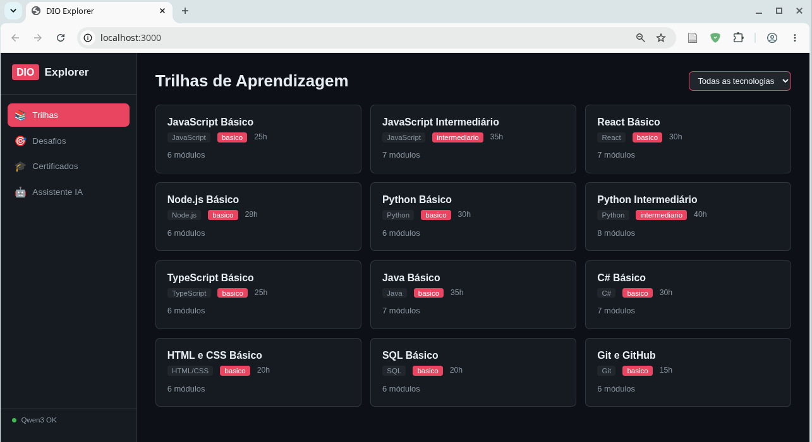
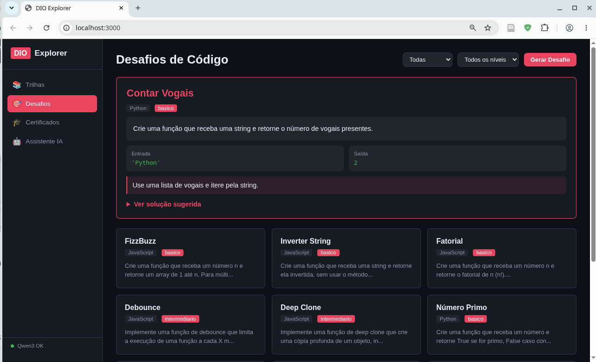
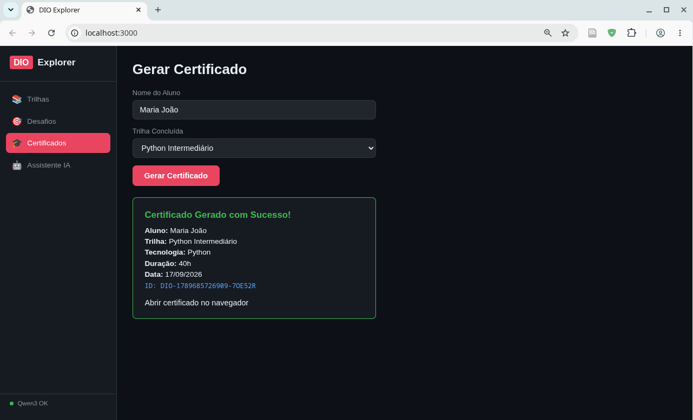
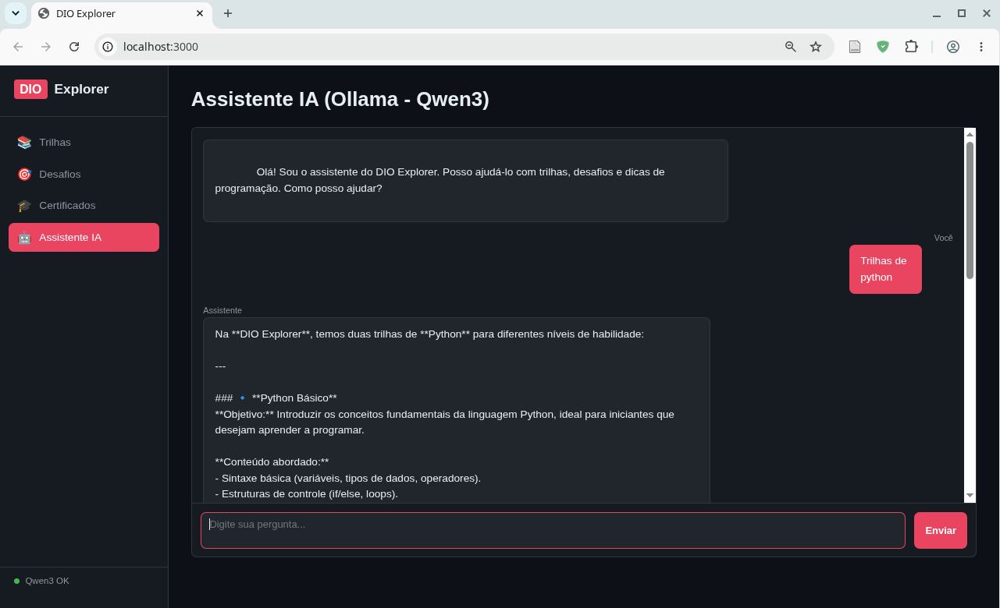

<h1>
<a href="https://www.dio.me/">
</a>
<span>Construindo Seu Primeiro Produto com um Agente de IA</span>
</h1>

## ⚠️ Disclaimer - Uso de Inteligência Artificial

> Este projeto foi desenvolvido com auxílio de ferramentas de Inteligência Artificial, incluindo o **OpenCode** como agente de código e o **Ollama (Qwen3 14B)** como assistente de IA integrado à interface gráfica. O código gerado, a documentação e os testes foram revisados e adaptados manualmente para garantir qualidade e correção. As respostas do assistente IA no chat da GUI são geradas por um modelo de linguagem local e podem conter imprecisões — use-as como referência, não como verdade absoluta.

## 📌 Descrição

**DIO Explorer** é uma plataforma completa de aprendizagem de programação com interface gráfica, assistente de IA local via Ollama, CLI, MCP Server e Agent interativo. Explore trilhas de estudo, resolva desafios de código e gere certificados fictícios.

### Funcionalidades Principais

| Funcionalidade | Descrição |
|----------------|-----------|
| **GUI Web** | Interface gráfica completa com trilhas, desafios, certificados e chat IA |
| **Assistente IA** | Chat com Ollama (modelo Qwen3) para tirar dúvidas sobre programação |
| **CLI** | Comandos de linha de comando para trilhas, desafios e certificados |
| **MCP Server** | Servidor Model Context Protocol para integração com IAs externas |
| **Agent** | Assistente interativo via terminal com linguagem natural |

## 🖼️ Interface Gráfica

### Trilhas de Aprendizagem


### Desafios de Código


### Gerador de Certificados


### Assistente IA (Ollama - Qwen3)


## 🎯 Objetivo

Criar uma experiência completa de aprendizagem onde a pessoa usuária pode:
- Explorar trilhas de estudo por tecnologia via interface gráfica
- Receber desafios de código com soluções sugeridas
- Gerar certificados fictícios em HTML e JSON
- Conversar com um assistente de IA local para dúvidas de programação
- Usar comandos CLI para automação e scripts

## 🧰 Tecnologias Utilizadas

- **Node.js** - Runtime JavaScript
- **Express** - Servidor web para a GUI
- **Ollama** - LLM local com modelo **Qwen3 14B**
- **MCP (Model Context Protocol)** - Protocolo para integração com IAs
- **HTML/CSS/JS** - Frontend da interface gráfica

## 🗂️ Estrutura do Projeto

```
DIO_Explorer/
├── src/
│   ├── index.js                    # CLI principal
│   ├── commands/
│   │   ├── trilha.js               # Comando de trilhas
│   │   ├── desafio.js              # Comando de desafios
│   │   └── certificado.js          # Comando de certificados
│   ├── web/
│   │   ├── server.js               # Servidor Express (API + GUI)
│   │   └── public/
│   │       ├── index.html          # Página principal
│   │       ├── style.css           # Estilos
│   │       └── app.js              # JavaScript do frontend
│   ├── ollama/
│   │   └── ollama.js               # Integração com Ollama
│   ├── mcp/
│   │   └── server.js               # Servidor MCP
│   ├── agents/
│   │   └── explorer-agent.js       # Agent interativo
│   └── skills/
│       └── skills.md               # Skills definidas
├── data/
│   ├── trilhas.json                # Base de trilhas (12 trilhas)
│   └── desafios.json               # Base de desafios (12 desafios)
├── tests/
│   ├── trilha.test.js              # Testes de trilhas
│   ├── desafio.test.js             # Testes de desafios
│   ├── certificado.test.js         # Testes de certificados
│   ├── agent.test.js               # Testes do agent
│   ├── gui.test.js                 # Testes da GUI/API
│   └── ollama.test.js              # Testes do módulo Ollama
├── certificados/                   # Certificados gerados
├── package.json
└── README.md
```

## 🚀 Como Executar

### 1. Instale as dependências

```bash
cd DIO_Explorer
npm install
```

### 2. Interface Gráfica (recomendado)

```bash
npm run gui
```

Acesse http://localhost:3000 no navegador.

A GUI possui 4 seções:
- **Trilhas**: Navegue por todas as trilhas, filtre por tecnologia e veja detalhes com módulos
- **Desafios**: Gere desafios aleatórios ou filtre por tecnologia e nível, com soluções sugeridas
- **Certificados**: Gere certificados fictícios com nome e trilha escolhida
- **Assistente IA**: Converse com o assistente baseado em Qwen3 via Ollama

### 3. Assistente IA com Ollama

O projeto usa o modelo **Qwen3 14B** via Ollama para o assistente de IA.

**Pré-requisitos:**
- [Ollama](https://ollama.com/) instalado
- Modelo baixado: `ollama pull qwen3:14b-q4_K_M`

**Verificar se o Ollama está rodando:**
```bash
ollama ls
# Deve listar qwen3:14b-q4_K_M
```

O status do Ollama é exibido na sidebar da GUI. Se estiver offline, o chat mostrará mensagem de erro.

**Configuração alternativa:**
```bash
# Usar outro modelo
OLLAMA_URL=http://localhost:11434 npm run gui
```

### 4. CLI (linha de comando)

```bash
# Ver ajuda
node src/index.js ajuda

# Listar trilhas disponíveis
node src/index.js trilha

# Filtrar por tecnologia
node src/index.js trilha JavaScript

# Ver detalhes de uma trilha
node src/index.js trilha --id javascript-basico

# Gerar um desafio aleatório
node src/index.js desafio

# Gerar desafio filtrado
node src/index.js desafio JavaScript basico

# Gerar um certificado
node src/index.js certificado "Maria Silva" "JavaScript Básico"
```

### 5. MCP Server

```bash
npm run mcp
```

### 6. Agent Interativo (terminal)

```bash
npm run agent
```

## 🧪 Como Executar os Testes

```bash
npm test
```

**59 testes automatizados** cobrindo:

| Suite | Testes | Descrição |
|-------|--------|-----------|
| Trilha | 8 | Listagem, filtros, busca, estrutura |
| Desafio | 11 | Listagem, filtros, aleatório, estrutura |
| Certificado | 5 | Geração, HTML, JSON, IDs únicos |
| Agent | 13 | Saudação, trilhas, desafios, certificados, ajuda |
| GUI API | 14 | Endpoints REST de trilhas, desafios, certificados, frontend |
| Ollama | 8 | Constantes, system prompt, status, chat, integração |

Execute testes individualmente:
```bash
node --test tests/trilha.test.js
node --test tests/gui.test.js
node --test tests/ollama.test.js
```

## 📡 MCP (Model Context Protocol)

### Recursos Disponíveis
- `dio://trilhas` - Lista completa de trilhas
- `dio://desafios` - Lista completa de desafios
- `dio://tecnologias` - Lista de tecnologias

### Tools Disponíveis
- `listar_trilhas` - Lista trilhas com filtro opcional
- `buscar_trilha` - Busca trilha por ID
- `listar_desafios` - Lista desafios com filtros
- `gerar_desafio` - Gera desafio aleatório
- `gerar_certificado` - Gera certificado fictício

## 🤖 Agent

O agent interativo (`explorer-agent.js`) entende linguagem natural:

```
Você: Olá
Agent: Olá! Sou o assistente do DIO Explorer...

Você: trilhas de Python
Agent: 📚 Trilhas de Python:
  • Python Básico | Básico | 30h
  • Python Intermediário | Intermediário | 40h

Você: gerar desafio JavaScript básico
Agent: 🎯 Desafio: FizzBuzz...
```

## 🎯 Skills

| Skill | Trigger | Descrição |
|-------|---------|-----------|
| Consultar Trilha | Usuário quer ver trilha | Busca e retorna dados da trilha |
| Gerar Desafio | Usuário quer código | Seleciona desafio aleatório |
| Gerar Certificado | Trilha concluída | Cria certificado JSON/HTML |
| Explorar Tecnologias | Lista de techs | Mostra tecnologias disponíveis |
| Assistente Interativo | Conversa | Processa intenção do usuário |
| Filtrar por Nível | Filtro | Filtra por básico/intermediário/avançado |
| Listar Módulos | Detalhes | Lista módulos de uma trilha |

## 📈 Melhorias Realizadas

1. **Interface Gráfica Web**: Dashboard completo com 4 seções (trilhas, desafios, certificados, chat IA)
2. **Integração Ollama/Qwen3**: Assistente de IA local usando modelo Qwen3 14B para dúvidas de programação
3. **API REST**: Endpoints para todas as funcionalidades consumidos pela GUI
4. **Base de dados completa**: 12 trilhas com 10 tecnologias e múltiplos níveis
5. **12 desafios de código**: Cobrindo JavaScript, Python, React, Node.js, SQL, HTML/CSS
6. **Certificado HTML**: Geração de certificado visual estilizado em HTML
7. **MCP Server**: Integração com Model Context Protocol
8. **Agent interativo**: Assistente via terminal com linguagem natural
9. **59 testes automatizados**: Cobrindo CLI, GUI, API, agent e Ollama
10. **Design responsivo**: Interface adaptável para desktop e mobile

## 📄 Licença

MIT
