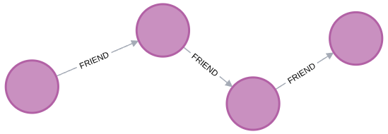

<h1>
<a href="https://www.dio.me/">
     </a>
    <span>Analisando Dados de Redes Sociais com Base em Consultas de Grafos</span>
</h1>

O objetivo desse projeto é analisar dados de redes sociais com base em consultas de grafos para identificar o engajamento e as conexões entre usuários em uma plataforma. Deve-se responder perguntas complexas sobre interações de usuários, popularidade de conteúdo e comunidades de interesse.

Deve-se projetar, construir e consultar um banco de dados de grafos para essa rede social. Possíveis análises incluem:

* **Recomendação de Amizade:** Identificar "fechamento de triângulos" (amigos de amigos que você ainda não segue).
* **Identificação de Influenciadores:** Encontrar nós com alto grau de centralidade (usuários mais seguidos).
* **Detecção de Comunidades:** Agrupar usuários por interesses comuns ou localização geográfica.
* **Análise de Caminhos:** Calcular o grau de separação entre dois usuários distintos.

# :computer: Desenvolvimento do desafio

Este projeto utiliza o banco de dados de grafos **Neo4j** para analisar círculos sociais reais do Facebook [(dataset SNAP)](https://snap.stanford.edu/data/egonets-Facebook.html). O foco é extrair inteligência de conexões através de algoritmos de centralidade e detecção de comunidades. As consultas de grafos permitirão identificar padrões de engajamento, popularidade e comunidades de interesse. A execução desse projeto contou com o auxílio do Google Gemini.

## 📂 Dataset: SNAP Ego-Facebook

O dataset utilizado neste projeto é proveniente do **SNAP (Stanford Network Analysis Project)** e consiste em redes de "círculos" (listas de amigos) da plataforma Facebook.

**Principais características:**

* **Origem:** Dados coletados de participantes reais através de um aplicativo de pesquisa.
* **Estrutura:** O grafo representa **Ego Networks**, onde um nó central (ego) está conectado aos seus contatos e estes contatos entre si.
* **Anonimização:** Todos os IDs internos do Facebook foram substituídos por valores numéricos aleatórios para preservar a privacidade.
* **Atributos:** Embora o dataset contenha vetores de características (perfis), os significados foram obscurecidos. Isso permite identificar se dois usuários compartilham o mesmo interesse (ex: "Mesma Religião"), mas não permite saber qual é a religião específica.
* **Escopo:** É um dataset ideal para estudos de topologia de rede, detecção de comunidades e predição de novos links.

| Métrica | Valor |
| --- | --- |
| **Total de Nós (Usuários)** | 4.039 |
| **Total de Arestas (Amizades)** | 88.234 |
| **Tipo de Grafo** | Não-direcionado |
---


## 🚀 Como Iniciar

### 1. Requisitos

* Podman ou Docker instalado.
* Dataset `facebook_combined.txt` na pasta `~/neo4j_social/import`.

### 2. Configuração do Container

Execute o comando abaixo para subir o Neo4j otimizado com 32GB de RAM e suporte a algoritmos avançados:

```bash
podman run -d \
  --name neo4j_social_analysis \
  -p 7474:7474 -p 7687:7687 \
  --memory=32g \
  -v ~/neo4j_social/data:/data \
  -v ~/neo4j_social/import:/var/lib/neo4j/import \
  -v ~/neo4j_social/logs:/logs \
  -e NEO4J_AUTH=neo4j/social_password \
  -e NEO4J_PLUGINS='["graph-data-science"]' \
  -e NEO4J_dbms_security_procedures_unrestricted='gds.*' \
  -e NEO4J_server_memory_heap_initial__size=8G \
  -e NEO4J_server_memory_heap_max__size=16G \
  -e NEO4J_server_memory_pagecache_size=12G \
  docker.io/library/neo4j:latest

```

---

## 📥 Ingestão de Dados

Após acessar o console (http://localhost:7474), execute os passos:

1. **Índice de Performance:**
```cypher
CREATE CONSTRAINT User_ID FOR (u:User) REQUIRE u.id IS UNIQUE;

```


2. **Carga Massiva (SNAP Ego-Facebook):**
```cypher
LOAD CSV FROM 'file:///facebook_combined.txt' AS row FIELDTERMINATOR ' '
MERGE (u1:User {id: row[0]})
MERGE (u2:User {id: row[1]})
MERGE (u1)-[:FRIEND]-(u2);

```


---

## 📊 Análises Implementadas

### A. Centralidade (Quem são os influenciadores?)

Utilizamos o algoritmo **PageRank** para medir a importância de cada nó com base na qualidade e quantidade de conexões.

1. **Criar Projeção:**
```cypher
CALL gds.graph.project('socialNet', 'User', 'FRIEND');

```

2. **Executar PageRank:**
```cypher
CALL gds.pageRank.stream('socialNet')
YIELD nodeId, score
RETURN gds.util.asNode(nodeId).id AS UserID, score
ORDER BY score DESC LIMIT 10;
```
**Retorno:** 

| UserID | score              |
|--------|--------------------|
| 3437   | 29.516876736724523 |
| 107    | 26.95371287877457  |
| 1684   | 24.66061112564407  |
| 0      | 24.381107430731646 |
| 1912   | 14.995911783359741 |
| 348    | 9.092951286318264  |
| 686    | 8.617083351309427  |
| 3980   | 8.405237907653392  |
| 414    | 6.994354910226071  |
| 698    | 5.077326055496855  |

3. **Perfis com mais conexões**

```cypher
MATCH (u:User)-[r:FRIEND]-()
RETURN u.id AS Usuario, count(r) AS Total_Amigos
ORDER BY Total_Amigos DESC
LIMIT 10;
```
| Usuario | Total_Amigos |
|---------|--------------|
| 107     | 1045         |
| 1684    | 792          |
| 1912    | 755          |
| 3437    | 547          |
| 0       | 347          |
| 2543    | 294          |
| 2347    | 291          |
| 1888    | 254          |
| 1800    | 245          |
| 1663    | 235          |

Note que o perfil de Id. 3437, que apareceu em primeiro no pageRank, aparece em quarto no total de conexões, mostrando que nem sempre o usuario com maior centralidade tem mais conexões.

### B. Tamanho das Comunidades (Círculos Sociais)

Utilizamos o algoritmo de **Louvain** para encontrar o tamanho das comunidades.

```cypher
CALL gds.louvain.stream('socialNet')
YIELD nodeId, communityId
RETURN communityId, count(*) AS TamanhoDaComunidade
ORDER BY TamanhoDaComunidade DESC;

```
**Retorno:**
| communityId | TamanhoDaComunidade |
|-------------|---------------------|
| 3609        | 548                 |
| 2939        | 535                 |
| 468         | 457                 |
| 2111        | 442                 |
| 1613        | 427                 |
| 3741        | 354                 |
| 911         | 331                 |
| 1830        | 237                 |
| 2692        | 226                 |
| 598         | 206                 |
| 3755        | 124                 |
| 1834        | 73                  |
| 3648        | 60                  |
| 3889        | 19                  |


### C. Sugestão de Conexões (Link Prediction)

Técnica de fechamento de tríades para sugerir novos amigos.

```cypher
MATCH (u:User)-[:FRIEND]-(amigo)-[:FRIEND]-(sugestao)
WHERE NOT (u)-[:FRIEND]-(sugestao) AND u <> sugestao
RETURN u.id AS Usuario, sugestao.id AS Sugerido, count(*) AS AmigosEmComum
ORDER BY AmigosEmComum DESC LIMIT 20;
```
**Retorno:**
| Usuario | Sugerido | AmigosEmComum |
|---------|----------|---------------|
| 1917    | 2233     | 183           |
| 2233    | 1917     | 183           |
| 2369    | 2088     | 182           |
| 2607    | 1985     | 182           |
| 1985    | 2607     | 182           |
| 2088    | 2369     | 182           |
| 2593    | 1985     | 176           |
| 1985    | 2593     | 176           |
| 2233    | 2414     | 175           |
| 2414    | 2233     | 175           |
| 2229    | 2600     | 171           |
| 2600    | 2229     | 171           |
| 2323    | 2369     | 171           |
| 2369    | 2323     | 171           |
| 1979    | 2244     | 169           |
| 2244    | 1979     | 169           |
| 2324    | 2104     | 167           |
| 2492    | 2542     | 167           |
| 2104    | 2324     | 167           |
| 2542    | 2492     | 167           |
---

### D. Menor Caminho (Shortest Path)

Menor caminho entre o usuário `0` e o `500`.
```cypher
MATCH p = shortestPath((u1:User {id: "0"})-[:FRIEND*..10]-(u2:User {id: "500"}))
RETURN p;
```

**Retorno:**

<p align=center>

</p>

## 🛠️ Tecnologias

* **Banco de Dados:** Neo4j 5.x
* **Biblioteca:** Graph Data Science (GDS)
* **Orquestração:** Podman / Docker
* **Dataset:** SNAP Stanford (Ego-Facebook)

---