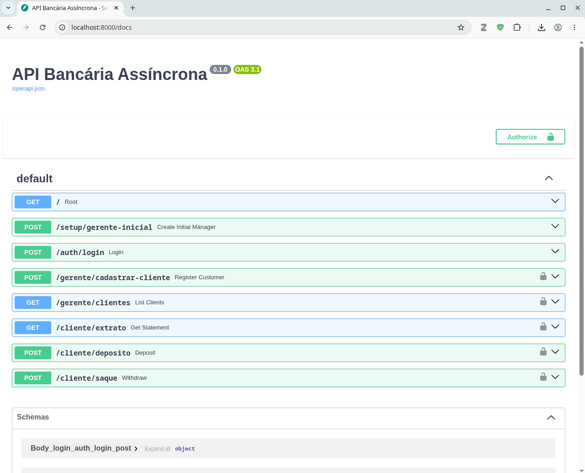
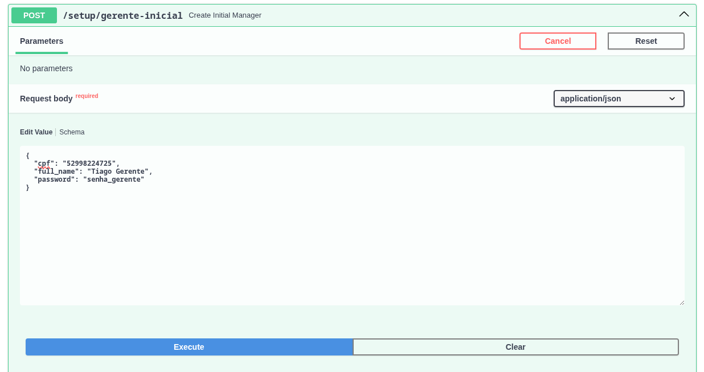
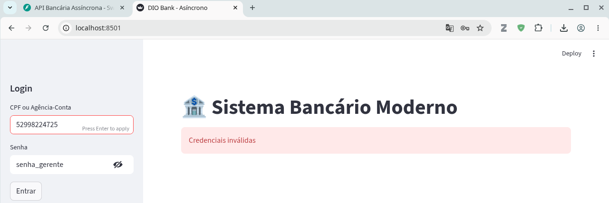
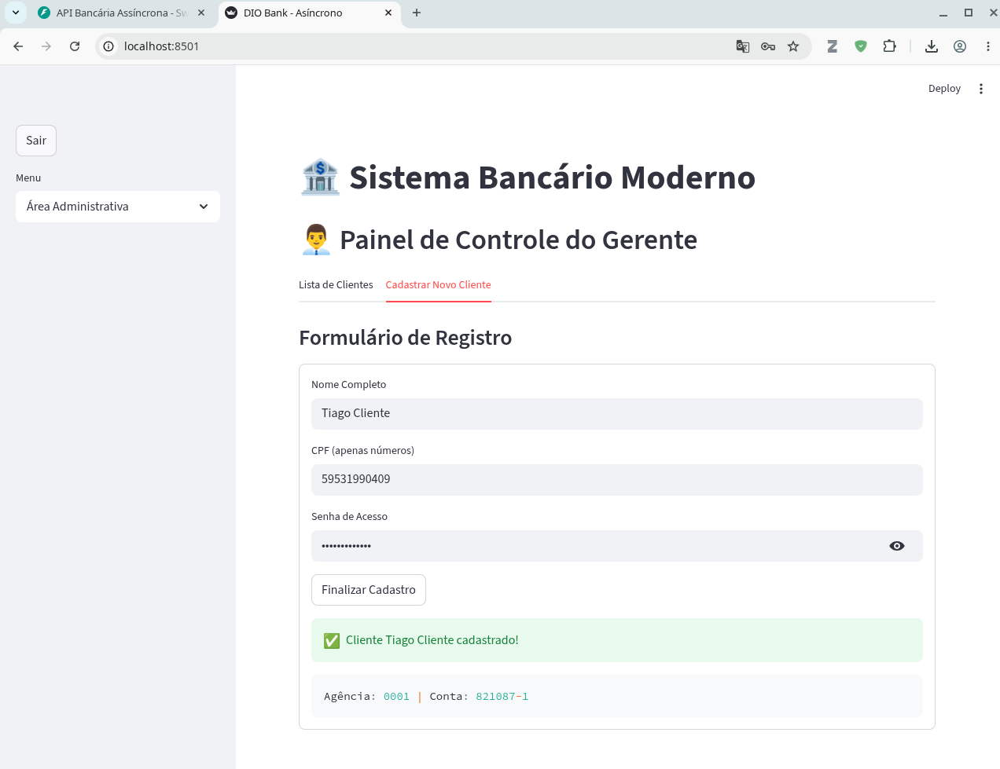
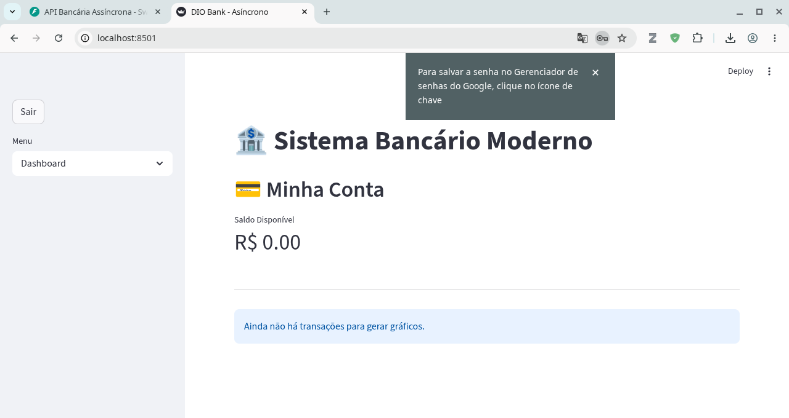
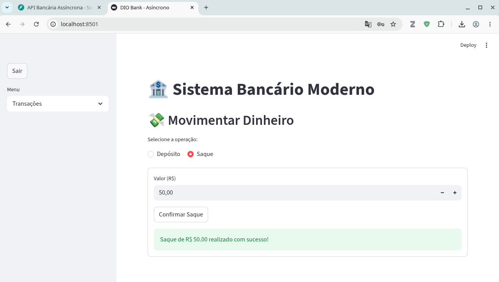
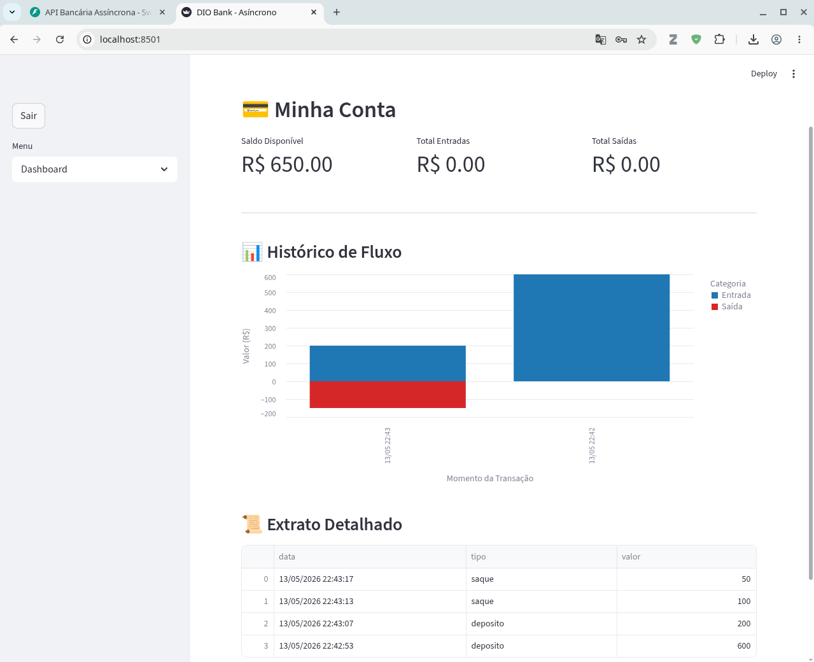

<h1>
<a href="https://www.dio.me/">
     </a>
    <span>Criando sua API Bancária Assíncrona com FastAPI</span>
</h1>

Este projeto foi desenvolvido com _vibe coding_ usando o **Google Gemini** no modo raciocínio. Foram necessárias várias interações para eliminar bugs e chegar em um aplicativo funcional.

# 🏦 Sistema Bancário Assíncrono
 
Este projeto consiste em uma plataforma bancária completa, dividida em uma **API de alto desempenho** e uma **Interface Gráfica reativa**. O sistema foi desenvolvido para gerenciar operações financeiras com precisão decimal, autenticação robusta e visualização de dados em tempo real.

---

## 🛠️ Tech Stack

### **Backend**

* **Python 3.12** com **FastAPI** (Assíncrono).
* **SQLAlchemy 2.0** (ORM Assíncrono) & **PostgreSQL 15**.
* **Pydantic v2** para validação de dados e schemas.
* **OAuth2 + JWT** para segurança e controle de níveis de acesso (Gerente/Cliente).
* **validate-docbr** para validação rigorosa de CPFs.

### **Frontend**

* **Streamlit** para a interface do usuário.
* **Pandas** para manipulação e limpeza de dados financeiros.
* **Altair** para visualização de fluxos de caixa (Entradas/Saídas).

### **Infraestrutura**

* **Podman / Docker Compose** para orquestração de containers.
* **Dockerfile Multi-stage** para otimização das imagens.

---

## 🚀 Funcionalidades

### **Área Administrativa (Gerente)**

* **Cadastro de Clientes**: Criação atômica de usuário e conta bancária vinculada.
* **Monitoramento**: Listagem em tempo real de todos os correntistas e saldos.
* **Segurança**: Acesso restrito via filtragem de escopo em JWT.

### **Área do Correntista (Cliente)**

* **Dashboard Financeiro**: Visualização de saldo com métricas de desempenho.
* **Fluxo de Caixa**: Gráfico interativo bifásico (Azul para Entradas, Vermelho para Saídas).
* **Operações**: Depósitos e saques com validação de saldo e precisão de centavos (`Decimal`).
* **Extrato**: Histórico detalhado de transações com marcação temporal.

---

## 🏗️ Arquitetura do Sistema

O sistema opera sob uma arquitetura de microserviços simplificada, onde o Frontend (Streamlit) consome a API REST de forma desacoplada.

---

## ⚙️ Como Executar

Certifique-se de ter o **Podman** (ou Docker) instalado.

1. **Baixe os arquivos do projeto:**

Disponível no meu [Github](https://https://github.com/tsdes-santiago/DIO_Projetos/tree/main/FastAPIBanco).


2. **Configure as variáveis de ambiente:**
Crie um arquivo `.env` na raiz com:
```env
POSTGRES_USER=usuario
POSTGRES_PASSWORD=senha
POSTGRES_DB=dio_bank
SECRET_KEY=sua_chave_secreta_jwt
POSTGRES_HOST=db  # Nome do serviço no seu YAML do Podman
POSTGRES_PORT=5432

# Segurança
ALGORITHM=HS256
ACCESS_TOKEN_EXPIRE_MINUTES=30
```


3. **Suba os containers:**

```bash
    $ podman-compose up --build -d
```

4.  **Acesse as interfaces:**
    *   **API (Docs):** `http://localhost:8000/docs`
    *   **Interface Gráfica:** `http://localhost:8501`

---

## Interagindo com o app

### **API (Docs):**

<p align=center>

</p>

### Criando o primeiro gerente

CPF válidos podem ser gerados com o pacote `validate_docbr` com o seguinte script python:
```python
from validate_docbr import CPF

# Instanciar a classe CPF
cpf_gerador = CPF()

# 1. Gerar um CPF apenas números (sem máscara)
cpf_numerico = cpf_gerador.generate()
print(f"CPF Numérico: {cpf_numerico}")

# 2. Gerar um CPF com máscara (Pontos e Traço)
# O parâmetro mask=True faz com que o método retorne formatado
cpf_mascarado = cpf_gerador.generate(mask=True)
print(f"CPF Mascarado: {cpf_mascarado}")
```

<p align=center>

</p>

### Utilizando a interface do _front-end_

#### Logando com o Gerente

<p align=center>

</p>

#### Criando um Cliente

<p align=center>

</p>

#### Logando com o Cliente

<p align=center>

</p>

#### Fazendo transações

<p align=center>

</p>

#### Vendo o extrato 

<p align=center>

</p>

---

## Estrutura do Projeto

```bash
FastAPIBanco
├── app
│   ├── auth.py               # Segurança, JWT e níveis de acesso
│   ├── database.py           # Conexão e sessão assíncrona do banco
│   ├── __init__.py           # Inicialização do pacote Python
│   ├── main.py               # Endpoints e lógica de negócio da API
│   ├── models.py             # Definição das tabelas e relações ORM
│   ├── schemas.py            # Validação de dados com Pydantic
│   └── utils.py              # Helpers (CPF, geradores de conta)
├── container-compose.yaml    # Orquestração de todos os serviços
├── Dockerfile                # Build da imagem Docker do Backend
├── Dockerfile.frontend       # Build da imagem Docker do Frontend
├── frontend
│   └── app_gui.py            # Interface visual e Dashboard (Streamlit)
├── README.md                 # Documentação e manual do sistema
└── requirements.txt          # Dependências das bibliotecas Python
```
Aqui está a descrição funcional de cada arquivo:

### 📂 Diretório `app/` (O "Coração" do Backend)

* **`auth.py`**: Gerencia a segurança. Contém a lógica de hashing de senhas, criação e validação de tokens **JWT**, além do `role_checker` que diferencia o que um Gerente ou Cliente pode fazer.
* **`database.py`**: Configuração da infraestrutura de dados. Define a conexão assíncrona com o **PostgreSQL** usando SQLAlchemy e a função `get_db` para gerenciar as sessões.
* **`main.py`**: O ponto de entrada da API. Aqui estão as rotas (endpoints), a lógica de negócios das transações e onde todas as outras partes (auth, modelos, schemas) se conectam.
* **`models.py`**: Define as tabelas do banco de dados (User, Account, Transaction) como classes Python, mapeando as relações entre clientes e suas contas.
* **`schemas.py`**: Responsável pela validação de dados. Contém as classes **Pydantic** que garantem que as requisições (como o cadastro ou o depósito) cheguem com o formato e os tipos corretos.
* **`utils.py`**: O canivete suíço do projeto. Abriga funções auxiliares como o validador de CPF e os geradores aleatórios de números de conta e agência.
* **`__init__.py`**: Transforma a pasta em um pacote Python, facilitando as importações internas.

---

### 📂 Arquivos de Configuração e Docker

* **`container-compose.yaml`**: O maestro do projeto. Orquestra a subida simultânea dos containers de banco de dados, API e Frontend, garantindo que eles se comuniquem na mesma rede.
* **`Dockerfile`**: Receita de bolo para o backend. Define como construir a imagem da API FastAPI, instalando as dependências necessárias.
* **`Dockerfile.frontend`**: Receita específica para a interface. Otimiza o build do Streamlit, garantindo que o Pandas e o Altair estejam prontos para uso.
* **`requirements.txt`**: Lista de bibliotecas Python necessárias para rodar o backend (FastAPI, SQLAlchemy, validate-docbr, etc.).

---

### 📂 Diretório `frontend/` (A Interface Visual)

* **`app_gui.py`**: O cérebro da interface. Escrito em **Streamlit**, gerencia o estado da sessão (login), renderiza os dashboards financeiros e os gráficos coloridos de fluxo de caixa.

---

### 📂 Documentação

* **`README.md`**: O manual de instruções e a vitrine do projeto. Descreve as tecnologias, as decisões de arquitetura (como o uso de `Decimal`) e como rodar tudo via Podman.

---

## 🛡️ Decisões de Engenharia

*   **Precisão Monetária**: Substituição de `float` por `decimal.Decimal` em toda a cadeia de processamento para evitar erros de arredondamento binário.
*   **Integridade Referencial**: Uso de `db.flush()` e `db.commit()` para garantir que uma conta nunca seja criada sem um usuário válido (Transação Atômica).
*   **UX Financeira**: Implementação de visualização de dados com **Altair**, permitindo que o usuário identifique rapidamente o comportamento de gastos através de cores condicionais.

---
