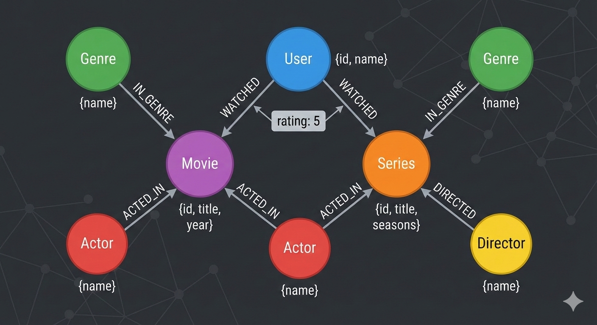
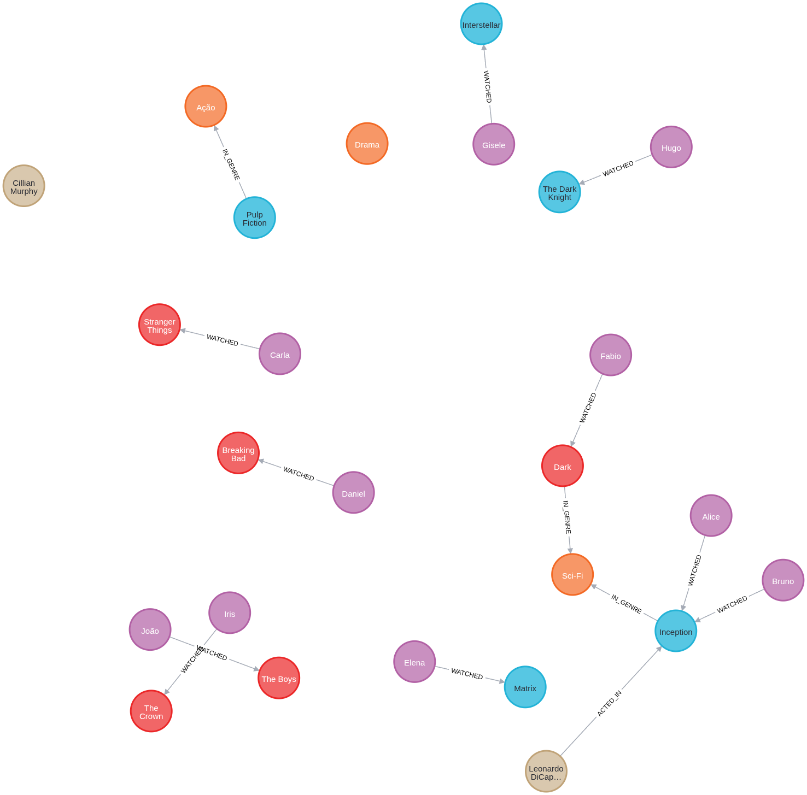
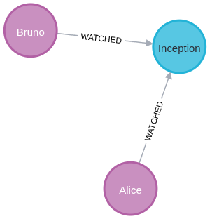

<h1>
<a href="https://www.dio.me/">
     </a>
    <span>Modelagem de Dados em Grafos de um Serviço de Streaming</span>
</h1>

O objetivo desse projeto é fazer a modelagem de um serviço de _streaming_ usando modelo de grafos. O modelo deve incluir:

- Entidades (nós): 
    - User
    - Movie
    - Series
    - Genre
    - Actor
    - Director
- Conexões (Relacionamentos): 
    - WATCHED (com propriedade _rating_)
    - ACTED_IN
    - DIRECTED
    - IN_GENRE

1. Criar um diagrama ou esboço do modelo de grafos

2. Um script Cypher (.cyfer) que cria _constraints_ para os nós (como UNIQUE para IDs) e popula o banco com pelo menos 10 usuários, 10 filmes/series e seus relacionamentos.

# :computer: Desenvolvimento do desafio

Para esse desafio utilizaremos o auxílio da ferramenta de LLM Google Gemini. Vamos implementar o banco de dados usando o neo4j em um container podman e rodaremos o script no VS Code com a extenção [Neo4j for VS Code](https://marketplace.visualstudio.com/items?itemName=neo4j-extensions.neo4j-for-vscode).

## Diagrama do modelo de grafos

Aqui podemos ver o diagrama com os nós e relacionamentos do modelo de grafos gerados com a ferramenta Gemini.

<p align=center>

</p>

## Configurando container para o neo4j

Após instalado o podman (no linux manjaro), criei os diretorios `neo4j/data` e `neo4j/logs` e rodei o container com o seguinte comando:

```console
podman run -d \
  --name neo4j_dev \
  -p 7474:7474 -p 7687:7687 \
  -v ./neo4j/data:/data \
  -v ./neo4j/logs:/logs \
  -e NEO4J_AUTH=neo4j/dio_grafos \
  docker.io/library/neo4j:latest        
  ```

#### Entendendo as flags:

`-d`: Roda em segundo plano (detach).

`-p 7474:7474`: Porta HTTP (para o navegador).

`-p 7687:7687`: Porta Bolt (protocolo binário usado pelo VS Code e drivers de aplicação).

`-v`: Mapeia suas pastas locais para dentro do container (persistência).

`-e NEO4J_AUTH`: Define o usuário (neo4j) e a senha inicial.

## Criando o banco de dados

O banco de dados é criado usando o script `streaming.cypher` que cria os nós e as conexões.

<p align=center>

</p>

## Consulta:

Exemplo de consulta em que procuramos todos os filmes assistidos por Alice e outros usuários:

```cypher
MATCH (u:User {name: 'Alice'})-[:WATCHED]->(m)<-[:WATCHED]-(other:User)
RETURN u, m, other;
```

<p align=center>

</p>