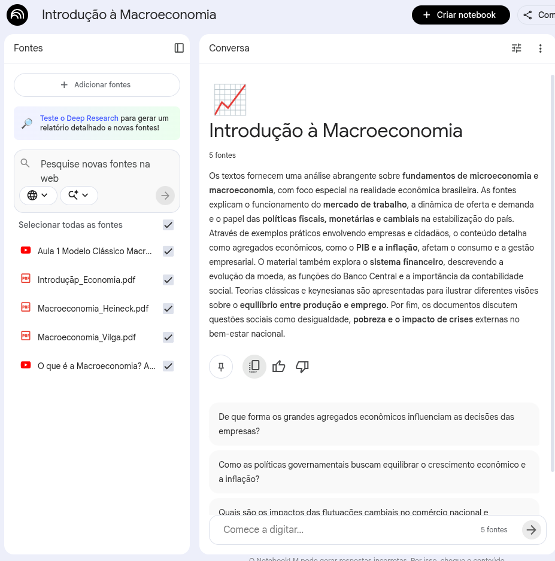

<h1>
<a href="https://www.dio.me/">
     </a>
    <span>Acelere sua Aprendizagem com IA: Explore o Poder do NotebookLM</span>
</h1>

Esse projeto aborda a criação de um caderno temático no NotebookLM, reunindo de três a cinco fontes abertas em texto ou PDF sobre macroeconomia. A partir desse material, são definidos objetivos de estudo e elaboradas perguntas estratégicas registrando as respostas e suas referências. A atividade enfatiza o uso da IA como ferramenta de aprendizagem ativa, aliando pensamento crítico, curadoria de fontes e organização do conhecimento.

# :computer: Projeto: Guia de Macroeconomia com Aprendizagem Ativa

Este projeto documenta a criação de um ecossistema de estudos personalizado utilizando o **NotebookLM**. O objetivo principal é transformar fontes brutas de macroeconomia em um guia de estudo estruturado, utilizando técnicas de engenharia de prompt e curadoria crítica de conteúdo.

## 🎯 Objetivos do Projeto

* **Curadoria Especializada:** Reunir e sintetizar fontes de alta qualidade sobre macroeconomia.
* **Aprendizagem Ativa:** Utilizar a IA para questionar o material, em vez de apenas consumi-lo passivamente.
* **Documentação de Processo:** Registrar a evolução de prompts e respostas para criar um fluxo de trabalho replicável.

---

## 🛠️ Passo a Passo do Desenvolvimento

### 1. Curadoria de Fontes

A primeira etapa consistiu na seleção de fontes abertas (PDFs ou textos) que cobrissem os pilares da macroeconomia.

* **Critérios de seleção:** Autoridade do autor/instituição, atualidade dos dados e clareza didática.
* **Fontes utilizadas:** 
    * **Macroeconomia**; L. F. M. Heineck, Vol. 1 (2010)
    * **Macroeconomia**; V. F. Vilga e M. F. G. V. Sprogis (2015)
    * **INTRODUÇÃO À ECONOMIA**: Resumo e Exercícios; N. Gregory Mankiw, Ed.: Cengage (2005)
    * https://www.youtube.com/watch?v=0QBB1IME4F8
    * https://www.youtube.com/watch?v=KW5ExlE-2qg


### 2. Configuração do NotebookLM

Com as fontes selecionadas, o ambiente de estudo foi configurado:

1. Upload dos arquivos para um novo caderno temático.
2. Aguardar a indexação completa para garantir que a IA utilize apenas as fontes fornecidas (Grounding).

### 3. Definição de Objetivos e Perguntas Estratégicas

Antes de interagir com a ferramenta, foram definidos os tópicos centrais a serem dominados, como:

* Modelos de crescimento econômico.
* Indicadores de inflação e desemprego.

## 📝 Resultados Obtidos

### 📑 Resumos Estruturados

Ao adicionar as fontes o NotebookLM já nos fornece um resumo estruturado com os principais temas abordados nas fontes selecionadas:

<p align=center>

</p>

### 📖 Glossário de Conceitos

#### **Modelos de crescimento econômico**:

**Prompt**:
```console
Como um professor de economia, explique os modelos de crescimento econômico
```
**Resposta**:

>Olá! Como professor de economia, é um prazer explicar como a ciência econômica compreende o crescimento das nações através de seus modelos teóricos. A macroeconomia estuda a economia como um todo, focando em agregados como o **Produto Interno Bruto (PIB)**, que mede o valor de mercado de todos os bens e serviços finais produzidos em um país.
>
>Para entender o crescimento, precisamos dividir nossa análise entre o **curto, o longo e o longuíssimo prazo**.
>
>### 1. O Modelo Clássico: O Foco no Longo Prazo e na Oferta
>Os primeiros grandes modelos surgiram com a **Escola Clássica** (Adam Smith e David Ricardo), fundamentados no liberalismo econômico. 
>*   **Lei de Say:** Este modelo baseia-se na ideia de que "a oferta gera sua própria demanda", sugerindo que o equilíbrio com pleno emprego é o estado natural do capitalismo. 
>*   **Determinantes da Produtividade:** No longo prazo, o padrão de vida de um país depende da sua capacidade de produzir bens e serviços, ou seja, de sua **produtividade**. Segundo as fontes, essa produtividade é determinada por quatro fatores principais:
>    1.  **Capital Físico:** Estoque de equipamentos e estruturas.
>    2.  **Capital Humano:** Conhecimento e habilidades adquiridos pelos trabalhadores.
>    3.  **Recursos Naturais:** Insumos fornecidos pela natureza.
>    4.  **Conhecimento Tecnológico:** A compreensão da sociedade sobre as melhores formas de produzir.
>
>Neste modelo, a acumulação de capital está sujeita a **retornos decrescentes**: quanto mais capital uma economia possui, menor é o ganho extra de uma unidade adicional de capital. Isso gera o **"efeito de alcance"**, onde países pobres tendem a crescer mais rápido que os ricos ao investirem em capital.
>
>### 2. O Modelo Keynesiano: O Foco no Curto Prazo e na Demanda
>Após a Crise de 1929, **John Maynard Keynes** revolucionou o pensamento econômico ao focar no curto prazo e nas falhas do equilíbrio automático.
>*   **Demanda Agregada:** Keynes propôs que a demanda, e não a oferta, é o principal motor da produção e do emprego. 
>*   **Equilíbrio Abaixo do Pleno Emprego:** Ao contrário dos clássicos, ele demonstrou que uma economia pode atingir o equilíbrio mesmo com altos níveis de desemprego, se a demanda efetiva for insuficiente.
>*   **Expectativas:** O crescimento e os investimentos dependem muito do "instinto animal" ou das expectativas dos empresários sobre o futuro.
>
>### 3. Produto Potencial e Ciclos Econômicos
>No longo prazo, a economia tende ao seu **Produto Potencial** (ou natural), que é a capacidade máxima de produção com todos os recursos plenamente empregados. No entanto, a economia real oscila em torno dessa tendência através dos **ciclos econômicos** de expansão e retração. 
>
>Enquanto o crescimento no curto prazo pode ser estimulado por políticas que aumentam a demanda, o crescimento sustentado no **longuíssimo prazo** (períodos de 10 a 50 anos) depende de mudanças na base tecnológica e institucional da sociedade.
>
>**Analogia para facilitar o entendimento:**
>Imagine que a economia é como um **navio de grande porte** em alto-mar. O **Modelo Clássico** olha para o destino final e a potência do motor (produtividade e tecnologia) que determina a velocidade máxima que o navio pode atingir no longo prazo. Já o **Modelo Keynesiano** foca nas manobras necessárias para enfrentar as tempestades do caminho (crises de curto prazo), ajustando as velas para que o navio não pare ou mude de rota por falta de vento (demanda).
>
>
#### **Indices de inflação e desemprego**

**Prompt**:
```console
Crie um resumo comparativo entre a visão do autor Heineck e do autor Vilga sobre indices de inflação e desemprego.
```
**Resposta**:

>Com base nas fontes fornecidas, os autores Heineck e Vilga convergem na definição de que os índices de inflação e desemprego são os **"males gêmeos" da economia** e representam os principais problemas macroeconômicos de curto prazo. No entanto, Heineck foca na **derivação teórica e matemática** dessas variáveis, enquanto Vilga enfatiza o **impacto prático nos agentes econômicos** e na gestão empresarial.
>
>A seguir, apresento um resumo comparativo das visões:
>
>### 1. Visão sobre a Inflação
>*   **Heineck:** Define a inflação como uma **alta continuada e generalizada de preços** que atinge a maioria dos setores. Ele detalha tipos específicos, como a **inflação inercial** (causada por desajustes passados), a **psicológica** (expectativas puras) e a **importada** (custos vindos do exterior). Ele utiliza a **Equação de Fisher** para explicar como a inflação esperada é incorporada às taxas de juros nominais.
>*   **Vilga:** Foca na inflação como um fenômeno que altera os **hábitos de consumo das famílias** e a capacidade de investimento das empresas. Ele destaca que a inflação no Brasil é controlada pelo **Regime de Metas**, onde o Banco Central atua para manter o índice dentro de uma banda estabelecida. Vilga também enfatiza como a **desvalorização cambial** serve como gatilho inflacionário ao encarecer insumos essenciais como o petróleo e o trigo.
>
>### 2. Visão sobre o Desemprego
>*   **Heineck:** Apresenta uma classificação técnica exaustiva, dividindo o desemprego em categorias como **friccional** (tempo de busca por novo emprego), **estrutural** (marginalização tecnológica), **desalento** (quem parou de procurar) e **sazonal**. Ele argumenta que o desemprego de recursos gera desperdício e perda de qualificação da mão de obra.
>*   **Vilga:** Analisa o desemprego sob a **ótica Keynesiana**, defendendo que ele é causado por uma **baixa demanda agregada**; ou seja, se as pessoas compram pouco, as empresas produzem pouco e demitem. Ele destaca o impacto social, observando que a insegurança com o emprego faz o consumidor substituir produtos ou cortar gastos, o que agrava a recessão.
>
>### 3. A Relação entre os Índices (Curva de Phillips)
>*   **Heineck:** Explora a **Curva de Phillips** como um instrumento de política econômica que mostra o *trade-off* (compensação): para reduzir o desemprego, a sociedade muitas vezes aceita uma inflação maior. Ele também utiliza a **Lei de Okun** para calcular a "taxa de sacrifício", que é quanto o PIB deve cair para que a inflação seja reduzida em determinado percentual.
>*   **Vilga:** Embora reconheça essa relação, Vilga foca na **função estabilizadora do governo**, que deve usar políticas fiscais e monetárias para equilibrar esses índices e evitar que a economia entre em estagflação (recessão com inflação).
>
>**Resumo Comparativo:**
>
>| Característica | Autor Heineck | Autor Vilga |
>| :--- | :--- | :--- |
>| **Foco Principal** | Modelagem teórica e relações matemáticas (Okun, Fisher, Phillips). | Gestão de políticas, metas inflacionárias e impacto nos negócios. |
>| **Causa da Inflação** | Desequilíbrio monetário, inércia e choques de custo. | Crises, alta do dólar e excesso de demanda sobre a oferta. |
>| **Causa do Desemprego** | Inflexibilidade de salários e transições estruturais/friccionais. | Queda na demanda agregada e consumo insuficiente. |
>
>Para entender melhor, imagine que a economia é um **balão**. Para **Heineck**, os índices são como as fórmulas físicas que calculam a pressão interna e a elasticidade da borracha para o balão não estourar (Curva de Phillips). Para **Vilga**, os índices são os sinais que o piloto usa para decidir se deve colocar mais ar (política expansionista) ou abrir a válvula (política contracionista) para manter o balão na altitude correta para os passageiros.

## 🚀 Conclusão

O uso do NotebookLM permitiu uma imersão profunda no conteúdo de macroeconomia. A ferramenta não apenas organizou os dados, mas serviu como um "parceiro de pensamento", permitindo identificar conexões entre diferentes textos que não seriam óbvias em uma leitura linear.

---
