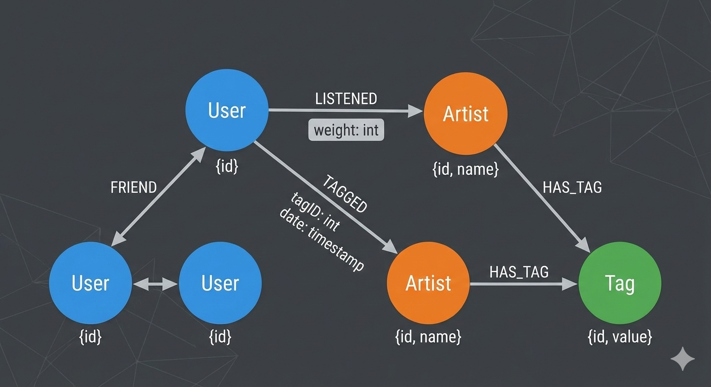
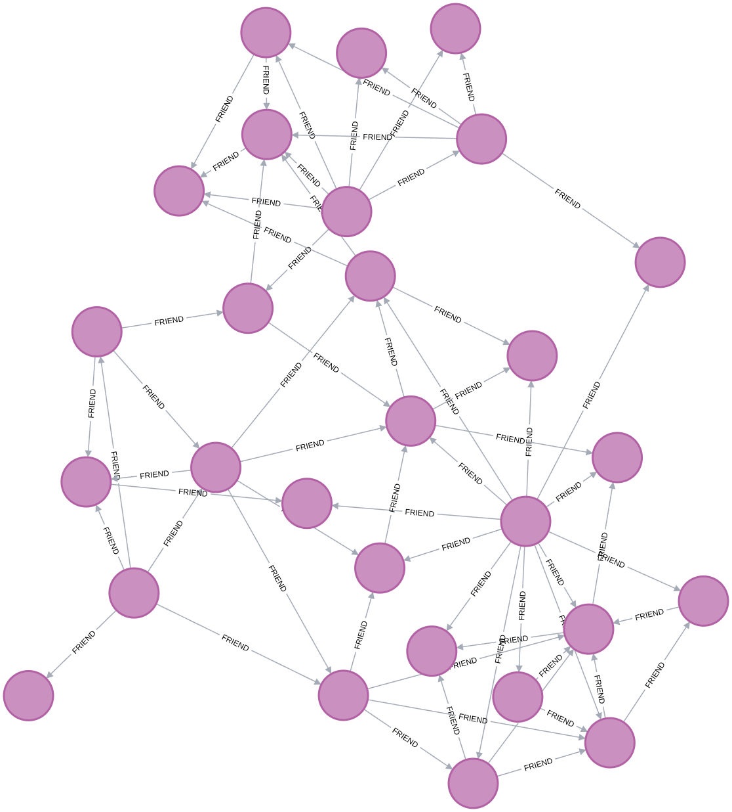
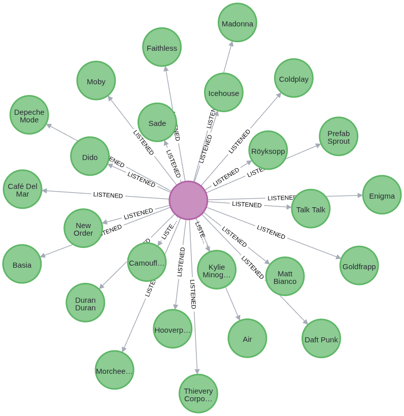

<h1>
<a href="https://www.dio.me/">
     </a>
    <span>
Criando um Algoritmo de Recomendação de Músicas Com Base Em Grafos</span>
</h1>

O objetivo desse projeto é criar um algoritmo de recomendação de músicas com base em grafos para identificar padrões de escuta e sugerir novas faixas aos usuários.

# :computer: Desenvolvimento do desafio


## Banco de dados

Utilizaremos o dataset [**HETREC-2011 (Last.fm)**](https://grouplens.org/datasets/hetrec-2011/) que já vem com relações de amizade (`user_friends`) e hábitos de escuta (`user_artists`), o que permite criar recomendações por proximidade social ou gosto musical. Para começarmos, precisamos mapear esses arquivos `.dat` para a lógica de **Nós** e **Relacionamentos**. 

---

### Mapeamento do Grafo


| Arquivo | De (Nó) | Relação (Aresta) | Para (Nó) | Propriedade |
| --- | --- | --- | --- | --- |
| `artists.dat` | - | **(Artist)** | - | id, name, url, picture |
| `user_artists.dat` | **(User)** | `LISTENED` | **(Artist)** | weight (contagem) |
| `user_friends.dat` | **(User)** | `FRIEND` | **(User)** | - |
| `tags.dat` | - | **(Tag/Genre)** | - | id, value |
| `user_taggedartists.dat` | **(User)** | `TAGGED` | **(Artist)** | tagID, date |

### Diagrama do Grafo

<p align=center>


## Preparando o Ambiente (Podman)

Como vamos trabalhar com arquivos externos (`.dat`), precisamos colocar esses arquivos em uma pasta que o container consiga ler.

1. Crie uma pasta chamada `import` dentro do seu diretório de projeto:
```bash
mkdir -p neo4j_music/import
mkdir -p neo4j_music/data
```


2. Mova os arquivos `.dat` para dentro dessa pasta `~/neo4j_music/import`.
3. Inicie o container mapeando a pasta de importação:

```bash
podman run -d \
  --name neo4j_music \
  -p 7474:7474 -p 7687:7687 \
  -v ./neo4j_music/data:/data \
  -v ./neo4j_music/import:/var/lib/neo4j/import \
  -e NEO4J_AUTH=neo4j/music_dio \
  docker.io/library/neo4j:latest
```

---

## Script de Importação (Cypher)
A importação completa pode ser vista no arquivo `music.cypher`. 

Primeiro tratamos os dados para remover aspas duplas que estavam causando o erro e geramos arquivos "clean".

No terminal:
```console
cd neo4j_music/import
sed 's/"//g' artists.dat > artists_clean.dat
sed 's/"//g' tags.dat > tags_clean.dat
```
### Passo A: Criar Artistas, Tags e Usuários

Como os arquivos `.dat` desse dataset geralmente usam `\t` (tabulação) como separador, precisaremos tratar isso. No Neo4j, usamos o comando `LOAD CSV`. Como o seu arquivo usa tabulação, definiremos o `FIELDTERMINATOR`.

```cypher
// 1. Criar Artistas (Usando o arquivo limpo)
LOAD CSV WITH HEADERS FROM "file:///artists_clean.dat" AS row
FIELDTERMINATOR '\t'
WITH row WHERE row.id IS NOT NULL
MERGE (a:Artist {id: row.id})
SET a.name = row.name;

// 2. Criar Tags (Usando o arquivo limpo)
LOAD CSV WITH HEADERS FROM "file:///tags_clean.dat" AS row
FIELDTERMINATOR '\t'
WITH row WHERE row.tagID IS NOT NULL
MERGE (t:Tag {id: row.tagID})
SET t.value = row.tagValue;

// Criar Usuários (baseado nas interações, já que não há um users.dat isolado)
LOAD CSV WITH HEADERS FROM "file:///user_artists.dat" AS row
FIELDTERMINATOR '\t'
MERGE (u:User {id: row.userID});
```

### Passo B: Criar Relacionamentos

```cypher
// Relação de Escuta (LISTENED)
LOAD CSV WITH HEADERS FROM "file:///user_artists.dat" AS row
FIELDTERMINATOR '\t'
MATCH (u:User {id: row.userID})
MATCH (a:Artist {id: row.artistID})
MERGE (u)-[r:LISTENED]->(a)
SET r.weight = toInteger(row.weight);

// Relação de Amizade (FRIEND)
LOAD CSV WITH HEADERS FROM "file:///user_friends.dat" AS row
FIELDTERMINATOR '\t'
MATCH (u1:User {id: row.userID})
MATCH (u2:User {id: row.friendID})
MERGE (u1)-[:FRIEND]-(u2);

```

## Queries de relacionamento do Grafo
Após o grafo criado, vamos visualizar os relacionamentos.

### Relacionamentos de Amizade
```cypher
MATCH p=()-[r:FRIEND]->() RETURN p LIMIT 25
```
<p align=center>

</p>

### Relacionamentos de Escuta o Artista
```cypher
MATCH p=()-[r:LISTENED]->() RETURN p LIMIT 25
```
<p align=center>

</p>

## Recomendações usando diferentes técnicas

Agora que temos a estrutura do Last.fm mapeada, vamos explorar o poder do Cypher para criar algoritmos de recomendação. O diferencial do grafo é que podemos combinar **proximidade social** (amigos) com **comportamento de consumo** (peso de escuta).

---
### Recomendação "Friend-of-Friend" (Social)

Esta query sugere artistas que os seus amigos ouvem muito, mas que você ainda não conhece. É a base do "Descobertas da Semana".

```cypher
MATCH (u:User {id: '10'})-[:FRIEND]-(amigo:User)-[escuta:LISTENED]->(artista:Artist)
WHERE NOT (u)-[:LISTENED]->(artista)
RETURN artista.name AS Recomendacao, 
       sum(escuta.weight) AS Forca_da_Sugestao,
       count(amigo) AS Amigos_que_ouvem
ORDER BY Forca_da_Sugestao DESC
LIMIT 10;

```
A tabela abaixo apresenta os 10 artistas recomendados para o usuário (ID: 10), baseados no peso das reproduções (`weight`) dos seus amigos diretos, filtrando artistas que o usuário ainda não conhece.

| Recomendação | Força da Sugestão (Sum Weight) | Amigos que ouvem |
| --- | --- | --- |
| Nirvana | 41.304 | 3 |
| Iron Maiden | 13.032 | 2 |
| Red Hot Chili Peppers | 6.575 | 3 |
| Foo Fighters | 5.846 | 3 |
| Engenheiros do Hawaii | 5.127 | 1 |
| Sinéad O'Connor | 5.003 | 1 |
| Phillip Boa & The Voodooclub | 4.988 | 1 |
| System of a Down | 4.713 | 2 |
| Pink Floyd | 4.608 | 2 |
| Puddle of Mudd | 4.607 | 1 |


#### Insights do Grafo:

* **Nirvana** é a recomendação mais forte, não apenas por ter o maior volume de escuta, mas por ser um consenso entre 3 amigos diferentes.
* **Engenheiros do Hawaii** aparece na lista devido a um único amigo que possui um volume de escuta muito alto (`weight: 5127`), o que demonstra como o algoritmo valoriza fãs "fies" em círculos sociais próximos.

### 🧠 Lógica das Métricas de Recomendação

O algoritmo utiliza uma abordagem de **Filtragem Colaborativa baseada em Grafos**. Abaixo, detalhamos as métricas apresentadas na tabela:

#### Força da Sugestão (`sum(escuta.weight)`)

No dataset do Last.fm, o `weight` representa a **intensidade do interesse**. Diferente de um banco de dados relacional que apenas diria se um usuário ouviu ou não um artista, o grafo armazena a quantidade de vezes que a faixa foi tocada.

* **Cálculo:** Somamos o peso de todos os relacionamentos `:LISTENED` que partem dos seus amigos para um artista específico.
* **Significado:** Um valor alto indica que o artista é um "pilar" no consumo de música do seu círculo social. Mesmo que apenas um amigo ouça (como no caso de *Engenheiros do Hawaii*), se ele ouve compulsivamente, a "força" da recomendação sobe.

#### Amigos que ouvem (`count(amigo)`)

Esta é uma métrica de **Consenso Social**.

* **Cálculo:** Conta o número de nós `:User` distintos que possuem uma conexão `:FRIEND` com você e uma conexão `:LISTENED` com o artista sugerido.
* **Significado:** Indica a popularidade do artista dentro da sua "bolha". Artistas com contagem alta (como *Nirvana* com 3 amigos) têm menos chance de serem um gosto isolado e mais chance de serem um sucesso garantido para o seu perfil.


### 🛠️ O Caminho da Recomendação (Traversal)

O motor do Neo4j realiza um "salto" entre nós para calcular esses valores em tempo real. O diagrama abaixo exemplifica o fluxo:

1. **Início:** Parte do nó `(u:User {id: '10'})`.
2. **Expansão:** Segue todas as arestas `:FRIEND` para encontrar os vizinhos.
3. **Filtragem:** Segue as arestas `:LISTENED` dos vizinhos, mas descarta artistas que o usuário inicial já possui em sua coleção.
4. **Agregação:** Agrupa os artistas encontrados e aplica as funções matemáticas `sum()` e `count()`.


### Por que usar Grafos para isso?

Diferente de consultas SQL complexas com múltiplos `JOINs`, o Neo4j percorre esses caminhos de forma nativa e extremamente veloz. À medida que mais amigos ou tags são adicionados, o grafo se torna mais inteligente, permitindo recomendações híbridas que cruzam **quem você conhece** com **o que você gosta**.

---

### Recomendação por Similaridade de Gosto (Item-Based)

Se você gosta de um artista, esta query encontra outros usuários que também gostam dele e vê o que mais eles estão ouvindo. É o famoso *"Quem ouve este artista também gosta de..."*.

```cypher
MATCH (u:User {id: '10'})-[:LISTENED]->(a:Artist)<-[:LISTENED]-(outro:User)
MATCH (outro)-[:LISTENED]->(sugestao:Artist)
WHERE u <> outro 
  AND NOT (u)-[:LISTENED]->(sugestao)
RETURN sugestao.name AS Artista, 
       count(outro) AS Usuarios_em_Comum
ORDER BY Usuarios_em_Comum DESC
LIMIT 10;

```
Esta consulta é um exemplo clássico de **Filtragem Colaborativa Baseada em Itens** (*Item-Based Collaborative Filtering*). Ela foca puramente no comportamento de consumo global para encontrar "almas gêmeas musicais".

Esta query identifica usuários que ouvem os mesmos artistas que você (vizinhos de gosto) e recomenda o que eles estão ouvindo, mas que ainda não faz parte da sua coleção.

| Artista | Usuários em Comum (Frequência) |
| --- | --- |
| The Beatles | 1.678 |
| Muse | 1.392 |
| Arctic Monkeys | 1.306 |
| Coldplay | 1.276 |
| Placebo | 1.007 |
| Franz Ferdinand | 983 |
| Oasis | 937 |
| Lady Gaga | 799 |
| Depeche Mode | 789 |
| MGMT | 747 |

### 🔍 Como Funciona: Filtragem Colaborativa

Diferente da recomendação social (que depende de quem você segue), esta métrica utiliza a **sabedoria das multidões**. O motor do grafo executa os seguintes passos:

1. **Ponto de Partida:** O algoritmo olha para todos os artistas que o Usuário 10 ouve.
2. **Identificação de Pares:** Ele busca no grafo todos os *outros* usuários que ouvem pelo menos um desses mesmos artistas.
3. **Filtragem de Novidades:** Desses outros usuários, o Neo4j mapeia quais artistas eles ouvem, mas exclui qualquer um que o Usuário 10 já conheça.
4. **Métrica `Usuarios_em_Comum`:** O resultado é ordenado pela quantidade de usuários que servem de "ponte" para essa recomendação.

**Por que "The Beatles" está no topo?**
Isso indica que entre os usuários que compartilham o gosto musical com o Usuário 10, um número massivo (1.678 pessoas) também ouve Beatles. No mundo de sistemas de recomendação, isso é chamado de **similaridade de cosseno simplificada**, onde a força do link é definida pela sobreposição de hábitos de consumo.

---
