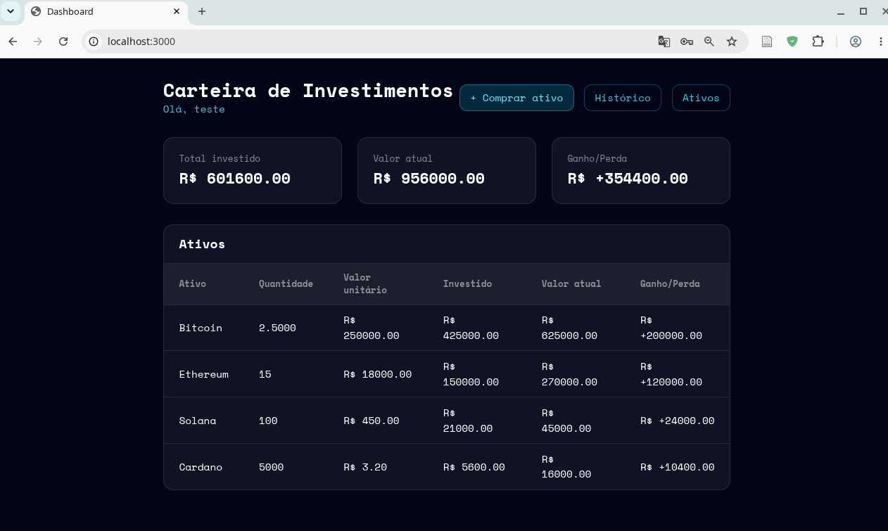
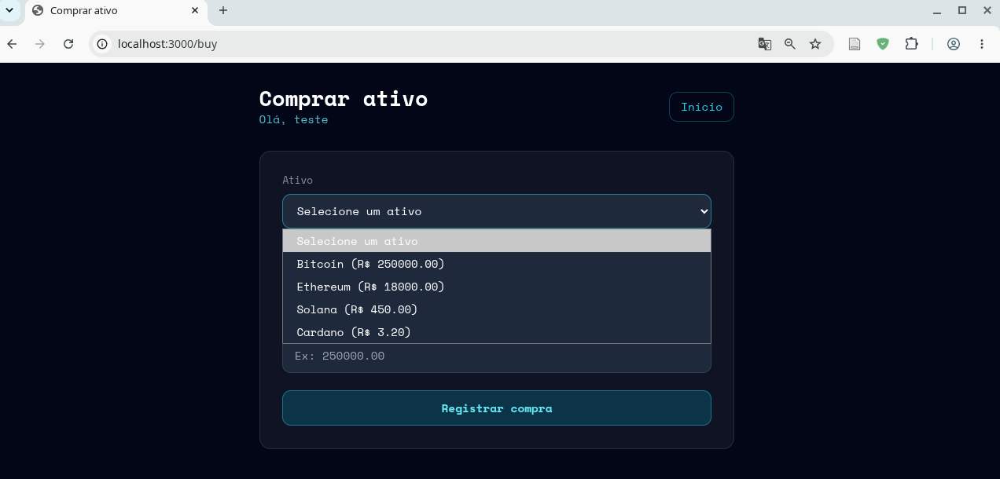
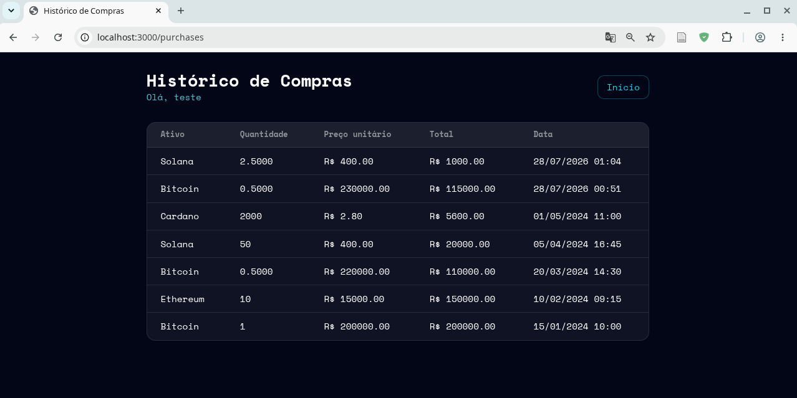

<h1>
<a href="https://www.dio.me/">
</a>
<span>Desenvolvendo sua Carteira de Investimentos Inteligente com Rust</span>
</h1>


## :scroll: Visão geral

Este projeto é uma evolução do lab oficial da DIO **“Carteira de Investimentos Fullstack com Rust”**, disponível em:  
[https://github.com/digitalinnovationone/rust-fullstack-carteira-investimentos](https://github.com/digitalinnovationone/rust-fullstack-carteira-investimentos)

A base original implementa uma aplicação fullstack em Rust com Axum, SQLx e Askama para cadastro, listagem e atualização de ativos, autenticação de usuários e renderização de páginas HTML no servidor. A partir dessa base, este repositório estende a funcionalidade para incluir posições de ativos, histórico de compras e um dashboard com visão de ganhos e perdas.

De forma resumida, a aplicação conecta:

- **API REST** para gerenciar ativos e histórico de compras.
- **Autenticação de usuários** com login/cadastro, cookies HTTP-only e JWT.
- **Banco de dados PostgreSQL** com migrações versionadas via SQLx.
- **Interface web SSR** (Server-Side Rendering) usando Askama + Tailwind CSS.

O fluxo principal da aplicação é:

1. A pessoa usuária acessa `/login` para criar um usuário ou autenticar.
2. Após o login, recebe um cookie de sessão (`token`) e é redirecionada para `/`, que funciona como **mini dashboard** da carteira.
3. Os ativos são cadastrados/atualizados via API em `/api/assets` e consolidados em uma tabela de posições com quantidade disponível e preço médio de compra.
4. A página `/assets` exibe os ativos e suas posições (quantidade, valor atual e custo médio).
5. As rotas `/buy` e `/purchases` permitem registrar compras e visualizar o histórico, alimentando os cálculos do dashboard com total investido, valor atual da carteira e ganho/perda por ativo.

Exemplos de rotas:

<p align="center">

</p>

<p align="center">

</p>

<p align="center">

</p>


## :robot: Declaração de uso de Inteligência Artificial

Este projeto foi desenvolvido acompanhando o lab da DIO e utilizando agentes de IA como apoio para:

- Entender melhor a organização do código (rotas, autenticação, templates e repositórios).
- Configurar o ambiente local com Rust, SQLx, PostgreSQL e Podman.
- Planejar e implementar melhorias simples, como criação de páginas HTML adicionais e ajustes de infraestrutura.

Nenhum trecho de código foi simplesmente copiado de respostas de IA; todas as modificações foram implementadas, testadas e revisadas manualmente.


## :bulb: Funcionalidades

- **Ativos** — cadastro, listagem e atualização com quantidade disponível
- **Compras** — registro de compras com data, quantidade e valor unitário
- **Dashboard** — visão geral com total investido, valor atual e ganho/perda por ativo
- **Autenticação** — login/cadastro stateless com JWT + cookies
- **API REST** — endpoints para gerenciar ativos e histórico de compras
- **Banco de dados** — PostgreSQL com migrações versionadas
- **Testes** — testes unitários com banco isolado via `sqlx::test`


## :gear: Stack

| Camada       | Tecnologia                             |
|-------------|----------------------------------------|
| Servidor    | Axum (Rust)                            |
| Templates   | Askama (SSR)                           |
| Banco       | PostgreSQL + SQLx                      |
| Autenticação| JWT (jwt-simple) + cookies             |
| Testes      | sqlx::test + insta (snapshot)          |


## :rocket: Como rodar

### 1. Subir o banco

```bash
podman compose up -d   # ou docker compose up -d
```

### 2. Rodar as migrações

```bash
export PATH="$HOME/.cargo/bin:$PATH"
sqlx migrate run
```

### 3. (Opcional) Popular com dados mock

```bash
podman compose exec -T db psql -U postgres -d postgres < src/routes/fixtures/mock_data.sql
```

### 4. Iniciar o servidor

```bash
cargo run
```

Acesse http://localhost:3000

### 5. Rodar testes

```bash
cargo test
```


## :globe_with_meridians: Rotas do Frontend (SSR)

| Rota              | Descrição                     | Autenticação |
|-------------------|-------------------------------|-------------|
| `GET /`           | Dashboard com ganhos/perdas   | Obrigatória |
| `GET /login`      | Página de login/cadastro      | —           |
| `POST /login`     | Autenticar ou registrar       | —           |
| `GET /assets`     | Listar ativos                 | Obrigatória |
| `GET /buy`        | Formulário de compra          | Obrigatória |
| `POST /buy`       | Registrar compra              | Obrigatória |
| `GET /purchases`  | Histórico de compras          | Obrigatória |


## :link: Endpoints da API

### Ativos

| Método   | Rota             | Descrição              | Autenticação |
|----------|------------------|------------------------|-------------|
| `GET`    | `/api/assets`    | Listar ativos          | —           |
| `POST`   | `/api/assets`    | Criar ativo            | Admin       |
| `PATCH`  | `/api/assets`    | Atualizar ativo        | Admin       |

**POST /api/assets**
```json
{ "name": "Bitcoin", "unit_value": 250000.0, "quantity": 2.5 }
```

### Compras

| Método   | Rota                        | Descrição              |
|----------|-----------------------------|------------------------|
| `GET`    | `/api/assets/purchases`     | Listar compras         |
| `POST`   | `/api/assets/purchases`     | Registrar compra       |

**POST /api/assets/purchases**
```json
{ "asset_id": 1, "quantity": 0.5, "buy_price": 230000.0 }
```


## :file_folder: Estrutura

```text
migrations/                     # Migrações SQL versionadas
  ├── *create_assets            # Criação da tabela assets
  ├── *create_users             # Criação da tabela users
  ├── *create_positions         # Criação da tabela positions
  ├── *add_asset_quantity       # Adiciona coluna quantity em assets
  └── *create_purchases         # Criação da tabela purchases
src/
  ├── main.rs
  ├── app.rs                    # Estado global e inicialização
  ├── models.rs                 # Structs Asset, Purchase
  ├── repository.rs             # Queries SQL
  ├── error.rs                  # Tratamento de erros
  ├── auth/                     # Autenticação (admin, user, JWT)
  └── routes/
      ├── api.rs                # Rotas REST
      ├── frontend.rs           # Rotas SSR (dashboard, buy, assets, purchases)
      └── fixtures/             # SQL fixtures para testes / mock data
templates/                      # Templates Askama (HTML + Tailwind)
  ├── assets.html               # Lista ativos com valores e quantidades.
  ├── buy.html                  # Formulário para registrar compras de ativos.
  ├── dashboard.html            # Resumo da carteira com totais e ganhos.
  ├── login.html                # Tela de login e cadastro de usuários.
  └── purchases.html            # Histórico de compras realizadas.
```
