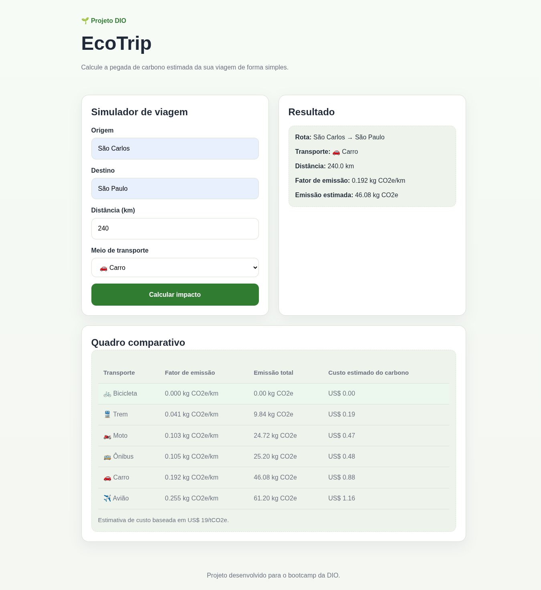

<h1>
<a href="https://www.dio.me/">
     </a>
    <span>Calculadora EcoTrip: Simulador de Impacto Ambiental para Viagens
</span>
</h1>

Projeto desenvolvido como uma aplicação web estática para estimar a pegada de carbono de viagens com base na distância informada e no meio de transporte selecionado. O projeto foi pensado para ser simples de executar localmente com o VS Code e a extensão Live Server, além de ser fácil de publicar no GitHub Pages.

Obs.: Projeto desenvolvido com uso do [Perplexity AI](https://www.perplexity.ai/).

## :pencil: Objetivo

Permitir que o usuário simule uma viagem informando origem, destino, distância e meio de transporte para obter uma estimativa de emissão de CO2e (gás carbônico equivalente). A aplicação também foi estruturada para evoluir futuramente para comparações entre modais, estimativa de custo de carbono e integração com APIs externas.

## :gear: Funcionalidades do MVP

- Entrada de origem e destino.
- Entrada manual da distância em quilômetros.
- Seleção do meio de transporte.
- Cálculo local da emissão estimada de carbono.
- Exibição do resultado diretamente na interface.
- Estrutura compatível com hospedagem estática no GitHub Pages

## :computer: Tecnologias utilizadas

- HTML5
- CSS3
- JavaScript modular (ES Modules)
- VS Code
- Extensão Live Server para execução local.

## Estrutura do projeto

```text
ecotrip/
├── index.html
├── README.md
├── css/
│   └── style.css
├── js/
│   ├── app.js
│   ├── calculator.js
│   ├── comparison.js
│   └── emission-factors.js
└── assets/
    └── favicon.svg
```

## Como executar localmente

1. Abra a pasta `ecotrip` no VS Code.
2. Instale a extensão **Live Server**.
3. Clique com o botão direito no arquivo `index.html`.
4. Selecione **Open with Live Server** para abrir o projeto no navegador com atualização automática a cada alteração salva.

## Como funciona o cálculo

A lógica do projeto utiliza fatores médios de emissão por meio de transporte definidos no arquivo `js/emission-factors.js`. O cálculo principal segue a fórmula abaixo:

```text
emissão estimada = distância (km) × fator de emissão (kg CO2e/km)
```

O resultado é mostrado em quilogramas de CO2e para facilitar a leitura no contexto de uma única viagem.

## Meios de transporte considerados

Atualmente o projeto considera os seguintes modais:

- Bicicleta
- Moto
- Carro
- Ônibus
- Trem
- Avião

Os fatores de emissão estão centralizados em um único arquivo JavaScript para facilitar futuras revisões metodológicas e ajustes dos valores utilizados no cálculo.

Também é calculado para todos os meios de transporte para a mesma distância uma tabela comparativa com fator de emissão, emissão total e custo estimado de carbono é exibida. 

## Exemplo de uso

<p align='center'>

</p>

## Publicação no GitHub Pages

Como o projeto é totalmente estático, ele pode ser publicado diretamente no GitHub Pages sem necessidade de backend ou processo de build. O GitHub Pages suporta esse tipo de estrutura com `index.html` como ponto de entrada principal.

### Passos básicos

1. Criar um repositório no GitHub.
2. Enviar os arquivos do projeto para a branch principal.
3. Ativar o GitHub Pages nas configurações do repositório.
4. Definir a branch e a pasta publicadas.
5. Acessar a URL gerada para compartilhar o projeto.

## Limitações atuais

- A distância da viagem é informada manualmente pelo usuário.
- O projeto usa fatores fixos de emissão para cada modal.
- Não há integração com mapas, geocodificação ou serviços de rota.
- O cálculo representa uma estimativa simplificada, adequada para um MVP.

## :bulb: Próximas melhorias sugeridas

As próximas etapas podem transformar o projeto em uma calculadora mais realista e útil para diferentes trajetos.

### 1. Integrar APIs de geocodificação

Uma melhoria importante é permitir que o usuário informe apenas origem e destino, convertendo esses locais automaticamente em coordenadas geográficas. A API pública do Nominatim pode ser usada para esse tipo de consulta, respeitando suas políticas de uso, limites de requisição e necessidade de identificação da aplicação.

### 2. Integrar APIs de rota e distância por modal

Uma etapa natural depois da geocodificação é buscar as distâncias reais para cada tipo de transporte. O openrouteservice oferece serviços de directions e rotas com base em dados do OpenStreetMap, o que pode ajudar a estimar trajetos mais realistas para carro, bicicleta e outros perfis de deslocamento.

### 3. Mostrar os transportes disponíveis para o trajeto

Com APIs de rota, o sistema pode passar a verificar quais modais fazem sentido entre origem e destino, em vez de apenas exibir todos fixamente. Isso permite mostrar, por exemplo, quando um trajeto tem rota viável de carro e bicicleta, mas não de trem em determinado contexto.

### 4. Incluir mapa interativo

O uso de bibliotecas como MapLibre GL JS pode ajudar a visualizar origem, destino e rota em um mapa interativo dentro do navegador. Isso é especialmente útil para enriquecer a apresentação visual do projeto em uma hospedagem estática.

### 5. Evoluir o modelo de emissão

O cálculo também pode ser aprimorado no futuro com fatores mais detalhados por ocupação do veículo, tipo de combustível, classe de voo e integração com serviços especializados em emissões, como plataformas voltadas para contabilidade de carbono em viagens.